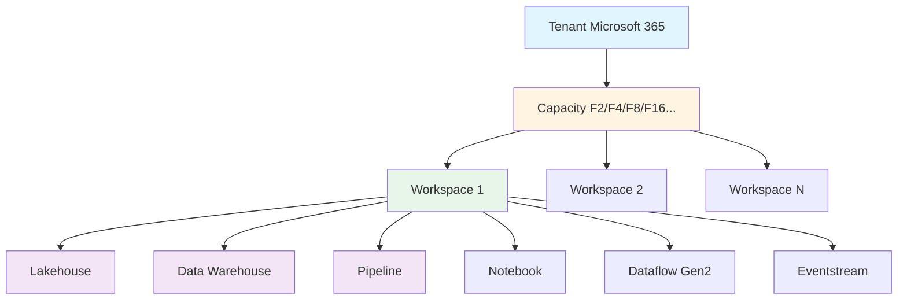
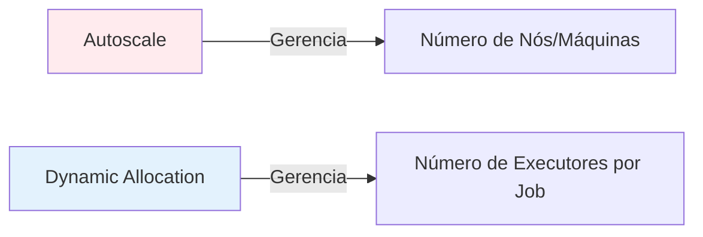
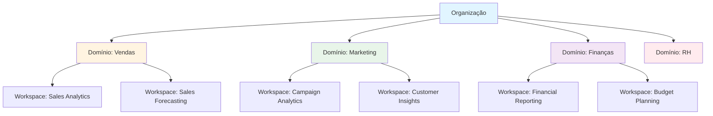
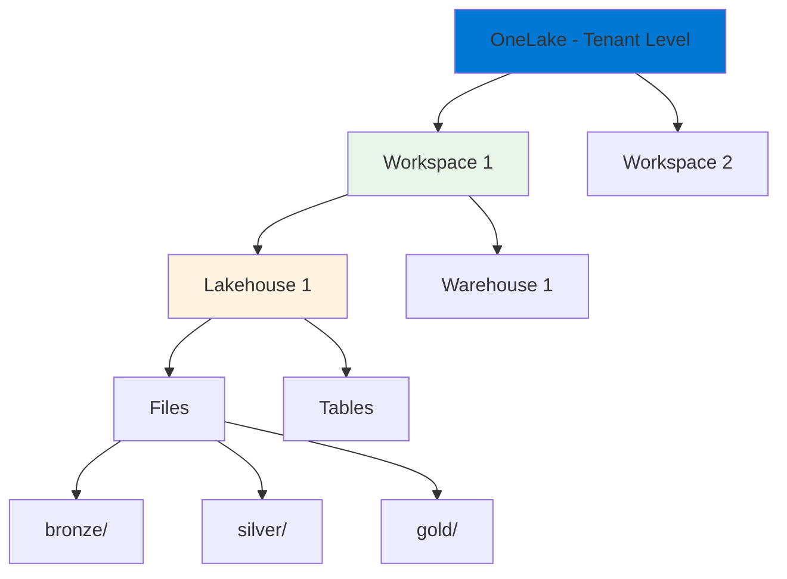
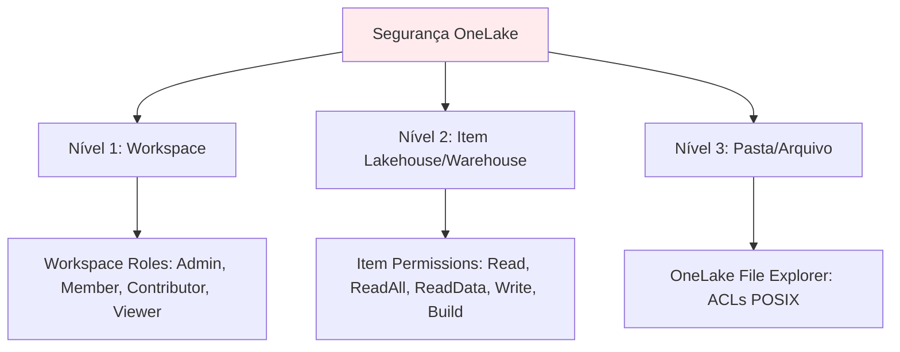

# 1.1 Definir as configurações do workspace do Microsoft Fabric

A configuração adequada de um workspace no Microsoft Fabric é a base para a implementação de uma solução de análise de dados robusta, bem governada e otimizada. Esta seção aborda em profundidade as configurações essenciais para os diferentes componentes de um workspace, garantindo que o ambiente esteja preparado para desempenho, segurança, colaboração e escalabilidade.

## Visão Geral da Hierarquia do Fabric

Antes de mergulhar nas configurações específicas, é fundamental entender a hierarquia organizacional do Microsoft Fabric:



**Componentes da Hierarquia:**

- **Tenant**: Sua organização Microsoft 365
- **Capacity**: Recurso de computação dedicado (SKUs: F2, F4, F8, F16, F32, F64, F128, F256, F512, F1024, F2048)
- **Workspace**: Container lógico para itens relacionados
- **Items**: Lakehouses, Warehouses, Pipelines, Notebooks, etc.

---

## 1. Configurações do Workspace do Spark

As configurações do Apache Spark no Microsoft Fabric são **críticas** para gerenciar o desempenho, custos e recursos dos seus trabalhos de engenharia de dados. Elas são divididas em **Pools do Spark** e **Ambientes do Spark**.

### 1.1 Pools do Spark (Spark Pools)

Os Pools do Spark definem o **hardware** (infraestrutura de computação) no qual seus trabalhos Spark serão executados.

#### Componentes de um Pool do Spark

| Componente | Descrição | Opções Disponíveis |
|------------|-----------|-------------------|
| **Node Family** | Família de hardware dos nós | Memory Optimized, Compute Optimized, GPU Optimized |
| **Node Size** | Tamanho de cada nó | Small, Medium, Large, X-Large, XX-Large |
| **Autoscale** | Escalonamento automático de nós | Min nodes, Max nodes |
| **Dynamic Allocation** | Alocação dinâmica de executores | Habilitado por padrão |

#### Node Families - Comparação Detalhada

| Node Family | Quando Usar | Características | Casos de Uso Típicos |
|-------------|-------------|-----------------|---------------------|
| **Memory Optimized** | Workloads que requerem muita memória | Alta proporção memória/vCore (8:1) | - Grandes joins<br>- Agregações complexas<br>- Machine Learning<br>- Caching extensivo |
| **Compute Optimized** | Workloads balanceados | Proporção equilibrada memória/vCore (4:1) | - ETL geral<br>- Transformações padrão<br>- Processamento batch |
| **GPU Optimized** | Workloads de IA/ML intensivos | GPUs NVIDIA para computação paralela | - Deep Learning<br>- Processamento de imagens<br>- Treinamento de modelos |

#### Node Sizes - Especificações

| Size | vCores | Memória | Quando Usar |
|------|--------|---------|-------------|
| Small | 4 | 32 GB | Desenvolvimento, testes, datasets pequenos (<10 GB) |
| Medium | 8 | 64 GB | Workloads de produção pequenos a médios |
| Large | 16 | 128 GB | Workloads de produção médios |
| X-Large | 32 | 256 GB | Workloads de produção grandes |
| XX-Large | 64 | 512 GB | Workloads muito grandes, processamento massivo |

#### Autoscale vs Dynamic Allocation

**Conceito Fundamental:**



| Característica | Autoscale | Dynamic Allocation |
|----------------|-----------|-------------------|
| **O que gerencia** | Número de nós (máquinas) no pool | Número de executores (processos) por job |
| **Escopo** | Nível do Pool | Nível do Job/Notebook |
| **Configuração** | Min nodes: 1, Max nodes: 10 | Habilitado por padrão no Fabric |
| **Quando escala** | Baseado na demanda agregada do pool | Baseado nas necessidades do job específico |
| **Benefício** | Otimização de custo do pool | Otimização de recursos por job |

**No Microsoft Fabric**: Cada nó do pool corresponde a **um executor**, simplificando a gestão. Quando você configura Autoscale de 1-5 nós, você terá de 1-5 executores disponíveis.

#### Configuração de Pool - Exemplo Prático

**Cenário**: ETL de produção com workloads variáveis ao longo do dia

```
Pool Configuration:
├── Name: "Production_ETL_Pool"
├── Node Family: Memory Optimized
├── Node Size: Large (16 vCores, 128 GB)
├── Autoscale: Enabled
│   ├── Min nodes: 2
│   └── Max nodes: 8
└── Dynamic Allocation: Enabled (default)
```

**Justificativa**:
- **Memory Optimized**: ETL com joins complexos
- **Large**: Balanceamento custo/performance
- **Min 2 nodes**: Garantir disponibilidade mínima
- **Max 8 nodes**: Controlar custos, suportar picos

### 1.2 Ambientes do Spark (Spark Environments)

Os Ambientes do Spark definem o **software** (runtime e bibliotecas) disponível para notebooks e jobs.

#### Componentes de um Ambiente

| Componente | Descrição | Exemplo |
|------------|-----------|---------|
| **Spark Runtime** | Versão do Apache Spark | Spark 3.4, Spark 3.5 |
| **Python Version** | Versão do Python | Python 3.10, 3.11 |
| **Libraries** | Bibliotecas instaladas | pandas, scikit-learn, tensorflow |
| **Spark Properties** | Configurações do Spark | spark.sql.adaptive.enabled=true |

#### Tipos de Bibliotecas

**1. Bibliotecas Públicas (Public Libraries)**

```python
# Instalação via PyPI
pip install pandas==2.0.0
pip install scikit-learn==1.3.0

# Instalação via Conda
conda install -c conda-forge xgboost
```

**2. Bibliotecas Customizadas (Custom Libraries)**

- Upload de arquivos `.whl` (Python wheel)
- Upload de arquivos `.jar` (Java/Scala)
- Upload de arquivos `.tar.gz`

**3. Bibliotecas Inline (no Notebook)**

```python
# Instalação temporária (apenas para a sessão atual)
%pip install package-name

# Instalação com configuração do Spark
%conda install package-name
```

#### Criando um Ambiente Customizado - Passo a Passo

**Cenário**: Equipe de Data Science precisa de bibliotecas específicas de ML

1. **Criar Novo Ambiente**:
   - Workspace Settings → Spark → Environments → New Environment
   - Nome: "DataScience_ML_Environment"

2. **Selecionar Runtime**:
   - Spark Runtime: 3.5
   - Python Version: 3.11

3. **Adicionar Bibliotecas Públicas**:
   ```
   scikit-learn==1.3.0
   xgboost==2.0.0
   lightgbm==4.0.0
   imbalanced-learn==0.11.0
   shap==0.42.0
   ```

4. **Adicionar Bibliotecas Customizadas**:
   - Upload: `company_ml_utils-1.0.0-py3-none-any.whl`

5. **Configurar Spark Properties**:
   ```properties
   spark.sql.adaptive.enabled=true
   spark.sql.adaptive.coalescePartitions.enabled=true
   spark.sql.adaptive.skewJoin.enabled=true
   ```

6. **Definir como Padrão do Workspace** (opcional)

#### Ambiente Padrão vs Ambiente Específico

| Aspecto | Ambiente Padrão do Workspace | Ambiente Específico do Item |
|---------|------------------------------|----------------------------|
| **Aplicação** | Todos os notebooks/jobs do workspace | Apenas o notebook/job específico |
| **Configuração** | Workspace Settings → Default Environment | Item Settings → Environment |
| **Prioridade** | Menor | Maior (sobrescreve o padrão) |
| **Quando usar** | Bibliotecas comuns a todos os projetos | Requisitos específicos de um projeto |

#### Best Practices - Ambientes do Spark

✅ **DO (Faça)**:
- Versione seus ambientes (ex: `ML_Env_v1.0`, `ML_Env_v2.0`)
- Documente as bibliotecas e versões usadas
- Use ambientes específicos para projetos com requisitos únicos
- Teste novos ambientes em workspace de desenvolvimento primeiro
- Mantenha ambientes enxutos (apenas bibliotecas necessárias)

❌ **DON'T (Não Faça)**:
- Instalar bibliotecas conflitantes
- Usar `%pip install` em produção (preferir ambiente configurado)
- Criar muitos ambientes similares (dificulta manutenção)
- Esquecer de atualizar bibliotecas com vulnerabilidades de segurança

---

## 2. Configurações do Workspace de Domínio

Os **Domínios** no Microsoft Fabric são uma construção lógica para agrupar workspaces que compartilham as mesmas necessidades de negócio, governança e propriedade. Eles são fundamentais para implementar uma arquitetura de **Data Mesh**.

### Conceito de Data Mesh



### Configurações de Domínio

#### 1. Criação de Domínio

**Requisitos**:
- Ser **Fabric Administrator** ou **Capacity Administrator**

**Passos**:
1. Admin Portal → Domains → Create Domain
2. Nome: "Sales_Domain"
3. Descrição: "Domínio para todos os ativos de dados de vendas"
4. Imagem (opcional): Logo do departamento

#### 2. Atribuição de Workspaces

**Métodos**:

**A) Pelo Administrador do Domínio**:
- Domain Settings → Workspaces → Assign Workspaces
- Selecionar workspaces existentes

**B) Pelo Administrador do Workspace**:
- Workspace Settings → Domain → Request to join domain
- Aguardar aprovação do Domain Admin

#### 3. Funções de Domínio

| Função | Permissões | Quando Atribuir |
|--------|-----------|-----------------|
| **Domain Admin** | - Gerenciar configurações do domínio<br>- Aprovar/rejeitar solicitações de workspace<br>- Atribuir Domain Contributors<br>- Definir políticas de governança | Líderes de departamento, Data Governance team |
| **Domain Contributor** | - Solicitar adição de workspaces ao domínio<br>- Visualizar workspaces do domínio | Workspace Admins, Data Engineers do domínio |

### Benefícios dos Domínios

1. **Descoberta de Dados**: Usuários podem filtrar por domínio no OneLake Data Hub
2. **Governança Centralizada**: Políticas aplicadas a todos os workspaces do domínio
3. **Ownership Claro**: Cada domínio tem proprietários definidos
4. **Organização Lógica**: Agrupa ativos relacionados ao negócio

---

## 3. Configurações do Workspace do OneLake

O **OneLake** é o "OneDrive para dados" do Microsoft Fabric - um único data lake lógico para toda a organização, baseado em ADLS Gen2.

### Arquitetura do OneLake



### 3.1 Atalhos (Shortcuts)

Os **Shortcuts** permitem referenciar dados de outras fontes **sem copiar os dados**, promovendo reutilização e evitando duplicação.

#### Tipos de Shortcuts

| Tipo | Fonte | Quando Usar |
|------|-------|-------------|
| **OneLake Shortcut** | Outro Lakehouse/Warehouse no Fabric | Compartilhar dados entre workspaces/lakehouses |
| **ADLS Gen2 Shortcut** | Azure Data Lake Storage Gen2 | Acessar dados externos no Azure |
| **S3 Shortcut** | Amazon S3 | Acessar dados em AWS S3 |
| **Dataverse Shortcut** | Microsoft Dataverse | Integrar dados do Dynamics 365 |

#### Criando um Shortcut - Exemplo

**Cenário**: Workspace de Analytics precisa acessar dados do Workspace de Engenharia

**Passos**:
1. Lakehouse Analytics → Files → New Shortcut
2. Tipo: OneLake
3. Selecionar:
   - Workspace: "Engineering_Workspace"
   - Lakehouse: "Raw_Data_Lakehouse"
   - Path: "Files/bronze/customers/"
4. Nome do Shortcut: "customers_bronze"

**Resultado**:
```
Lakehouse Analytics/
└── Files/
    └── customers_bronze/ (shortcut → Engineering_Workspace/Raw_Data_Lakehouse/Files/bronze/customers/)
```

#### Shortcuts vs Cópia de Dados

| Aspecto | Shortcuts | Cópia de Dados |
|---------|-----------|----------------|
| **Armazenamento** | Dados permanecem na fonte | Dados duplicados |
| **Custo** | Menor (sem duplicação) | Maior (armazenamento duplicado) |
| **Atualização** | Sempre dados atuais | Requer refresh |
| **Latência** | Pode ter latência de rede | Acesso local mais rápido |
| **Quando usar** | Dados de referência, compartilhamento | Dados que precisam de transformação local |

### 3.2 Segurança do OneLake

A segurança no OneLake pode ser configurada em **múltiplos níveis**:



#### Níveis de Segurança

**1. Workspace Level**:
- Roles: Admin, Member, Contributor, Viewer
- Controla acesso a todos os itens do workspace

**2. Item Level (Lakehouse/Warehouse)**:
- Permissions: Read, ReadAll, ReadData, Write, Build
- Controla acesso ao item específico

**3. File/Folder Level**:
- OneLake File Explorer: ACLs POSIX (rwx)
- Controle granular em pastas/arquivos específicos

#### Exemplo de Configuração de Segurança

**Cenário**: Diferentes níveis de acesso para diferentes equipes

```
Lakehouse: Sales_Data
├── Files/
│   ├── bronze/          (Acesso: Data Engineers - RWX)
│   ├── silver/          (Acesso: Data Engineers - RWX, Analysts - R-X)
│   └── gold/            (Acesso: Todos - R-X)
└── Tables/
    ├── dim_customers    (RLS aplicado)
    └── fact_sales       (RLS aplicado)
```

**Configuração**:
1. **Workspace Level**: Data Engineers = Member, Analysts = Viewer
2. **Item Level**: Lakehouse = ReadAll para Analysts
3. **Folder Level** (via OneLake File Explorer):
   - `bronze/`: ACL = Data Engineers (RWX)
   - `silver/`: ACL = Data Engineers (RWX), Analysts (R-X)
   - `gold/`: ACL = All Users (R-X)

---

## 4. Configurações do Workspace do Fluxo de Trabalho de Dados

Os fluxos de trabalho de dados no Fabric são representados por **Dataflows Gen2** e **Pipelines**.

### 4.1 Parâmetros e Expressões Dinâmicas

Permitem criar pipelines e dataflows **reutilizáveis** e **dinâmicos**.

#### Parâmetros de Pipeline

**Exemplo**:
```json
{
  "parameters": {
    "SourcePath": {
      "type": "String",
      "defaultValue": "/bronze/sales/"
    },
    "ProcessDate": {
      "type": "String",
      "defaultValue": "2024-01-01"
    },
    "Environment": {
      "type": "String",
      "defaultValue": "DEV"
    }
  }
}
```

**Uso em Atividades**:
```
Copy Activity:
├── Source: @concat(parameters('SourcePath'), parameters('ProcessDate'))
└── Destination: @concat('/silver/sales_', parameters('ProcessDate'))
```

#### Expressões do Sistema

| Função | Descrição | Exemplo |
|--------|-----------|---------|
| `utcnow()` | Data/hora atual UTC | `@utcnow()` → "2024-01-15T10:30:00Z" |
| `adddays()` | Adicionar dias | `@adddays(utcnow(), -1)` → Ontem |
| `formatDateTime()` | Formatar data | `@formatDateTime(utcnow(), 'yyyy-MM-dd')` → "2024-01-15" |
| `concat()` | Concatenar strings | `@concat('prefix_', parameters('name'))` |
| `pipeline()` | Metadados do pipeline | `@pipeline().RunId` |

### 4.2 Agendamento e Gatilhos

#### Tipos de Triggers

| Tipo | Quando Usar | Configuração |
|------|-------------|--------------|
| **Schedule Trigger** | Execução em horários fixos | Diário às 2:00 AM, A cada hora |
| **Event-based Trigger** | Execução quando evento ocorre | Novo arquivo em pasta OneLake |
| **Manual Trigger** | Execução sob demanda | Botão "Run" |

#### Schedule Trigger - Exemplos

**1. Execução Diária**:
```
Schedule:
├── Frequency: Daily
├── Time: 02:00 AM
└── Timezone: (UTC-03:00) Brasília
```

**2. Execução a Cada Hora (Horário Comercial)**:
```
Schedule:
├── Frequency: Hourly
├── Interval: 1 hour
├── Start time: 08:00 AM
└── End time: 06:00 PM
```

**3. Execução Semanal**:
```
Schedule:
├── Frequency: Weekly
├── Days: Monday, Wednesday, Friday
└── Time: 06:00 AM
```

#### Event-based Trigger - Exemplo

**Cenário**: Processar automaticamente quando novo arquivo chegar

```
Trigger Configuration:
├── Type: Storage events
├── Scope: OneLake
├── Lakehouse: "Raw_Data_Lakehouse"
├── Path: "/Files/bronze/incoming/"
├── Event: Blob created
└── File pattern: "*.csv"
```

**Quando um arquivo `sales_2024-01-15.csv` é carregado em `/Files/bronze/incoming/`, o pipeline é automaticamente acionado.**

---

## 5. Configurações Gerais do Workspace

### 5.1 Workspace Settings

| Configuração | Opções | Descrição |
|--------------|--------|-----------|
| **License Mode** | Trial, Premium Per User, Premium Per Capacity, Fabric Capacity | Tipo de licenciamento |
| **Workspace Description** | Texto livre | Descrição do propósito do workspace |
| **Contact List** | E-mails | Contatos para suporte/questões |
| **OneLake Storage** | Enabled/Disabled | Habilitar armazenamento OneLake |
| **Git Integration** | Azure DevOps, GitHub | Controle de versão |
| **Default Lakehouse** | Selecionar Lakehouse | Lakehouse padrão para notebooks |

### 5.2 Workspace Access (Funções)

| Função | Permissões | Quando Atribuir |
|--------|-----------|-----------------|
| **Admin** | - Gerenciar workspace<br>- Gerenciar permissões<br>- Deletar workspace<br>- Publicar/compartilhar conteúdo | Líderes de projeto, Workspace owners |
| **Member** | - Criar/editar/deletar itens<br>- Publicar/compartilhar conteúdo<br>- Executar notebooks/pipelines | Data Engineers, desenvolvedores |
| **Contributor** | - Criar/editar/deletar itens<br>- Executar notebooks/pipelines<br>- **NÃO pode** publicar/compartilhar | Data Engineers júnior |
| **Viewer** | - Visualizar conteúdo<br>- **NÃO pode** editar | Analistas, stakeholders |

---

## Best Practices - Configurações de Workspace

### ✅ Organização

1. **Naming Conventions**:
   ```
   Workspace: [Department]_[Project]_[Environment]
   Exemplo: Sales_Analytics_PROD
   
   Pool: [Purpose]_[Size]_Pool
   Exemplo: ETL_Large_Pool
   
   Environment: [Team]_[Purpose]_Env_v[Version]
   Exemplo: DataScience_ML_Env_v1.0
   ```

2. **Separação de Ambientes**:
   - DEV, TEST, PROD em workspaces separados
   - Use Deployment Pipelines para promover entre ambientes

3. **Uso de Domínios**:
   - Agrupe workspaces relacionados em domínios
   - Facilita governança e descoberta

### ✅ Segurança

1. **Princípio do Menor Privilégio**:
   - Atribua apenas as permissões necessárias
   - Use Viewer sempre que possível

2. **Revisão Periódica**:
   - Audite permissões trimestralmente
   - Remova acessos de usuários inativos

3. **Segurança em Camadas**:
   - Workspace → Item → Pasta/Arquivo
   - RLS/CLS para dados sensíveis

### ✅ Performance

1. **Pools do Spark**:
   - Use Autoscale para otimizar custos
   - Escolha Node Family apropriado para workload
   - Min nodes = 1 para DEV, ≥2 para PROD

2. **Ambientes**:
   - Mantenha ambientes enxutos
   - Evite bibliotecas conflitantes
   - Versione ambientes

3. **Shortcuts**:
   - Prefira shortcuts a cópias quando possível
   - Use para dados de referência compartilhados

### ✅ Governança

1. **Documentação**:
   - Mantenha descrições atualizadas
   - Documente propósito de cada workspace

2. **Controle de Versão**:
   - Integre com Git (Azure DevOps/GitHub)
   - Use branches para desenvolvimento

3. **Monitoramento**:
   - Habilite logs de auditoria
   - Configure alertas para falhas

---

## Cenários Práticos

### Cenário 1: Configurar Workspace para ETL de Produção

**Requisitos**:
- Processar 500 GB de dados diariamente
- Joins complexos e agregações
- Equipe de 5 Data Engineers
- Ambiente de produção crítico

**Configuração Recomendada**:

```
Workspace: Sales_ETL_PROD
├── License Mode: Fabric Capacity (F64)
├── Domain: Sales_Domain
├── Git Integration: Azure DevOps
│
├── Spark Pool:
│   ├── Name: "Production_ETL_Pool"
│   ├── Node Family: Memory Optimized
│   ├── Node Size: X-Large (32 vCores, 256 GB)
│   ├── Autoscale: Min 2, Max 10
│   └── Dynamic Allocation: Enabled
│
├── Spark Environment:
│   ├── Name: "ETL_Prod_Env_v1.0"
│   ├── Runtime: Spark 3.5
│   ├── Libraries: delta-spark, pandas, pyarrow
│   └── Spark Properties:
│       ├── spark.sql.adaptive.enabled=true
│       └── spark.sql.adaptive.skewJoin.enabled=true
│
├── Access:
│   ├── Admin: Data Engineering Lead
│   ├── Member: 5 Data Engineers
│   └── Viewer: Business Stakeholders
│
└── Triggers:
    └── Schedule: Daily at 2:00 AM (UTC-3)
```

### Cenário 2: Workspace de Data Science com ML

**Requisitos**:
- Treinamento de modelos de ML
- Bibliotecas específicas (scikit-learn, xgboost, tensorflow)
- Experimentação e desenvolvimento
- GPU para deep learning

**Configuração Recomendada**:

```
Workspace: DataScience_ML_DEV
├── License Mode: Fabric Capacity (F32)
├── Domain: Analytics_Domain
│
├── Spark Pool:
│   ├── Name: "ML_GPU_Pool"
│   ├── Node Family: GPU Optimized
│   ├── Node Size: Large
│   ├── Autoscale: Min 1, Max 4
│   └── Dynamic Allocation: Enabled
│
├── Spark Environment:
│   ├── Name: "DataScience_ML_Env_v2.0"
│   ├── Runtime: Spark 3.5
│   ├── Python: 3.11
│   └── Libraries:
│       ├── scikit-learn==1.3.0
│       ├── xgboost==2.0.0
│       ├── tensorflow==2.14.0
│       ├── shap==0.42.0
│       └── mlflow==2.8.0
│
└── Access:
    ├── Admin: Data Science Lead
    ├── Member: Data Scientists
    └── Contributor: ML Engineers
```

---

## Referências e Recursos

### Documentação Oficial Microsoft

1. [Microsoft Fabric Documentation](https://learn.microsoft.com/fabric/)
2. [Workspace Settings](https://learn.microsoft.com/fabric/data-engineering/workspace-admin-settings)
3. [Spark Compute Configuration](https://learn.microsoft.com/fabric/data-engineering/configure-spark-settings)
4. [OneLake Security](https://learn.microsoft.com/fabric/onelake/onelake-security)
5. [Domains in Fabric](https://learn.microsoft.com/fabric/governance/domains)
6. [Guia de Estudo DP-700](https://learn.microsoft.com/credentials/certifications/resources/study-guides/dp-700)

### Recursos Adicionais

- [Fabric Capacity Metrics App](https://learn.microsoft.com/fabric/enterprise/metrics-app)
- [OneLake File Explorer](https://learn.microsoft.com/fabric/onelake/onelake-file-explorer)
- [Deployment Pipelines](https://learn.microsoft.com/fabric/cicd/deployment-pipelines/intro-to-deployment-pipelines)

---

## Pontos-Chave para o Exame DP-700

🎯 **Memorize**:
- Diferença entre Autoscale (nós) e Dynamic Allocation (executores)
- Node Families: Memory Optimized (8:1), Compute Optimized (4:1), GPU
- Workspace Roles: Admin > Member > Contributor > Viewer
- Item Permissions: Read, ReadAll, ReadData, Write, Build
- Shortcuts não copiam dados, apenas referenciam
- Domínios são para organização lógica e governança (Data Mesh)
- Ambientes definem software (runtime, bibliotecas)
- Pools definem hardware (nós, memória, vCores)

🎯 **Entenda**:
- Quando usar cada Node Family
- Como configurar segurança em múltiplos níveis
- Diferença entre Schedule e Event-based triggers
- Quando usar Shortcuts vs Cópia de dados
- Hierarquia: Tenant → Capacity → Workspace → Items
