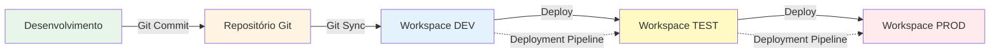
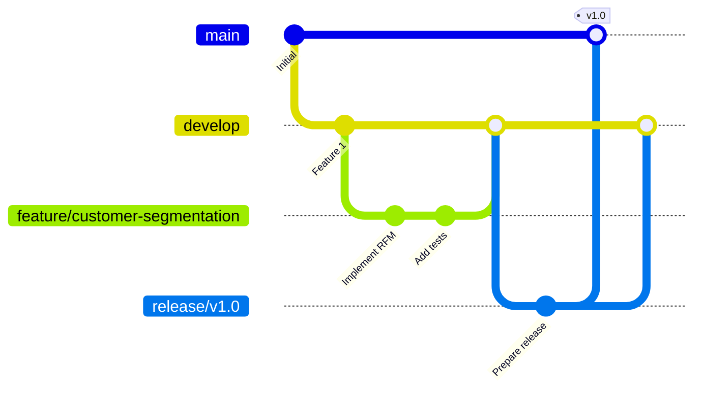
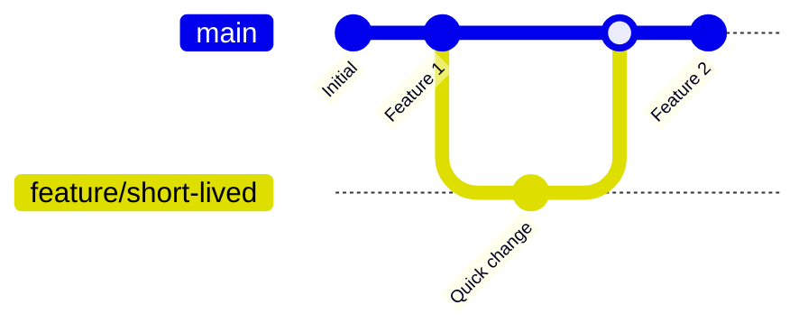
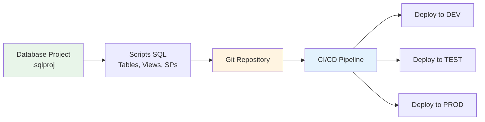
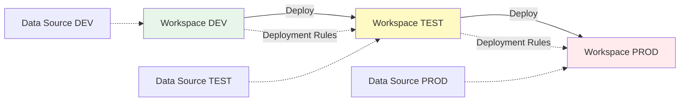

# 1.2 Implementar o gerenciamento do ciclo de vida no Fabric

O gerenciamento do ciclo de vida de aplicativos (**Application Lifecycle Management - ALM**) no Microsoft Fabric é **essencial** para garantir que as soluções de dados sejam desenvolvidas, testadas e implantadas de forma consistente, confiável, rastreável e automatizada. O Fabric integra-se com ferramentas padrão do setor, como **Git** (Azure DevOps e GitHub), e fornece recursos nativos, como os **Deployment Pipelines**, para facilitar esse processo em ambientes corporativos.

## Visão Geral do ALM no Fabric



**Componentes do ALM no Fabric:**

1. **Git Integration**: Controle de versão e colaboração
2. **Deployment Pipelines**: Promoção entre ambientes (DEV → TEST → PROD)
3. **Database Projects**: Schema-as-Code para SQL
4. **CI/CD Automation**: Integração com Azure DevOps Pipelines/GitHub Actions

---

## 1. Controle de Versão com Git

A integração com o Git é um **pilar fundamental** do ALM no Fabric, permitindo que as equipes de desenvolvimento colaborem, controlem as versões de seus artefatos, revertam para versões anteriores e mantenham um histórico completo de alterações.

### 1.1 Conexão com Repositório Git

#### Provedores Suportados

| Provedor | Suporte | Quando Usar |
|----------|---------|-------------|
| **Azure DevOps (Azure Repos)** | ✅ Completo | Organizações que usam Azure DevOps |
| **GitHub** | ✅ Completo | Organizações que usam GitHub |
| **GitLab** | ❌ Não suportado | - |
| **Bitbucket** | ❌ Não suportado | - |

#### Configurando Git Integration - Passo a Passo

**Pré-requisitos**:
- Repositório Git criado (Azure DevOps ou GitHub)
- Permissões de Admin no Workspace
- Permissões de Contributor no repositório Git

**Passos**:

1. **Criar Repositório Git**:
   ```bash
   # Azure DevOps
   az repos create --name "FabricWorkspace_Sales_Analytics" --project "DataEngineering"
   
   # GitHub
   gh repo create FabricWorkspace_Sales_Analytics --private
   ```

2. **Conectar Workspace ao Git**:
   - Workspace Settings → Git integration → Connect
   - Selecionar provedor: Azure DevOps ou GitHub
   - Autenticar (OAuth)
   - Selecionar:
     - Organization: "MyCompany"
     - Project: "DataEngineering"
     - Repository: "FabricWorkspace_Sales_Analytics"
     - Branch: "main"
     - Folder: "/" (ou subpasta específica)

3. **Sincronizar pela Primeira Vez**:
   - Source Control → Commit
   - Mensagem: "Initial commit - workspace setup"
   - Commit all changes

**Estrutura do Repositório**:

```
FabricWorkspace_Sales_Analytics/
├── .platform
├── Lakehouse_Sales.Lakehouse/
│   ├── lakehouse.yml
│   └── tables/
├── Notebook_ETL_Sales.Notebook/
│   ├── notebook-content.py
│   └── .platform
├── Pipeline_Daily_Load.DataPipeline/
│   ├── pipeline-content.json
│   └── .platform
├── Warehouse_Sales_DW.Warehouse/
│   ├── warehouse.yml
│   └── definition/
└── README.md
```

### 1.2 Operações Git no Fabric

#### Commit (Salvar Alterações no Git)

**Quando usar**: Após fazer alterações em notebooks, pipelines, etc.

**Passos**:
1. Source Control → View changes
2. Revisar alterações (diff)
3. Adicionar mensagem de commit descritiva
4. Commit

**Exemplo de Mensagem de Commit**:
```
feat: Add customer segmentation logic to ETL notebook

- Implemented RFM analysis
- Added data quality checks
- Updated error handling
```

**Convenções de Commit** (recomendadas):
```
feat: Nova funcionalidade
fix: Correção de bug
refactor: Refatoração de código
docs: Documentação
perf: Melhoria de performance
test: Adição de testes
```

#### Sync (Atualizar Workspace com Git)

**Quando usar**: Quando colegas fizeram commits e você quer atualizar seu workspace

**Passos**:
1. Source Control → Update
2. Revisar alterações que serão baixadas
3. Sync

**⚠️ Atenção**: Se houver conflitos, você precisará resolvê-los manualmente no Git antes de sincronizar.

#### Undo (Reverter Alterações Locais)

**Quando usar**: Descartar alterações não commitadas

**Passos**:
1. Source Control → View changes
2. Selecionar item
3. Undo changes

### 1.3 Branching Strategies para Fabric

#### Estratégia 1: Git Flow (Recomendada para Produção)



**Branches**:
- `main`: Produção (sempre estável)
- `develop`: Desenvolvimento (integração contínua)
- `feature/*`: Features individuais
- `release/*`: Preparação para release
- `hotfix/*`: Correções urgentes em produção

**Workflow**:
1. Criar feature branch a partir de `develop`
2. Desenvolver e testar
3. Merge para `develop`
4. Criar release branch
5. Testar release
6. Merge para `main` e `develop`

#### Estratégia 2: Trunk-Based (Recomendada para Equipes Pequenas)



**Características**:
- Branch principal: `main`
- Feature branches de curta duração (1-2 dias)
- Commits frequentes no `main`
- CI/CD automatizado

#### Estratégia 3: Environment Branches

```
main (PROD)
├── test (TEST)
└── dev (DEV)
```

**Workflow**:
1. Desenvolver em `dev`
2. Promover para `test` via merge
3. Promover para `main` (PROD) via merge

**Vantagens**: Simples, claro
**Desvantagens**: Pode gerar conflitos em merges

### 1.4 Itens Suportados pelo Git Integration

| Item do Fabric | Suportado | Formato no Git |
|----------------|-----------|----------------|
| Notebook | ✅ | `.py`, `.ipynb` |
| Pipeline | ✅ | `.json` |
| Dataflow Gen2 | ✅ | `.json` |
| Lakehouse | ✅ | `.yml` (metadados) |
| Data Warehouse | ✅ | `.yml` (metadados) |
| Semantic Model | ✅ | `.bim` |
| Report | ✅ | `.pbir` |
| Eventstream | ✅ | `.json` |
| KQL Database | ✅ | `.yml` |
| Environment | ✅ | `.yml` |

**⚠️ Não Suportado**:
- Dados em si (apenas definições/metadados)
- Histórico de execução
- Configurações de workspace (parcialmente)

### 1.5 Best Practices - Git Integration

✅ **DO (Faça)**:
- Commit frequentemente com mensagens descritivas
- Use branches para features isoladas
- Revise diffs antes de commitar
- Mantenha `.gitignore` atualizado
- Documente no README.md

❌ **DON'T (Não Faça)**:
- Commitar dados sensíveis (credenciais, PII)
- Fazer commits direto no `main` em produção
- Usar mensagens genéricas ("update", "fix")
- Ignorar conflitos de merge

---

## 2. Projetos de Banco de Dados (Database Projects)

Os **Database Projects** permitem que você trate o esquema do seu Data Warehouse ou Lakehouse como código (**Schema-as-Code**), que pode ser versionado no Git e implantado via CI/CD.

### 2.1 Conceito de Schema-as-Code



**Benefícios**:
- Versionamento de esquema
- Rastreabilidade de alterações
- Rollback de esquema
- Automação de deploys
- Comparação de esquemas entre ambientes

### 2.2 Criando um Database Project

**Ferramentas**:
- Visual Studio 2022
- Azure Data Studio (extensão SQL Database Projects)
- VS Code (extensão SQL Database Projects)

**Passos (Azure Data Studio)**:

1. **Criar Projeto**:
   - Ctrl+Shift+P → "Database Projects: New"
   - Nome: "SalesWarehouse_Schema"
   - Target Platform: Microsoft Fabric Warehouse

2. **Estrutura do Projeto**:
   ```
   SalesWarehouse_Schema/
   ├── SalesWarehouse_Schema.sqlproj
   ├── Tables/
   │   ├── dim_customer.sql
   │   ├── dim_product.sql
   │   ├── fact_sales.sql
   │   └── ...
   ├── Views/
   │   ├── vw_sales_summary.sql
   │   └── ...
   ├── StoredProcedures/
   │   ├── sp_load_dim_customer.sql
   │   └── ...
   ├── Security/
   │   ├── Roles.sql
   │   └── RLS_Policies.sql
   └── Scripts/
       └── SeedData.sql
   ```

3. **Adicionar Objetos**:
   - Right-click → Add → Table
   - Criar script SQL:
   
   ```sql
   -- Tables/dim_customer.sql
   CREATE TABLE [dbo].[dim_customer]
   (
       [customer_key] INT NOT NULL PRIMARY KEY,
       [customer_id] VARCHAR(50) NOT NULL,
       [customer_name] VARCHAR(200) NOT NULL,
       [email] VARCHAR(200),
       [segment] VARCHAR(50),
       [created_date] DATETIME2 NOT NULL DEFAULT GETDATE(),
       [modified_date] DATETIME2 NOT NULL DEFAULT GETDATE(),
       [is_current] BIT NOT NULL DEFAULT 1,
       [effective_date] DATE NOT NULL,
       [end_date] DATE
   );
   ```

4. **Build do Projeto**:
   - Build → Gera arquivo `.dacpac`
   - `.dacpac` = Database Application Package (deployment artifact)

5. **Publicar no Warehouse**:
   - Right-click projeto → Publish
   - Target: Fabric Warehouse connection string
   - Publish

### 2.3 Schema Compare

**Cenário**: Comparar esquema do projeto com warehouse de produção

**Passos**:
1. Right-click projeto → Schema Compare
2. Source: Database Project
3. Target: Fabric Warehouse (PROD)
4. Compare
5. Revisar diferenças
6. Gerar script de atualização
7. Aplicar alterações

**Exemplo de Diferenças**:
```
✅ New Table: dim_customer_segment (in project, not in PROD)
⚠️ Modified Table: fact_sales (new column: discount_amount)
❌ Missing Table: temp_old_data (in PROD, not in project)
```

### 2.4 CI/CD com Database Projects

**Azure DevOps Pipeline Example**:

```yaml
# azure-pipelines.yml
trigger:
  branches:
    include:
      - main
  paths:
    include:
      - SalesWarehouse_Schema/**

pool:
  vmImage: 'windows-latest'

steps:
- task: VSBuild@1
  displayName: 'Build Database Project'
  inputs:
    solution: 'SalesWarehouse_Schema/SalesWarehouse_Schema.sqlproj'
    configuration: 'Release'

- task: SqlAzureDacpacDeployment@1
  displayName: 'Deploy to Fabric Warehouse'
  inputs:
    azureSubscription: 'MyAzureSubscription'
    authenticationType: 'servicePrincipal'
    serverName: 'fabric-warehouse-endpoint.datawarehouse.fabric.microsoft.com'
    databaseName: 'SalesWarehouse'
    deployType: 'DacpacTask'
    deploymentAction: 'Publish'
    dacpacFile: '$(Build.ArtifactStagingDirectory)/SalesWarehouse_Schema.dacpac'
```

---

## 3. Pipelines de Implantação (Deployment Pipelines)

Os **Deployment Pipelines** são um recurso nativo do Microsoft Fabric que fornece uma interface visual para gerenciar o ciclo de vida do conteúdo entre diferentes ambientes.

### 3.1 Arquitetura de Deployment Pipeline



### 3.2 Estágios do Pipeline

| Estágio | Propósito | Características |
|---------|-----------|-----------------|
| **Development (DEV)** | Ambiente de desenvolvimento | - Desenvolvedores criam/modificam conteúdo<br>- Fonte de dados de desenvolvimento<br>- Testes unitários<br>- Iteração rápida |
| **Test (TEST)** | Ambiente de validação e QA | - Validação por testadores<br>- Testes de integração<br>- UAT (User Acceptance Testing)<br>- Fonte de dados de teste (subset de produção) |
| **Production (PROD)** | Ambiente final para usuários | - Acesso somente leitura para desenvolvedores<br>- Fonte de dados de produção<br>- Monitoramento rigoroso<br>- Change management controlado |

### 3.3 Criando um Deployment Pipeline

**Pré-requisitos**:
- Fabric Capacity (F64 ou superior recomendado)
- Permissões de Admin nos workspaces
- Workspaces criados para cada ambiente

**Passos**:

1. **Criar Pipeline**:
   - Fabric Portal → Deployment Pipelines → Create pipeline
   - Nome: "Sales_Analytics_Pipeline"
   - Descrição: "Pipeline para solução de analytics de vendas"

2. **Atribuir Workspaces**:
   ```
   Development: Sales_Analytics_DEV
   Test: Sales_Analytics_TEST
   Production: Sales_Analytics_PROD
   ```

3. **Configurar Deployment Rules**:
   - Definir regras para cada estágio
   - Configurar parâmetros de fonte de dados

### 3.4 Deployment Rules (Regras de Implantação)

As **Deployment Rules** permitem configurar como as fontes de dados e parâmetros são alterados automaticamente quando o conteúdo é movido entre estágios.

#### Tipos de Regras

| Tipo de Regra | Quando Usar | Exemplo |
|---------------|-------------|---------|
| **Data Source Rules** | Alterar conexões de banco de dados | DEV: `server-dev.database.windows.net`<br>PROD: `server-prod.database.windows.net` |
| **Parameter Rules** | Alterar parâmetros de dataflows/pipelines | DEV: `Environment=DEV`<br>PROD: `Environment=PROD` |
| **Lakehouse Rules** | Alterar lakehouse de destino | DEV: `Lakehouse_Sales_DEV`<br>PROD: `Lakehouse_Sales_PROD` |

#### Configurando Deployment Rules - Exemplo

**Cenário**: Pipeline conecta a diferentes SQL Warehouses por ambiente

**Configuração**:

1. **Selecionar Item**: Pipeline "Daily_ETL"

2. **Criar Regra para DEV → TEST**:
   ```
   Rule Type: Data source
   Source (DEV):
     Server: fabric-warehouse-dev.datawarehouse.fabric.microsoft.com
     Database: SalesWarehouse_DEV
   
   Target (TEST):
     Server: fabric-warehouse-test.datawarehouse.fabric.microsoft.com
     Database: SalesWarehouse_TEST
   ```

3. **Criar Regra para TEST → PROD**:
   ```
   Rule Type: Data source
   Source (TEST):
     Server: fabric-warehouse-test.datawarehouse.fabric.microsoft.com
     Database: SalesWarehouse_TEST
   
   Target (PROD):
     Server: fabric-warehouse-prod.datawarehouse.fabric.microsoft.com
     Database: SalesWarehouse_PROD
   ```

4. **Criar Regra de Parâmetro**:
   ```
   Parameter: EnvironmentName
   DEV: "Development"
   TEST: "Testing"
   PROD: "Production"
   ```

### 3.5 Processo de Deployment

#### Deploy de DEV para TEST

**Passos**:

1. **Comparar Estágios**:
   - Pipeline view → Compare DEV vs TEST
   - Revisar diferenças:
     - ✅ New: Notebook "Customer_Segmentation"
     - ⚠️ Modified: Pipeline "Daily_ETL" (nova atividade)
     - ❌ Deleted: Report "Old_Dashboard"

2. **Selecionar Itens**:
   - Marcar itens para deploy
   - Opção: Deploy all ou Deploy selected

3. **Deploy**:
   - Click "Deploy to Test"
   - Aguardar conclusão
   - Verificar logs

4. **Validar no TEST**:
   - Executar testes de integração
   - Validar com stakeholders
   - Verificar dados de saída

#### Deploy de TEST para PROD

**Processo mais rigoroso**:

1. **Approval Gate** (recomendado):
   - Configurar aprovação manual
   - Notificar stakeholders
   - Aguardar aprovação

2. **Deployment Window**:
   - Agendar para horário de baixo uso
   - Ex: Sábado 2:00 AM

3. **Deploy**:
   - Click "Deploy to Production"
   - Deployment rules aplicadas automaticamente

4. **Post-Deployment Validation**:
   - Smoke tests
   - Verificar dashboards
   - Monitorar métricas

5. **Rollback Plan**:
   - Ter versão anterior documentada
   - Procedimento de rollback testado

### 3.6 Implantação Seletiva

**Cenário**: Apenas um notebook foi alterado, não precisa deployar tudo

**Passos**:
1. Pipeline view → Select specific items
2. Marcar apenas: Notebook "Customer_Segmentation"
3. Deploy selected

**Benefícios**:
- Reduz risco
- Deploy mais rápido
- Menos impacto

### 3.7 Comparação de Conteúdo

A interface de Deployment Pipeline mostra diferenças entre estágios:

| Ícone | Significado | Ação Recomendada |
|-------|-------------|------------------|
| ✅ New | Item existe em DEV, não em TEST | Deploy |
| ⚠️ Different | Item existe em ambos, mas é diferente | Revisar diff, então deploy |
| ❌ Missing | Item existe em TEST, não em DEV | Investigar (foi deletado?) |
| ✔️ Same | Item idêntico em ambos | Nenhuma ação |

---

## 4. CI/CD Automation

### 4.1 Azure DevOps Pipelines

**Exemplo de Pipeline Completo**:

```yaml
# azure-pipelines.yml
name: Fabric_CI_CD_$(Date:yyyyMMdd)$(Rev:.r)

trigger:
  branches:
    include:
      - main
      - develop
  paths:
    include:
      - Notebooks/**
      - Pipelines/**

variables:
  - group: Fabric-Variables-DEV
  - name: workspaceName
    value: 'Sales_Analytics_DEV'

stages:
- stage: Build
  displayName: 'Build and Validate'
  jobs:
  - job: Validate
    displayName: 'Validate Notebooks'
    pool:
      vmImage: 'ubuntu-latest'
    steps:
    - task: UsePythonVersion@0
      inputs:
        versionSpec: '3.10'
    
    - script: |
        pip install nbformat nbconvert
        python scripts/validate_notebooks.py
      displayName: 'Lint Notebooks'
    
    - task: PublishTestResults@2
      inputs:
        testResultsFiles: '**/test-results.xml'

- stage: Deploy_DEV
  displayName: 'Deploy to DEV'
  dependsOn: Build
  condition: and(succeeded(), eq(variables['Build.SourceBranch'], 'refs/heads/develop'))
  jobs:
  - deployment: DeployDEV
    environment: 'Fabric-DEV'
    strategy:
      runOnce:
        deploy:
          steps:
          - task: PowerShell@2
            displayName: 'Deploy to Fabric Workspace'
            inputs:
              targetType: 'inline'
              script: |
                # Use Fabric REST API to deploy
                $token = az account get-access-token --resource https://analysis.windows.net/powerbi/api | ConvertFrom-Json
                # Deploy logic here

- stage: Deploy_PROD
  displayName: 'Deploy to PROD'
  dependsOn: Deploy_DEV
  condition: and(succeeded(), eq(variables['Build.SourceBranch'], 'refs/heads/main'))
  jobs:
  - deployment: DeployPROD
    environment: 'Fabric-PROD'
    strategy:
      runOnce:
        deploy:
          steps:
          - task: ManualValidation@0
            displayName: 'Approval Gate'
            inputs:
              notifyUsers: 'data-engineering-leads@company.com'
              instructions: 'Please validate and approve deployment to PROD'
          
          - task: PowerShell@2
            displayName: 'Deploy to Production'
            inputs:
              targetType: 'inline'
              script: |
                # Production deployment logic
```

### 4.2 GitHub Actions

```yaml
# .github/workflows/fabric-cicd.yml
name: Fabric CI/CD

on:
  push:
    branches: [ main, develop ]
  pull_request:
    branches: [ main ]

jobs:
  validate:
    runs-on: ubuntu-latest
    steps:
      - uses: actions/checkout@v3
      
      - name: Set up Python
        uses: actions/setup-python@v4
        with:
          python-version: '3.10'
      
      - name: Validate Notebooks
        run: |
          pip install nbformat nbconvert pylint
          python scripts/validate_notebooks.py
      
      - name: Run Tests
        run: |
          pytest tests/

  deploy-dev:
    needs: validate
    if: github.ref == 'refs/heads/develop'
    runs-on: ubuntu-latest
    environment: DEV
    steps:
      - uses: actions/checkout@v3
      
      - name: Deploy to DEV Workspace
        env:
          FABRIC_TOKEN: ${{ secrets.FABRIC_DEV_TOKEN }}
        run: |
          # Deployment script

  deploy-prod:
    needs: validate
    if: github.ref == 'refs/heads/main'
    runs-on: ubuntu-latest
    environment: PROD
    steps:
      - uses: actions/checkout@v3
      
      - name: Manual Approval
        uses: trstringer/manual-approval@v1
        with:
          approvers: data-engineering-leads
      
      - name: Deploy to PROD Workspace
        env:
          FABRIC_TOKEN: ${{ secrets.FABRIC_PROD_TOKEN }}
        run: |
          # Production deployment script
```

---

## 5. Best Practices - ALM no Fabric

### ✅ Organização

1. **Estrutura de Workspaces**:
   ```
   [Project]_[Environment]
   
   Exemplos:
   - Sales_Analytics_DEV
   - Sales_Analytics_TEST
   - Sales_Analytics_PROD
   ```

2. **Naming Conventions**:
   - Branches: `feature/`, `bugfix/`, `hotfix/`, `release/`
   - Commits: Conventional Commits (feat, fix, docs, etc.)
   - Tags: Semantic Versioning (v1.0.0, v1.1.0)

3. **Separação de Ambientes**:
   - Workspaces separados
   - Capacities separadas (recomendado para PROD)
   - Fontes de dados separadas

### ✅ Segurança

1. **Controle de Acesso**:
   - DEV: Developers = Member
   - TEST: Developers = Contributor, QA = Member
   - PROD: Developers = Viewer, Ops = Member

2. **Secrets Management**:
   - Nunca commitar credenciais no Git
   - Usar Azure Key Vault
   - Deployment rules para connection strings

3. **Audit Trail**:
   - Git history para alterações de código
   - Deployment pipeline history para deploys
   - Workspace activity log para execuções

### ✅ Qualidade

1. **Code Review**:
   - Pull requests obrigatórios
   - Pelo menos 1 aprovação
   - Automated checks (linting, tests)

2. **Testing**:
   - Unit tests para notebooks
   - Integration tests em TEST
   - Smoke tests em PROD

3. **Documentation**:
   - README.md em cada repositório
   - Comentários em notebooks
   - Deployment runbooks

### ✅ Automação

1. **CI/CD Pipelines**:
   - Build automático em cada commit
   - Deploy automático para DEV
   - Deploy manual (com aprovação) para PROD

2. **Deployment Rules**:
   - Configurar para todos os itens relevantes
   - Testar em DEV → TEST primeiro

3. **Monitoring**:
   - Alertas para falhas de deployment
   - Métricas de deployment frequency
   - Lead time tracking

---

## 6. Cenários Práticos

### Cenário 1: Hotfix em Produção

**Situação**: Bug crítico em produção precisa de correção urgente

**Workflow**:

1. **Criar Hotfix Branch**:
   ```bash
   git checkout main
   git pull
   git checkout -b hotfix/fix-sales-calculation
   ```

2. **Fazer Correção**:
   - Editar notebook
   - Testar localmente
   - Commit

3. **Deploy Direto para PROD** (exceção):
   - Usar Deployment Pipeline
   - Deploy de DEV → PROD (pular TEST)
   - Documentar exceção

4. **Merge de Volta**:
   ```bash
   git checkout main
   git merge hotfix/fix-sales-calculation
   git push
   
   git checkout develop
   git merge hotfix/fix-sales-calculation
   git push
   ```

### Cenário 2: Feature Development

**Situação**: Desenvolver nova feature de customer segmentation

**Workflow**:

1. **Criar Feature Branch**:
   ```bash
   git checkout develop
   git pull
   git checkout -b feature/customer-segmentation
   ```

2. **Desenvolver**:
   - Criar notebook
   - Implementar lógica
   - Commits incrementais

3. **Pull Request**:
   - Criar PR para `develop`
   - Code review
   - Aprovar e merge

4. **Deploy para TEST**:
   - Deployment Pipeline: DEV → TEST
   - QA testing

5. **Deploy para PROD**:
   - Criar release branch
   - Deployment Pipeline: TEST → PROD
   - Monitorar

---

## Referências e Recursos

### Documentação Oficial

1. [Deployment Pipelines Overview](https://learn.microsoft.com/fabric/cicd/deployment-pipelines/intro-to-deployment-pipelines)
2. [Git Integration](https://learn.microsoft.com/fabric/cicd/git-integration/git-overview)
3. [Database Projects](https://learn.microsoft.com/sql/azure-data-studio/extensions/sql-database-project-extension)
4. [Guia de Estudo DP-700](https://learn.microsoft.com/credentials/certifications/resources/study-guides/dp-700)

### Recursos Adicionais

- [Deployment Rules](https://learn.microsoft.com/fabric/cicd/deployment-pipelines/create-rules)
- [Git Integration Best Practices](https://learn.microsoft.com/fabric/cicd/git-integration/git-integration-process)
- [Azure DevOps for Fabric](https://learn.microsoft.com/azure/devops/pipelines/)

---

## Pontos-Chave para o Exame DP-700

🎯 **Memorize**:
- Deployment Pipeline: DEV → TEST → PROD (ordem fixa)
- Git Integration: Azure DevOps e GitHub suportados
- Deployment Rules: Alteram connection strings automaticamente
- Database Projects: Schema-as-Code, gera `.dacpac`
- Branching: Git Flow vs Trunk-Based vs Environment Branches
- Itens suportados: Notebooks, Pipelines, Lakehouses (metadados)

🎯 **Entenda**:
- Quando usar Deployment Pipeline vs Git Integration
- Como configurar Deployment Rules
- Diferença entre Commit e Sync no Git
- Quando usar Database Projects
- Como implementar CI/CD para Fabric
- Estratégias de branching e quando usar cada uma

