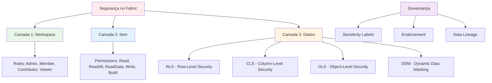
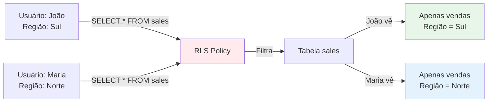

# 1.3 Configurar a segurança e a governança

A segurança e a governança são **pilares fundamentais** no Microsoft Fabric, garantindo que os dados sejam protegidos, que o acesso seja controlado de forma granular e que a qualidade, conformidade e confiabilidade dos dados sejam mantidas. O Fabric oferece um **modelo de segurança em camadas** que abrange desde o workspace até o nível granular de linhas e colunas, proporcionando controle total sobre quem pode acessar o quê.

## Visão Geral do Modelo de Segurança em Camadas



**Princípio Fundamental**: **Defesa em Profundidade** (Defense in Depth)
- Múltiplas camadas de segurança
- Princípio do menor privilégio
- Segregação de funções
- Auditoria e monitoramento

---

## 1. Controles de Acesso - Workspace Level

O acesso no Fabric é gerenciado através de **funções (roles)** em diferentes níveis. O primeiro nível é o **Workspace**.

### 1.1 Workspace Roles

| Role | Permissões | Quando Atribuir | Casos de Uso |
|------|-----------|-----------------|--------------|
| **Admin** | - Gerenciar workspace (configurações, delete)<br>- Gerenciar permissões de usuários<br>- Publicar e compartilhar conteúdo<br>- Criar, editar, deletar itens<br>- Executar notebooks/pipelines<br>- Configurar Git integration<br>- Configurar Deployment Pipelines | Líderes de projeto<br>Workspace owners<br>Data Engineering Leads | - Gerente de Data Engineering<br>- Tech Lead do projeto<br>- Administrador do workspace |
| **Member** | - Publicar e compartilhar conteúdo<br>- Criar, editar, deletar itens<br>- Executar notebooks/pipelines<br>- **NÃO pode** gerenciar permissões<br>- **NÃO pode** deletar workspace | Data Engineers<br>Desenvolvedores<br>Data Scientists | - Data Engineer sênior<br>- Desenvolvedor full-time<br>- Data Scientist que publica modelos |
| **Contributor** | - Criar, editar, deletar itens<br>- Executar notebooks/pipelines<br>- **NÃO pode** publicar/compartilhar<br>- **NÃO pode** gerenciar permissões | Data Engineers júnior<br>Desenvolvedores em treinamento | - Estagiário de Data Engineering<br>- Desenvolvedor júnior<br>- Colaborador externo (consultoria) |
| **Viewer** | - Visualizar conteúdo<br>- Executar relatórios<br>- **NÃO pode** editar<br>- **NÃO pode** criar novos itens | Analistas de BI<br>Stakeholders<br>Usuários de negócio | - Analista de negócios<br>- Gerente que consome dashboards<br>- Auditor (somente leitura) |

### 1.2 Diferenças Críticas: Member vs Contributor

**Questão Frequente no Exame**: Qual a diferença entre Member e Contributor?

| Capacidade | Member | Contributor |
|------------|--------|-------------|
| Criar itens | ✅ | ✅ |
| Editar itens | ✅ | ✅ |
| Deletar itens | ✅ | ✅ |
| Executar notebooks/pipelines | ✅ | ✅ |
| **Publicar conteúdo** | ✅ | ❌ |
| **Compartilhar itens** | ✅ | ❌ |
| **Criar Apps** | ✅ | ❌ |
| Gerenciar permissões | ❌ | ❌ |

**Regra Mnemônica**: 
- **Member** = Pode **M**ostrar (compartilhar) para outros
- **Contributor** = Apenas **C**ontribui (cria/edita), não compartilha

### 1.3 Atribuindo Workspace Roles

**Passos**:
1. Workspace Settings → Manage access
2. Add people or groups
3. Selecionar usuário/grupo do Azure AD
4. Escolher role
5. Add

**Exemplo**:
```
Workspace: Sales_Analytics_PROD
├── Admin: data-engineering-leads@company.com
├── Member: data-engineers@company.com (grupo)
├── Contributor: junior-engineers@company.com (grupo)
└── Viewer: business-analysts@company.com (grupo)
```

---

## 2. Controles de Acesso - Item Level

Além das funções do workspace, você pode compartilhar **itens individuais** (Lakehouse, Warehouse, Semantic Model, Report) com usuários específicos, concedendo permissões granulares.

### 2.1 Item Permissions

| Permission | Aplicável a | O que Permite | Quando Usar |
|------------|-------------|---------------|-------------|
| **Read** | Lakehouse, Warehouse | - Ler dados via SQL Endpoint<br>- Consultar tabelas<br>- **NÃO pode** acessar arquivos no OneLake | Analistas que precisam apenas consultar via SQL |
| **ReadAll** | Lakehouse | - Ler dados via SQL Endpoint<br>- **Acessar arquivos** no OneLake via Spark<br>- Ler todas as pastas e arquivos | Data Scientists que precisam acessar arquivos Parquet/Delta |
| **ReadData** | Lakehouse | - Ler dados via SQL Endpoint<br>- Acessar arquivos no OneLake<br>- Similar ao ReadAll | Usuários que precisam de acesso completo de leitura |
| **Write** | Lakehouse, Warehouse | - Todas as permissões de Read<br>- **Escrever dados** (INSERT, UPDATE, DELETE)<br>- Criar tabelas | Data Engineers que carregam dados |
| **Build** | Semantic Model, Lakehouse, Warehouse | - Criar relatórios do Power BI<br>- **NÃO pode** ler dados subjacentes<br>- Apenas usar o modelo semântico | Analistas de BI que criam relatórios mas não devem acessar dados brutos |

### 2.2 Matriz de Permissões - Lakehouse

| Ação | Viewer (Workspace) | Read (Item) | ReadAll (Item) | Write (Item) |
|------|-------------------|-------------|----------------|--------------|
| Ver item na lista | ✅ | ✅ | ✅ | ✅ |
| Consultar via SQL Endpoint | ❌ | ✅ | ✅ | ✅ |
| Acessar arquivos via Spark | ❌ | ❌ | ✅ | ✅ |
| Acessar via OneLake File Explorer | ❌ | ❌ | ✅ | ✅ |
| Escrever dados (INSERT/UPDATE) | ❌ | ❌ | ❌ | ✅ |
| Criar tabelas | ❌ | ❌ | ❌ | ✅ |
| Deletar tabelas | ❌ | ❌ | ❌ | ✅ |

### 2.3 Compartilhando Itens

**Cenário**: Compartilhar Lakehouse com analista de BI

**Passos**:
1. Lakehouse → Share
2. Add people: `analyst@company.com`
3. Selecionar permission: **Read**
4. Opcional: Notify via email
5. Grant access

**Resultado**: Analista pode consultar via SQL, mas não acessar arquivos no OneLake.

---

## 3. Segurança em Nível de Linha (RLS - Row-Level Security)

RLS **restringe o acesso a linhas específicas** em uma tabela com base na identidade do usuário que está executando a consulta. É o mecanismo de segurança **mais importante** para o exame DP-700.

### 3.1 Conceito de RLS



### 3.2 Implementando RLS - Passo a Passo

**Cenário**: Gerentes de vendas devem ver apenas vendas de sua região

#### Passo 1: Criar Tabela de Segurança

```sql
-- Tabela que mapeia usuários para regiões
CREATE TABLE dbo.UserRegionMapping
(
    UserEmail VARCHAR(200) NOT NULL,
    Region VARCHAR(50) NOT NULL,
    PRIMARY KEY (UserEmail, Region)
);

-- Inserir mapeamentos
INSERT INTO dbo.UserRegionMapping (UserEmail, Region) VALUES
('joao.silva@company.com', 'Sul'),
('maria.santos@company.com', 'Norte'),
('pedro.costa@company.com', 'Sudeste'),
('admin@company.com', 'ALL'); -- Admin vê tudo
```

#### Passo 2: Criar Função de Predicado de Filtro

```sql
-- Função que retorna 1 se o usuário pode ver a linha
CREATE FUNCTION dbo.fn_SecurityPredicateRegion(@Region AS VARCHAR(50))
RETURNS TABLE
WITH SCHEMABINDING
AS
RETURN
    SELECT 1 AS result
    WHERE
        -- Permitir se a região do usuário corresponde à região da linha
        @Region IN (
            SELECT Region 
            FROM dbo.UserRegionMapping 
            WHERE UserEmail = USER_NAME()
        )
        OR
        -- Permitir se o usuário tem acesso a TODAS as regiões
        EXISTS (
            SELECT 1 
            FROM dbo.UserRegionMapping 
            WHERE UserEmail = USER_NAME() 
            AND Region = 'ALL'
        );
GO
```

**Explicação**:
- `WITH SCHEMABINDING`: Obrigatório para RLS
- `USER_NAME()`: Retorna o email do usuário atual
- `@Region`: Parâmetro que vem da coluna da tabela
- Retorna `1` se o usuário pode ver a linha, caso contrário não retorna nada

#### Passo 3: Criar Política de Segurança

```sql
-- Criar política de segurança
CREATE SECURITY POLICY dbo.RegionSecurityPolicy
ADD FILTER PREDICATE dbo.fn_SecurityPredicateRegion(Region)
ON dbo.fact_sales
WITH (STATE = ON);
GO
```

**Parâmetros**:
- `FILTER PREDICATE`: Aplica filtro automaticamente em SELECT
- `ON dbo.fact_sales`: Tabela protegida
- `WITH (STATE = ON)`: Ativa a política imediatamente

#### Passo 4: Testar RLS

```sql
-- Como admin@company.com (vê tudo)
SELECT Region, COUNT(*) as TotalSales
FROM dbo.fact_sales
GROUP BY Region;

-- Resultado:
-- Region  | TotalSales
-- --------|------------
-- Sul     | 1500
-- Norte   | 2000
-- Sudeste | 1800

-- Como joao.silva@company.com (vê apenas Sul)
SELECT Region, COUNT(*) as TotalSales
FROM dbo.fact_sales
GROUP BY Region;

-- Resultado:
-- Region  | TotalSales
-- --------|------------
-- Sul     | 1500
```

### 3.3 RLS com Múltiplas Condições

**Cenário**: Filtrar por região E departamento

```sql
CREATE FUNCTION dbo.fn_SecurityPredicateRegionDept(
    @Region AS VARCHAR(50),
    @Department AS VARCHAR(50)
)
RETURNS TABLE
WITH SCHEMABINDING
AS
RETURN
    SELECT 1 AS result
    WHERE
        EXISTS (
            SELECT 1 
            FROM dbo.UserAccessMapping 
            WHERE UserEmail = USER_NAME()
            AND (Region = @Region OR Region = 'ALL')
            AND (Department = @Department OR Department = 'ALL')
        );
GO

CREATE SECURITY POLICY dbo.RegionDeptSecurityPolicy
ADD FILTER PREDICATE dbo.fn_SecurityPredicateRegionDept(Region, Department)
ON dbo.fact_sales
WITH (STATE = ON);
```

### 3.4 RLS - Block Predicate

**FILTER PREDICATE** vs **BLOCK PREDICATE**:

| Tipo | Quando Aplica | Operações Afetadas |
|------|---------------|-------------------|
| **FILTER PREDICATE** | Leitura (SELECT) | SELECT |
| **BLOCK PREDICATE** | Escrita (INSERT, UPDATE, DELETE) | INSERT, UPDATE, DELETE |

**Exemplo de BLOCK PREDICATE**:

```sql
-- Impedir que usuários insiram dados de outras regiões
CREATE SECURITY POLICY dbo.RegionSecurityPolicy
ADD FILTER PREDICATE dbo.fn_SecurityPredicateRegion(Region)
ON dbo.fact_sales,
ADD BLOCK PREDICATE dbo.fn_SecurityPredicateRegion(Region)
ON dbo.fact_sales AFTER INSERT,
ADD BLOCK PREDICATE dbo.fn_SecurityPredicateRegion(Region)
ON dbo.fact_sales AFTER UPDATE
WITH (STATE = ON);
```

**Resultado**: Usuário `joao.silva@company.com` (região Sul) não consegue inserir vendas da região Norte.

### 3.5 Gerenciando Políticas de RLS

```sql
-- Desabilitar política temporariamente
ALTER SECURITY POLICY dbo.RegionSecurityPolicy
WITH (STATE = OFF);

-- Reabilitar política
ALTER SECURITY POLICY dbo.RegionSecurityPolicy
WITH (STATE = ON);

-- Remover predicado
ALTER SECURITY POLICY dbo.RegionSecurityPolicy
DROP FILTER PREDICATE ON dbo.fact_sales;

-- Deletar política
DROP SECURITY POLICY dbo.RegionSecurityPolicy;

-- Deletar função
DROP FUNCTION dbo.fn_SecurityPredicateRegion;
```

### 3.6 Limitações do RLS

⚠️ **IMPORTANTE para o Exame**:

| Limitação | Descrição | Workaround |
|-----------|-----------|------------|
| **Não se aplica a Spark** | RLS funciona apenas no SQL Endpoint | Usar ACLs do OneLake para arquivos |
| **Performance** | Pode impactar queries complexas | Otimizar função de predicado, usar índices |
| **Não funciona para Admins do Workspace** | Admins veem tudo | Usar conta de serviço separada |
| **Complexidade de debug** | Difícil debugar quando usuário não vê dados esperados | Criar função de teste que mostra o filtro aplicado |

---

## 4. Segurança em Nível de Coluna (CLS - Column-Level Security)

CLS **impede que usuários acessem colunas específicas** de uma tabela. É mais simples que RLS.

### 4.1 Implementando CLS

**Cenário**: Ocultar coluna `Salary` de analistas

```sql
-- Criar role para analistas
CREATE ROLE AnalystRole;

-- Adicionar usuários ao role
ALTER ROLE AnalystRole ADD MEMBER [analyst1@company.com];
ALTER ROLE AnalystRole ADD MEMBER [analyst2@company.com];

-- Conceder SELECT em todas as colunas EXCETO Salary
GRANT SELECT ON dbo.dim_employee 
    (EmployeeID, EmployeeName, Department, HireDate, ManagerID) 
TO AnalystRole;

-- Explicitamente NEGAR acesso à coluna Salary
DENY SELECT ON dbo.dim_employee (Salary) TO AnalystRole;
```

**Resultado**:
```sql
-- Como analista
SELECT * FROM dbo.dim_employee;

-- Erro:
-- The SELECT permission was denied on the column 'Salary' 
-- of the object 'dim_employee', database 'SalesWarehouse'.
```

### 4.2 CLS com GRANT Seletivo

**Abordagem Alternativa**: Conceder acesso apenas às colunas permitidas

```sql
-- Revogar acesso total
REVOKE SELECT ON dbo.dim_employee TO AnalystRole;

-- Conceder acesso apenas a colunas específicas
GRANT SELECT ON dbo.dim_employee 
    (EmployeeID, EmployeeName, Department, HireDate) 
TO AnalystRole;
```

### 4.3 CLS para Múltiplas Colunas Sensíveis

```sql
-- Tabela de clientes com dados sensíveis
CREATE TABLE dbo.dim_customer
(
    CustomerID INT PRIMARY KEY,
    CustomerName VARCHAR(200),
    Email VARCHAR(200),          -- Sensível
    Phone VARCHAR(20),            -- Sensível
    SSN VARCHAR(11),              -- Muito sensível
    Address VARCHAR(500),
    City VARCHAR(100),
    State VARCHAR(50)
);

-- Role para analistas de marketing (podem ver email, não podem ver SSN/Phone)
CREATE ROLE MarketingAnalystRole;

GRANT SELECT ON dbo.dim_customer 
    (CustomerID, CustomerName, Email, Address, City, State) 
TO MarketingAnalystRole;

DENY SELECT ON dbo.dim_customer (Phone, SSN) TO MarketingAnalystRole;

-- Role para RH (podem ver tudo)
CREATE ROLE HRRole;

GRANT SELECT ON dbo.dim_customer TO HRRole;
```

### 4.4 Verificando Permissões de Coluna

```sql
-- Ver permissões de coluna para um usuário
SELECT 
    OBJECT_NAME(major_id) AS TableName,
    COL_NAME(major_id, minor_id) AS ColumnName,
    permission_name,
    state_desc
FROM sys.database_permissions
WHERE grantee_principal_id = USER_ID('analyst1@company.com')
AND minor_id <> 0; -- minor_id <> 0 indica permissão de coluna
```

---

## 5. Segurança em Nível de Objeto (OLS - Object-Level Security)

OLS **controla o acesso a objetos inteiros** (tabelas, views, stored procedures). Se um usuário não tiver permissão `SELECT` em uma tabela, ela será **invisível** para ele.

### 5.1 Implementando OLS

```sql
-- Criar schema para segregar objetos
CREATE SCHEMA Finance AUTHORIZATION dbo;
CREATE SCHEMA Sales AUTHORIZATION dbo;

-- Mover tabelas para schemas
ALTER SCHEMA Finance TRANSFER dbo.fact_revenue;
ALTER SCHEMA Sales TRANSFER dbo.fact_sales;

-- Criar roles por departamento
CREATE ROLE FinanceRole;
CREATE ROLE SalesRole;

-- Conceder acesso ao schema Finance apenas para FinanceRole
GRANT SELECT ON SCHEMA::Finance TO FinanceRole;
DENY SELECT ON SCHEMA::Finance TO SalesRole;

-- Conceder acesso ao schema Sales apenas para SalesRole
GRANT SELECT ON SCHEMA::Sales TO SalesRole;
DENY SELECT ON SCHEMA::Sales TO FinanceRole;
```

**Resultado**:
- Usuários do `FinanceRole` veem apenas tabelas do schema `Finance`
- Usuários do `SalesRole` veem apenas tabelas do schema `Sales`

### 5.2 OLS com Views Seguras

**Padrão Comum**: Criar views que expõem apenas dados permitidos

```sql
-- View para analistas (sem colunas sensíveis)
CREATE VIEW Sales.vw_SalesForAnalysts
AS
SELECT 
    SaleID,
    ProductID,
    CustomerID,
    SaleDate,
    Quantity,
    -- Não incluir: UnitPrice, TotalAmount (sensível)
    Region
FROM Sales.fact_sales;

-- Conceder acesso à view, não à tabela base
GRANT SELECT ON Sales.vw_SalesForAnalysts TO AnalystRole;
DENY SELECT ON Sales.fact_sales TO AnalystRole;
```

---

## 6. Máscara Dinâmica de Dados (DDM - Dynamic Data Masking)

DDM **limita a exposição de dados confidenciais**, mascarando-os para usuários não privilegiados, **sem alterar os dados reais** no banco de dados.

### 6.1 Funções de Mascaramento

| Função | Sintaxe | Exemplo Original | Exemplo Mascarado | Quando Usar |
|--------|---------|------------------|-------------------|-------------|
| **default()** | `MASKED WITH (FUNCTION = 'default()')` | `123-45-6789` | `XXXX` | Mascarar completamente |
| **email()** | `MASKED WITH (FUNCTION = 'email()')` | `john.doe@example.com` | `jXXX@XXXX.com` | E-mails |
| **partial()** | `MASKED WITH (FUNCTION = 'partial(1,"XXX",2)')` | `555-1234` | `5XXX34` | Números de telefone, CPF |
| **random()** | `MASKED WITH (FUNCTION = 'random(1000, 9999)')` | `5000` | `7234` (aleatório) | Valores numéricos |

### 6.2 Implementando DDM

#### Exemplo 1: Mascarar CPF

```sql
-- Criar tabela com máscara
CREATE TABLE dbo.dim_customer
(
    CustomerID INT PRIMARY KEY,
    CustomerName VARCHAR(200),
    Email VARCHAR(200) MASKED WITH (FUNCTION = 'email()'),
    Phone VARCHAR(20) MASKED WITH (FUNCTION = 'partial(2,"XXX-XXX",2)'),
    SSN VARCHAR(11) MASKED WITH (FUNCTION = 'partial(0,"XXX-XX-",4)'),
    CreditCardNumber VARCHAR(16) MASKED WITH (FUNCTION = 'partial(4,"XXXX-XXXX-",4)')
);

-- Inserir dados
INSERT INTO dbo.dim_customer VALUES
(1, 'João Silva', 'joao.silva@example.com', '11-98765-4321', '123-45-6789', '1234567890123456');
```

**Resultado para usuário SEM permissão UNMASK**:
```sql
SELECT * FROM dbo.dim_customer;

-- CustomerID | CustomerName | Email              | Phone         | SSN          | CreditCardNumber
-- -----------|--------------|--------------------|--------------|--------------|-----------------
-- 1          | João Silva   | jXXX@XXXX.com      | 11XXX-XX21   | XXX-XX-6789  | 1234XXXX-XXXX3456
```

**Resultado para usuário COM permissão UNMASK**:
```sql
SELECT * FROM dbo.dim_customer;

-- CustomerID | CustomerName | Email                  | Phone         | SSN         | CreditCardNumber
-- -----------|--------------|------------------------|--------------|-------------|------------------
-- 1          | João Silva   | joao.silva@example.com | 11-98765-4321| 123-45-6789 | 1234567890123456
```

#### Exemplo 2: Mascarar Salário com random()

```sql
ALTER TABLE dbo.dim_employee
ALTER COLUMN Salary ADD MASKED WITH (FUNCTION = 'random(30000, 150000)');
```

**Resultado**: Usuários sem UNMASK veem salário aleatório entre 30.000 e 150.000.

### 6.3 Concedendo Permissão UNMASK

```sql
-- Conceder permissão para ver dados não mascarados
GRANT UNMASK TO HRRole;
GRANT UNMASK TO [admin@company.com];

-- Revogar permissão
REVOKE UNMASK FROM AnalystRole;
```

### 6.4 Adicionando/Removendo Máscaras

```sql
-- Adicionar máscara a coluna existente
ALTER TABLE dbo.dim_customer
ALTER COLUMN Email ADD MASKED WITH (FUNCTION = 'email()');

-- Modificar máscara existente
ALTER TABLE dbo.dim_customer
ALTER COLUMN Phone ALTER MASKED WITH (FUNCTION = 'default()');

-- Remover máscara
ALTER TABLE dbo.dim_customer
ALTER COLUMN Email DROP MASKED;
```

### 6.5 Verificando Máscaras Aplicadas

```sql
-- Listar todas as colunas com máscaras
SELECT 
    SCHEMA_NAME(t.schema_id) AS SchemaName,
    t.name AS TableName,
    c.name AS ColumnName,
    c.masking_function
FROM sys.masked_columns AS c
JOIN sys.tables AS t ON c.object_id = t.object_id
WHERE c.is_masked = 1;
```

---

## 7. Rótulos de Confidencialidade (Sensitivity Labels)

Integrados com o **Microsoft Purview**, esses rótulos classificam os dados com base em sua sensibilidade e podem impor políticas de proteção.

### 7.1 Níveis de Confidencialidade

| Nível | Quando Usar | Políticas Típicas |
|-------|-------------|-------------------|
| **Public** | Dados públicos | Sem restrições |
| **General** | Dados internos não sensíveis | Compartilhamento interno permitido |
| **Confidential** | Dados sensíveis do negócio | Requer autenticação, não pode exportar |
| **Highly Confidential** | Dados muito sensíveis (PII, financeiro) | Criptografia obrigatória, auditoria, DLP |

### 7.2 Aplicando Sensitivity Labels

**Pré-requisitos**:
- Microsoft Purview configurado
- Labels criados no Purview Compliance Center

**Passos**:
1. Item (Lakehouse, Warehouse, Report) → Settings
2. Sensitivity → Select label
3. Escolher: "Highly Confidential"
4. Apply

**Efeitos**:
- Label visível no item
- Políticas de proteção aplicadas (ex: impedir download)
- Auditoria de acesso
- Data Loss Prevention (DLP)

---

## 8. Endosso (Endorsement)

É um **selo de qualidade** para os itens do Fabric, ajudando usuários a encontrar e confiar nos dados corretos.

### 8.1 Tipos de Endosso

| Tipo | Significado | Quem Pode Atribuir | Quando Usar |
|------|-------------|-------------------|-------------|
| **None** | Sem endosso | - | Itens em desenvolvimento |
| **Promoted** | Alta qualidade, pronto para compartilhar | Workspace Member ou superior | Datasets validados pela equipe |
| **Certified** | Autoritativo, validado pela governança | Apenas usuários autorizados (configurado pelo Admin) | Datasets oficiais da empresa |

### 8.2 Configurando Endorsement

**Promoted**:
1. Item → Settings → Endorsement
2. Select: "Promoted"
3. Save

**Certified**:
1. Admin deve habilitar certificação no tenant
2. Admin Portal → Tenant settings → Certification
3. Enable certification
4. Specify certifiers (grupo de segurança)
5. Certifiers podem então certificar itens

**Exemplo de Uso**:
```
Semantic Model: "Sales_Official_Dataset"
├── Endorsement: Certified
├── Certified by: data-governance-team@company.com
└── Description: "Modelo oficial de vendas, validado pela governança"
```

---

## 9. Segurança do OneLake

A segurança no OneLake pode ser definida de forma granular para controlar o acesso aos dados diretamente no data lake.

### 9.1 OneLake Data Access Roles

| Role | Permissões | Quando Usar |
|------|-----------|-------------|
| **Read** | Ler arquivos e pastas | Usuários que precisam apenas ler dados |
| **Write** | Ler e escrever arquivos | Data Engineers que carregam dados |

### 9.2 Configurando ACLs no OneLake

**Via OneLake File Explorer**:

1. Instalar OneLake File Explorer
2. Navegar para pasta específica
3. Right-click → Properties → Security
4. Add user/group
5. Set permissions (Read, Write, Execute)

**Exemplo de Estrutura de Permissões**:
```
Lakehouse: Sales_Data
├── Files/
│   ├── bronze/
│   │   └── ACL: DataEngineers (RWX), Analysts (---)
│   ├── silver/
│   │   └── ACL: DataEngineers (RWX), Analysts (R-X)
│   └── gold/
│       └── ACL: DataEngineers (RWX), Analysts (R-X), Business (R-X)
```

### 9.3 OneLake Security vs SQL Endpoint Security

| Aspecto | OneLake (Arquivos) | SQL Endpoint (Tabelas) |
|---------|-------------------|----------------------|
| **Mecanismo** | ACLs POSIX (rwx) | RLS, CLS, OLS, DDM |
| **Granularidade** | Pasta/Arquivo | Linha/Coluna |
| **Acesso via** | Spark, OneLake File Explorer | SQL queries |
| **Quando usar** | Controlar acesso a arquivos brutos | Controlar acesso a dados estruturados |

**⚠️ IMPORTANTE**: RLS aplicado no SQL Endpoint **NÃO se aplica** a arquivos acessados via Spark. Use ACLs do OneLake para proteger arquivos.

---

## 10. Cenários Práticos de Implementação

### Cenário 1: Implementação Completa de Segurança Multi-Camada

**Requisito**: Empresa com 3 departamentos (Vendas, Marketing, Finanças) precisa de segregação completa de dados.

**Solução**:

```sql
-- 1. Criar schemas por departamento
CREATE SCHEMA Sales AUTHORIZATION dbo;
CREATE SCHEMA Marketing AUTHORIZATION dbo;
CREATE SCHEMA Finance AUTHORIZATION dbo;

-- 2. Criar roles
CREATE ROLE SalesRole;
CREATE ROLE MarketingRole;
CREATE ROLE FinanceRole;
CREATE ROLE ExecutiveRole; -- Vê tudo

-- 3. Criar tabela de mapeamento para RLS
CREATE TABLE dbo.UserDepartmentMapping
(
    UserEmail VARCHAR(200) PRIMARY KEY,
    Department VARCHAR(50) NOT NULL
);

INSERT INTO dbo.UserDepartmentMapping VALUES
('sales.user@company.com', 'Sales'),
('marketing.user@company.com', 'Marketing'),
('finance.user@company.com', 'Finance'),
('ceo@company.com', 'ALL');

-- 4. Implementar RLS
CREATE FUNCTION dbo.fn_DepartmentSecurity(@Department AS VARCHAR(50))
RETURNS TABLE
WITH SCHEMABINDING
AS
RETURN
    SELECT 1 AS result
    WHERE
        @Department IN (
            SELECT Department 
            FROM dbo.UserDepartmentMapping 
            WHERE UserEmail = USER_NAME()
        )
        OR EXISTS (
            SELECT 1 
            FROM dbo.UserDepartmentMapping 
            WHERE UserEmail = USER_NAME() AND Department = 'ALL'
        );
GO

-- 5. Aplicar RLS em tabelas
CREATE SECURITY POLICY dbo.DepartmentSecurityPolicy
ADD FILTER PREDICATE dbo.fn_DepartmentSecurity(Department)
ON Sales.fact_sales,
ADD FILTER PREDICATE dbo.fn_DepartmentSecurity(Department)
ON Marketing.fact_campaigns,
ADD FILTER PREDICATE dbo.fn_DepartmentSecurity(Department)
ON Finance.fact_revenue
WITH (STATE = ON);

-- 6. Implementar CLS para dados sensíveis
-- Ocultar margem de lucro de usuários de vendas
DENY SELECT ON Finance.fact_revenue (ProfitMargin, Cost) TO SalesRole;

-- 7. Implementar DDM
ALTER TABLE Sales.dim_customer
ALTER COLUMN Email ADD MASKED WITH (FUNCTION = 'email()');

ALTER TABLE Sales.dim_customer
ALTER COLUMN Phone ADD MASKED WITH (FUNCTION = 'partial(2,"XXX-XXX",2)');

-- 8. Conceder UNMASK apenas para gerentes
GRANT UNMASK TO ExecutiveRole;

-- 9. Configurar OLS (acesso a schemas)
GRANT SELECT ON SCHEMA::Sales TO SalesRole;
GRANT SELECT ON SCHEMA::Marketing TO MarketingRole;
GRANT SELECT ON SCHEMA::Finance TO FinanceRole;
GRANT SELECT ON SCHEMA::Sales TO ExecutiveRole;
GRANT SELECT ON SCHEMA::Marketing TO ExecutiveRole;
GRANT SELECT ON SCHEMA::Finance TO ExecutiveRole;
```

### Cenário 2: Segurança para Ambiente de Analytics Self-Service

**Requisito**: Analistas podem criar relatórios, mas não podem ver dados brutos sensíveis.

**Solução**:

```sql
-- 1. Criar Semantic Model com RLS embutido
-- (configurado no Power BI Desktop)

-- 2. Compartilhar Semantic Model com permissão Build
-- Workspace → Semantic Model → Share → Build permission

-- 3. Criar views agregadas (sem dados sensíveis)
CREATE VIEW Sales.vw_SalesSummary
AS
SELECT 
    ProductID,
    Region,
    YEAR(SaleDate) AS SaleYear,
    MONTH(SaleDate) AS SaleMonth,
    SUM(Quantity) AS TotalQuantity,
    -- Não incluir: CustomerID, UnitPrice (sensível)
    COUNT(DISTINCT SaleID) AS TotalTransactions
FROM Sales.fact_sales
GROUP BY ProductID, Region, YEAR(SaleDate), MONTH(SaleDate);

-- 4. Conceder acesso apenas à view
GRANT SELECT ON Sales.vw_SalesSummary TO AnalystRole;
DENY SELECT ON Sales.fact_sales TO AnalystRole;
```

**Resultado**: Analistas criam relatórios usando o Semantic Model (com Build permission) ou consultam views agregadas, mas nunca acessam dados brutos.

---

## 11. Best Practices - Segurança e Governança

### ✅ Segurança

1. **Princípio do Menor Privilégio**:
   - Sempre atribua a menor permissão necessária
   - Use Viewer sempre que possível
   - Evite Admin desnecessário

2. **Defesa em Profundidade**:
   - Workspace Role + Item Permission + RLS/CLS
   - Múltiplas camadas de proteção

3. **Segregação de Funções**:
   - Desenvolvedores: Contributor em DEV
   - Analistas: Viewer em PROD
   - Admins: Apenas para gerenciamento

4. **Auditoria**:
   - Habilite logs de auditoria
   - Revise permissões trimestralmente
   - Monitore acessos anômalos

### ✅ Governança

1. **Sensitivity Labels**:
   - Classifique todos os datasets
   - Use labels consistentemente
   - Integre com Purview

2. **Endorsement**:
   - Promova datasets validados
   - Certifique apenas datasets oficiais
   - Documente critérios de certificação

3. **Documentação**:
   - Documente políticas de RLS
   - Mantenha inventário de permissões
   - Crie runbooks de segurança

### ✅ Performance

1. **RLS**:
   - Otimize funções de predicado
   - Use índices em colunas de filtro
   - Evite funções complexas

2. **CLS**:
   - Prefira GRANT seletivo a DENY
   - Minimize número de colunas mascaradas

3. **DDM**:
   - Use com moderação (impacto mínimo)
   - Combine com CLS quando apropriado

---

## 12. Matriz de Decisão - Qual Mecanismo Usar?

| Requisito | Mecanismo Recomendado | Justificativa |
|-----------|----------------------|---------------|
| Filtrar linhas por usuário | **RLS** | Controle granular de linhas |
| Ocultar colunas sensíveis | **CLS** | Simples e efetivo |
| Mascarar dados (mostrar parcialmente) | **DDM** | Dados visíveis mas protegidos |
| Ocultar tabelas inteiras | **OLS** | Segregação por schema |
| Proteger arquivos no OneLake | **OneLake ACLs** | Controle de acesso a arquivos |
| Classificar sensibilidade | **Sensitivity Labels** | Governança e compliance |
| Marcar qualidade | **Endorsement** | Confiabilidade |
| Analistas criarem relatórios sem ver dados | **Build Permission** | Acesso ao modelo, não aos dados |

---

## Referências e Recursos

### Documentação Oficial

1. [Security in Microsoft Fabric](https://learn.microsoft.com/fabric/security/security-overview)
2. [Row-Level Security (RLS)](https://learn.microsoft.com/fabric/data-warehouse/row-level-security)
3. [Column-Level Security (CLS)](https://learn.microsoft.com/sql/relational-databases/security/column-level-security)
4. [Dynamic Data Masking (DDM)](https://learn.microsoft.com/fabric/data-warehouse/dynamic-data-masking)
5. [Workspace Roles](https://learn.microsoft.com/fabric/get-started/roles-workspaces)
6. [OneLake Security](https://learn.microsoft.com/fabric/onelake/onelake-security)
7. [Guia de Estudo DP-700](https://learn.microsoft.com/credentials/certifications/resources/study-guides/dp-700)

---

## Pontos-Chave para o Exame DP-700

🎯 **Memorize**:
- **Workspace Roles**: Admin > Member > Contributor > Viewer
- **Member vs Contributor**: Member pode publicar/compartilhar, Contributor não
- **Item Permissions**: Read, ReadAll, ReadData, Write, Build
- **Build Permission**: Criar relatórios SEM acessar dados subjacentes
- **RLS**: Filtra linhas, usa função de predicado + política de segurança
- **CLS**: Oculta colunas, usa GRANT/DENY
- **OLS**: Oculta tabelas inteiras, usa schemas
- **DDM**: Mascara dados, funções: default(), email(), partial(), random()
- **UNMASK**: Permissão para ver dados não mascarados
- **Sensitivity Labels**: Classificação de dados (Purview)
- **Endorsement**: Promoted (qualquer Member) vs Certified (apenas autorizados)
- **RLS NÃO funciona via Spark**: Usar OneLake ACLs para arquivos

🎯 **Entenda**:
- Quando usar cada mecanismo de segurança
- Como combinar múltiplas camadas (Workspace + Item + RLS)
- Diferença entre FILTER PREDICATE e BLOCK PREDICATE
- Limitações do RLS (não funciona via Spark)
- Como implementar RLS passo a passo
- Diferença entre Read e ReadAll para Lakehouse
- Quando usar Build permission
- Como OneLake ACLs complementam RLS

