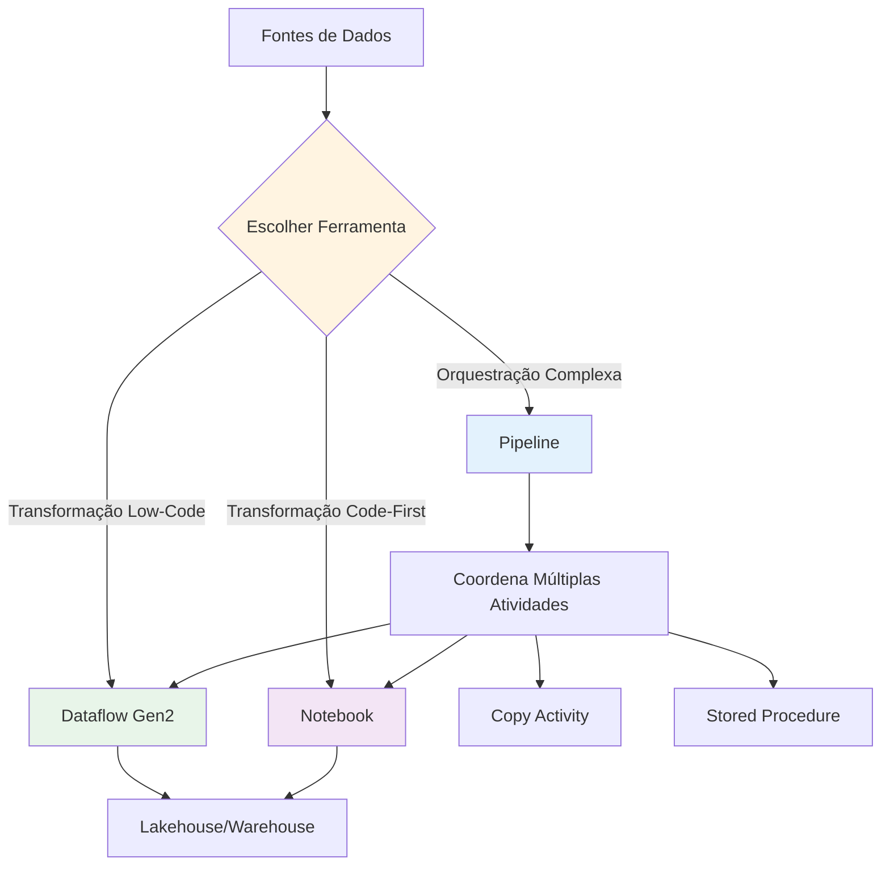
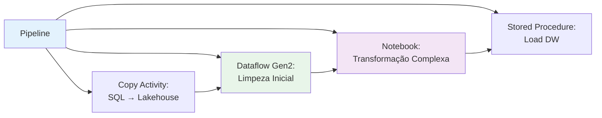
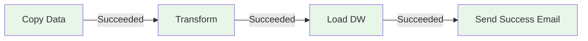
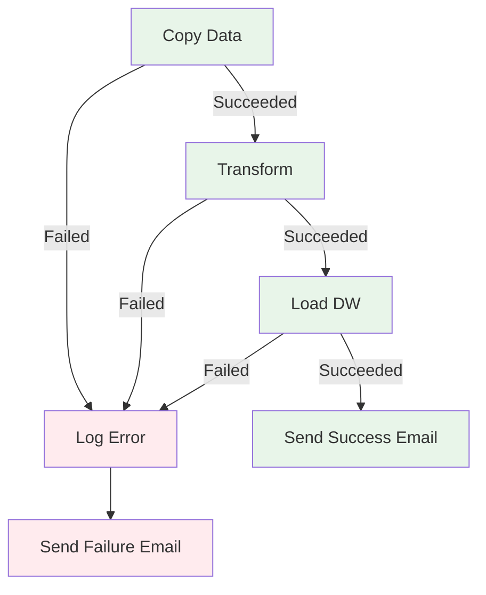
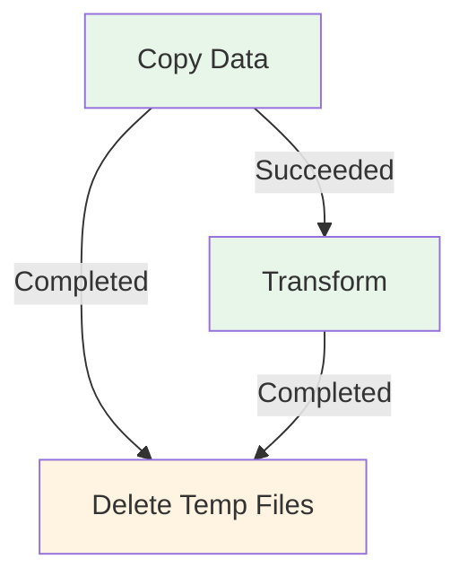
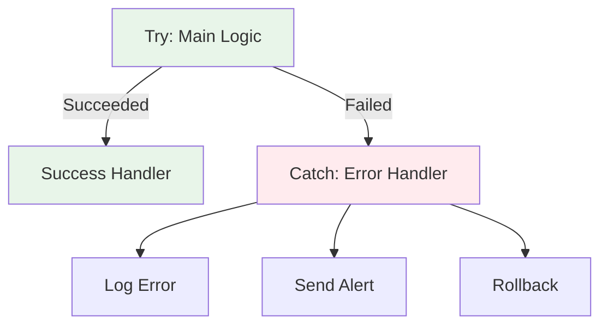
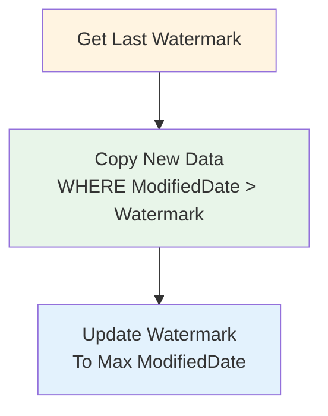

# 1.4 Orquestrar processos

A orquestração de processos no Microsoft Fabric refere-se à **automação, sequenciamento e gerenciamento de ponta a ponta** das tarefas de engenharia de dados. Um pipeline de dados bem orquestrado garante que os dados sejam ingeridos, transformados e disponibilizados para análise de forma confiável, eficiente, escalável e no tempo certo. O Fabric oferece várias ferramentas poderosas para construir e gerenciar esses fluxos de trabalho complexos.

## Visão Geral da Orquestração no Fabric



---

## 1. Escolhendo entre Dataflow Gen2, Pipeline e Notebook

A escolha da ferramenta de orquestração correta é **crítica** para o sucesso do projeto e depende da natureza da tarefa, complexidade da transformação e preferência de desenvolvimento.

### 1.1 Comparação Detalhada

| Aspecto | Dataflow Gen2 | Pipeline | Notebook |
|---------|---------------|----------|----------|
| **Abordagem** | Low-Code (Visual) | Orquestração (Visual + Code) | Code-First (PySpark, SQL, Scala) |
| **Interface** | Power Query Online | Pipeline Designer | Notebook Editor |
| **Linguagem** | Power Query M | Expressões JSON | PySpark, Spark SQL, Scala, R |
| **Melhor para** | Transformações simples a médias | Orquestração de múltiplas atividades | Transformações complexas, ML |
| **Complexidade** | Baixa a Média | Média a Alta | Alta |
| **Curva de Aprendizado** | Baixa | Média | Alta |
| **Performance** | Boa para datasets pequenos/médios | N/A (orquestra outras ferramentas) | Excelente (Spark distribuído) |
| **Destinos** | Lakehouse, Warehouse | N/A (executa atividades) | Lakehouse, Warehouse, OneLake |
| **Parametrização** | Sim (parâmetros do Dataflow) | Sim (parâmetros do Pipeline) | Sim (widgets, argumentos) |
| **Agendamento** | Sim (refresh schedule) | Sim (triggers) | Via Pipeline |
| **Debugging** | Query diagnostics | Pipeline run history | Spark UI, logs |

### 1.2 Quando Usar Cada Ferramenta

#### Dataflow Gen2

**✅ Use quando**:
- Transformações podem ser feitas com Power Query M
- Equipe prefere interface visual
- Dados cabem em memória (< 1 GB recomendado)
- Transformações são ETL padrão (filtros, joins, agregações)
- Precisa de query folding para performance

**❌ Evite quando**:
- Dados muito grandes (> 10 GB)
- Transformações complexas que requerem código customizado
- Precisa de controle fino sobre particionamento Spark
- Lógica de negócio muito complexa

**Exemplo de Uso**:
```
Cenário: Limpar e transformar dados de vendas de um arquivo CSV
Ferramenta: Dataflow Gen2
Razão: Transformações simples (remover duplicatas, filtrar, agregar)
```

#### Pipeline

**✅ Use quando**:
- Precisa orquestrar múltiplas atividades
- Workflow tem dependências complexas
- Precisa copiar dados de/para múltiplas fontes
- Combina diferentes tipos de processamento (Dataflow + Notebook + SP)
- Precisa de error handling e retry logic
- Workflow tem condicionais e loops

**❌ Evite quando**:
- Apenas uma transformação simples (use Dataflow ou Notebook direto)
- Não precisa de orquestração

**Exemplo de Uso**:
```
Cenário: Pipeline de ETL completo
1. Copiar dados de SQL Server para Lakehouse
2. Executar notebook para transformação
3. Executar stored procedure para carregar DW
4. Enviar notificação de sucesso/falha
Ferramenta: Pipeline
Razão: Múltiplas atividades com dependências
```

#### Notebook

**✅ Use quando**:
- Transformações complexas que requerem código
- Dados muito grandes (TB+)
- Precisa de controle fino sobre Spark
- Machine Learning / Data Science
- Lógica de negócio customizada
- Precisa de otimizações específicas (partitioning, caching)

**❌ Evite quando**:
- Transformações simples que podem ser feitas no Dataflow
- Equipe não tem experiência com Spark/Python

**Exemplo de Uso**:
```
Cenário: Implementar SCD Tipo 2 em dimensão de clientes
Ferramenta: Notebook (PySpark)
Razão: Lógica complexa de merge, controle fino sobre Delta Lake
```

### 1.3 Padrão Combinado (Recomendado)

**Melhor Prática**: Combinar as três ferramentas



---

## 2. Pipelines - Componentes e Atividades

### 2.1 Anatomia de um Pipeline

```
Pipeline: Daily_Sales_ETL
├── Parameters
│   ├── ProcessDate (String)
│   ├── SourcePath (String)
│   └── Environment (String)
├── Variables
│   ├── RowCount (Integer)
│   └── ErrorMessage (String)
└── Activities
    ├── Copy Data (Source → Lakehouse)
    ├── Notebook (Transform Data)
    ├── If Condition (Check Row Count)
    ├── Stored Procedure (Load DW)
    └── Web (Send Notification)
```

### 2.2 Atividades de Pipeline

#### Atividades de Movimentação de Dados

| Atividade | Descrição | Quando Usar |
|-----------|-----------|-------------|
| **Copy Data** | Copia dados de origem para destino | Ingestão de dados de fontes externas |
| **Delete** | Deleta arquivos/pastas | Limpeza de dados temporários |

#### Atividades de Transformação

| Atividade | Descrição | Quando Usar |
|-----------|-----------|-------------|
| **Dataflow** | Executa Dataflow Gen2 | Transformações low-code |
| **Notebook** | Executa notebook Spark | Transformações code-first |
| **Stored Procedure** | Executa SP no Warehouse | Lógica SQL no DW |

#### Atividades de Controle de Fluxo

| Atividade | Descrição | Quando Usar |
|-----------|-----------|-------------|
| **If Condition** | Execução condicional | Lógica if-then-else |
| **Switch** | Múltiplas condições | Lógica switch-case |
| **For Each** | Loop sobre array | Processar múltiplos arquivos |
| **Until** | Loop até condição | Retry até sucesso |
| **Wait** | Pausa execução | Aguardar processo externo |
| **Set Variable** | Define valor de variável | Armazenar valores intermediários |
| **Append Variable** | Adiciona a array | Coletar resultados |

#### Atividades de Integração

| Atividade | Descrição | Quando Usar |
|-----------|-----------|-------------|
| **Web** | Chama API REST | Notificações, integrações |
| **Webhook** | Chama webhook | Integração com sistemas externos |
| **Script** | Executa script (Python, PowerShell) | Automações customizadas |

### 2.3 Exemplo de Pipeline Completo

```json
{
  "name": "Daily_Sales_ETL_Pipeline",
  "properties": {
    "activities": [
      {
        "name": "Copy_Sales_Data",
        "type": "Copy",
        "inputs": [
          {
            "referenceName": "SQL_Server_Sales",
            "type": "DatasetReference"
          }
        ],
        "outputs": [
          {
            "referenceName": "Lakehouse_Bronze_Sales",
            "type": "DatasetReference"
          }
        ],
        "typeProperties": {
          "source": {
            "type": "SqlServerSource",
            "sqlReaderQuery": "SELECT * FROM Sales WHERE SaleDate = '@{pipeline().parameters.ProcessDate}'"
          },
          "sink": {
            "type": "LakehouseSink",
            "writeBehavior": "Append"
          }
        }
      },
      {
        "name": "Transform_Sales_Notebook",
        "type": "Notebook",
        "dependsOn": [
          {
            "activity": "Copy_Sales_Data",
            "dependencyConditions": ["Succeeded"]
          }
        ],
        "typeProperties": {
          "notebookPath": "/Notebooks/Transform_Sales",
          "parameters": {
            "process_date": {
              "value": "@pipeline().parameters.ProcessDate",
              "type": "String"
            }
          }
        }
      },
      {
        "name": "Load_DW_StoredProc",
        "type": "SqlServerStoredProcedure",
        "dependsOn": [
          {
            "activity": "Transform_Sales_Notebook",
            "dependencyConditions": ["Succeeded"]
          }
        ],
        "typeProperties": {
          "storedProcedureName": "sp_Load_Fact_Sales",
          "storedProcedureParameters": {
            "ProcessDate": {
              "value": "@pipeline().parameters.ProcessDate",
              "type": "String"
            }
          }
        }
      },
      {
        "name": "Send_Success_Notification",
        "type": "Web",
        "dependsOn": [
          {
            "activity": "Load_DW_StoredProc",
            "dependencyConditions": ["Succeeded"]
          }
        ],
        "typeProperties": {
          "url": "https://hooks.slack.com/services/YOUR/WEBHOOK/URL",
          "method": "POST",
          "body": {
            "text": "Pipeline Daily_Sales_ETL completed successfully for @{pipeline().parameters.ProcessDate}"
          }
        }
      },
      {
        "name": "Send_Failure_Notification",
        "type": "Web",
        "dependsOn": [
          {
            "activity": "Load_DW_StoredProc",
            "dependencyConditions": ["Failed"]
          }
        ],
        "typeProperties": {
          "url": "https://hooks.slack.com/services/YOUR/WEBHOOK/URL",
          "method": "POST",
          "body": {
            "text": "❌ Pipeline Daily_Sales_ETL FAILED for @{pipeline().parameters.ProcessDate}. Error: @{activity('Load_DW_StoredProc').error.message}"
          }
        }
      }
    ],
    "parameters": {
      "ProcessDate": {
        "type": "String",
        "defaultValue": "@formatDateTime(utcnow(), 'yyyy-MM-dd')"
      }
    }
  }
}
```

---

## 3. Parâmetros e Variáveis

### 3.1 Parâmetros de Pipeline

**Definição**: Valores passados para o pipeline em tempo de execução.

**Quando usar**: Tornar pipelines reutilizáveis.

**Tipos Suportados**:
- String
- Int
- Float
- Bool
- Array
- Object

**Exemplo de Definição**:
```json
{
  "parameters": {
    "SourcePath": {
      "type": "String",
      "defaultValue": "/bronze/sales/"
    },
    "ProcessDate": {
      "type": "String",
      "defaultValue": "@formatDateTime(utcnow(), 'yyyy-MM-dd')"
    },
    "BatchSize": {
      "type": "Int",
      "defaultValue": 1000
    },
    "EnableLogging": {
      "type": "Bool",
      "defaultValue": true
    },
    "Regions": {
      "type": "Array",
      "defaultValue": ["North", "South", "East", "West"]
    }
  }
}
```

**Uso em Atividades**:
```
@pipeline().parameters.SourcePath
@pipeline().parameters.ProcessDate
@pipeline().parameters.BatchSize
```

### 3.2 Variáveis de Pipeline

**Definição**: Valores armazenados e modificados durante a execução do pipeline.

**Quando usar**: Armazenar valores intermediários, contadores, flags.

**Diferença de Parâmetros**:
- Parâmetros: Somente leitura, definidos antes da execução
- Variáveis: Leitura/escrita, modificadas durante a execução

**Exemplo**:
```json
{
  "variables": {
    "RowCount": {
      "type": "Integer",
      "defaultValue": 0
    },
    "ErrorMessage": {
      "type": "String",
      "defaultValue": ""
    },
    "ProcessedFiles": {
      "type": "Array",
      "defaultValue": []
    }
  }
}
```

**Uso**:
```
// Ler variável
@variables('RowCount')

// Definir variável (atividade Set Variable)
@activity('Copy_Data').output.rowsCopied

// Adicionar a array (atividade Append Variable)
@concat(variables('ProcessedFiles'), item().name)
```

---

## 4. Expressões Dinâmicas e Funções do Sistema

### 4.1 Funções de Data/Hora

| Função | Descrição | Exemplo | Resultado |
|--------|-----------|---------|-----------|
| `utcnow()` | Data/hora atual UTC | `@utcnow()` | `2024-01-15T10:30:00Z` |
| `adddays(date, days)` | Adiciona dias | `@adddays(utcnow(), -1)` | Ontem |
| `addhours(date, hours)` | Adiciona horas | `@addhours(utcnow(), -3)` | 3 horas atrás |
| `formatDateTime(date, format)` | Formata data | `@formatDateTime(utcnow(), 'yyyy-MM-dd')` | `2024-01-15` |
| `dayOfWeek(date)` | Dia da semana (0-6) | `@dayOfWeek(utcnow())` | `1` (Monday) |
| `dayOfMonth(date)` | Dia do mês | `@dayOfMonth(utcnow())` | `15` |

**Exemplos Práticos**:

```javascript
// Processar dados de ontem
@formatDateTime(adddays(utcnow(), -1), 'yyyy-MM-dd')

// Nome de arquivo com timestamp
@concat('sales_', formatDateTime(utcnow(), 'yyyyMMdd_HHmmss'), '.csv')

// Primeiro dia do mês atual
@formatDateTime(startOfMonth(utcnow()), 'yyyy-MM-dd')

// Último dia do mês anterior
@formatDateTime(adddays(startOfMonth(utcnow()), -1), 'yyyy-MM-dd')
```

### 4.2 Funções de String

| Função | Descrição | Exemplo |
|--------|-----------|---------|
| `concat(str1, str2, ...)` | Concatena strings | `@concat('prefix_', parameters('name'))` |
| `substring(str, start, length)` | Extrai substring | `@substring('hello', 0, 2)` → `'he'` |
| `replace(str, old, new)` | Substitui texto | `@replace('hello', 'l', 'L')` → `'heLLo'` |
| `toLower(str)` | Minúsculas | `@toLower('HELLO')` → `'hello'` |
| `toUpper(str)` | Maiúsculas | `@toUpper('hello')` → `'HELLO'` |
| `trim(str)` | Remove espaços | `@trim(' hello ')` → `'hello'` |
| `split(str, delimiter)` | Divide string | `@split('a,b,c', ',')` → `['a','b','c']` |

### 4.3 Funções Lógicas

| Função | Descrição | Exemplo |
|--------|-----------|---------|
| `if(condition, true_value, false_value)` | Condicional | `@if(equals(variables('status'), 'success'), 'OK', 'ERROR')` |
| `and(cond1, cond2)` | E lógico | `@and(greater(variables('count'), 0), less(variables('count'), 100))` |
| `or(cond1, cond2)` | OU lógico | `@or(equals(variables('env'), 'DEV'), equals(variables('env'), 'TEST'))` |
| `not(condition)` | Negação | `@not(equals(variables('status'), 'failed'))` |
| `equals(val1, val2)` | Igualdade | `@equals(parameters('env'), 'PROD')` |
| `greater(val1, val2)` | Maior que | `@greater(variables('count'), 1000)` |
| `less(val1, val2)` | Menor que | `@less(variables('count'), 100)` |

### 4.4 Funções de Pipeline

| Função | Descrição | Exemplo |
|--------|-----------|---------|
| `pipeline().RunId` | ID da execução | `@pipeline().RunId` |
| `pipeline().Pipeline` | Nome do pipeline | `@pipeline().Pipeline` |
| `pipeline().parameters.ParamName` | Valor do parâmetro | `@pipeline().parameters.ProcessDate` |
| `pipeline().TriggerType` | Tipo de trigger | `@pipeline().TriggerType` |
| `pipeline().TriggerName` | Nome do trigger | `@pipeline().TriggerName` |
| `pipeline().TriggerTime` | Hora do trigger | `@pipeline().TriggerTime` |

### 4.5 Funções de Atividade

| Função | Descrição | Exemplo |
|--------|-----------|---------|
| `activity('ActivityName').output` | Output da atividade | `@activity('Copy_Data').output.rowsCopied` |
| `activity('ActivityName').error` | Erro da atividade | `@activity('Transform').error.message` |
| `activity('ActivityName').status` | Status da atividade | `@activity('Copy_Data').status` |

**Exemplo Completo**:
```javascript
// Construir caminho dinâmico com data
@concat(
  parameters('BasePath'),
  '/year=', formatDateTime(utcnow(), 'yyyy'),
  '/month=', formatDateTime(utcnow(), 'MM'),
  '/day=', formatDateTime(utcnow(), 'dd'),
  '/sales_', formatDateTime(utcnow(), 'yyyyMMdd_HHmmss'), '.parquet'
)

// Resultado: /bronze/sales/year=2024/month=01/day=15/sales_20240115_103045.parquet
```

---

## 5. Agendamento e Gatilhos

### 5.1 Tipos de Triggers

| Tipo | Quando Usar | Configuração |
|------|-------------|--------------|
| **Schedule Trigger** | Execução em horários fixos | Frequência, hora, timezone |
| **Tumbling Window Trigger** | Execução em janelas de tempo fixas com dependências | Frequência, janela, delay |
| **Event Trigger** | Execução quando evento ocorre | Evento OneLake (blob created/deleted) |
| **Manual Trigger** | Execução sob demanda | Botão "Run now" |

### 5.2 Schedule Trigger - Exemplos

#### Exemplo 1: Execução Diária

```json
{
  "name": "Daily_2AM_Trigger",
  "properties": {
    "type": "ScheduleTrigger",
    "typeProperties": {
      "recurrence": {
        "frequency": "Day",
        "interval": 1,
        "startTime": "2024-01-01T02:00:00Z",
        "timeZone": "E. South America Standard Time"
      }
    },
    "pipelines": [
      {
        "pipelineReference": {
          "referenceName": "Daily_Sales_ETL",
          "type": "PipelineReference"
        },
        "parameters": {
          "ProcessDate": "@formatDateTime(adddays(utcnow(), -1), 'yyyy-MM-dd')"
        }
      }
    ]
  }
}
```

#### Exemplo 2: Execução a Cada Hora (Horário Comercial)

```json
{
  "name": "Hourly_Business_Hours_Trigger",
  "properties": {
    "type": "ScheduleTrigger",
    "typeProperties": {
      "recurrence": {
        "frequency": "Hour",
        "interval": 1,
        "startTime": "2024-01-01T08:00:00Z",
        "endTime": "2024-01-01T18:00:00Z",
        "timeZone": "E. South America Standard Time",
        "schedule": {
          "weekDays": ["Monday", "Tuesday", "Wednesday", "Thursday", "Friday"]
        }
      }
    }
  }
}
```

#### Exemplo 3: Execução Semanal

```json
{
  "name": "Weekly_Monday_Trigger",
  "properties": {
    "type": "ScheduleTrigger",
    "typeProperties": {
      "recurrence": {
        "frequency": "Week",
        "interval": 1,
        "startTime": "2024-01-01T06:00:00Z",
        "timeZone": "E. South America Standard Time",
        "schedule": {
          "weekDays": ["Monday"]
        }
      }
    }
  }
}
```

### 5.3 Event Trigger - OneLake

**Cenário**: Processar automaticamente quando novo arquivo chegar

```json
{
  "name": "OneLake_File_Arrival_Trigger",
  "properties": {
    "type": "BlobEventsTrigger",
    "typeProperties": {
      "blobPathBeginsWith": "/lakehouse/Files/bronze/incoming/",
      "blobPathEndsWith": ".csv",
      "events": ["Microsoft.Storage.BlobCreated"],
      "scope": "/workspaces/{workspace-id}/lakehouses/{lakehouse-id}"
    },
    "pipelines": [
      {
        "pipelineReference": {
          "referenceName": "Process_Incoming_File",
          "type": "PipelineReference"
        },
        "parameters": {
          "FileName": "@triggerBody().fileName",
          "FilePath": "@triggerBody().folderPath"
        }
      }
    ]
  }
}
```

**Quando um arquivo `sales_2024-01-15.csv` é carregado em `/Files/bronze/incoming/`, o pipeline é automaticamente acionado.**

### 5.4 Tumbling Window Trigger

**Quando usar**: Processar dados em janelas de tempo fixas com dependências entre execuções.

```json
{
  "name": "Hourly_Tumbling_Window",
  "properties": {
    "type": "TumblingWindowTrigger",
    "typeProperties": {
      "frequency": "Hour",
      "interval": 1,
      "startTime": "2024-01-01T00:00:00Z",
      "delay": "00:15:00",
      "maxConcurrency": 1,
      "retryPolicy": {
        "count": 3,
        "intervalInSeconds": 300
      }
    },
    "pipeline": {
      "pipelineReference": {
        "referenceName": "Hourly_Aggregation",
        "type": "PipelineReference"
      },
      "parameters": {
        "WindowStart": "@trigger().outputs.windowStartTime",
        "WindowEnd": "@trigger().outputs.windowEndTime"
      }
    }
  }
}
```

---

## 6. Dependency Patterns (Padrões de Dependência)

### 6.1 Tipos de Dependência

| Tipo | Quando Executa | Uso |
|------|----------------|-----|
| **Succeeded** | Atividade anterior teve sucesso | Fluxo normal (happy path) |
| **Failed** | Atividade anterior falhou | Error handling |
| **Skipped** | Atividade anterior foi pulada | Lógica condicional |
| **Completed** | Atividade anterior completou (sucesso ou falha) | Cleanup, logging |

### 6.2 Padrão: Success Path



### 6.3 Padrão: Error Handling



### 6.4 Padrão: Cleanup (Always Execute)



### 6.5 Exemplo de Código

```json
{
  "name": "Transform_Data",
  "type": "Notebook",
  "dependsOn": [
    {
      "activity": "Copy_Data",
      "dependencyConditions": ["Succeeded"]
    }
  ]
},
{
  "name": "Log_Error",
  "type": "Web",
  "dependsOn": [
    {
      "activity": "Transform_Data",
      "dependencyConditions": ["Failed"]
    }
  ]
},
{
  "name": "Cleanup_Temp_Files",
  "type": "Delete",
  "dependsOn": [
    {
      "activity": "Transform_Data",
      "dependencyConditions": ["Completed"]
    }
  ]
}
```

---

## 7. Error Handling e Retry Logic

### 7.1 Retry Policy

**Configuração em Atividade**:

```json
{
  "name": "Copy_Data_With_Retry",
  "type": "Copy",
  "policy": {
    "retry": 3,
    "retryIntervalInSeconds": 300,
    "secureOutput": false,
    "secureInput": false,
    "timeout": "01:00:00"
  }
}
```

**Parâmetros**:
- `retry`: Número de tentativas (0-3)
- `retryIntervalInSeconds`: Intervalo entre tentativas
- `timeout`: Tempo máximo de execução

### 7.2 Padrão: Try-Catch



### 7.3 Padrão: Until Loop com Retry

```json
{
  "name": "Retry_Until_Success",
  "type": "Until",
  "typeProperties": {
    "expression": {
      "value": "@equals(variables('Status'), 'Success')",
      "type": "Expression"
    },
    "activities": [
      {
        "name": "Try_Operation",
        "type": "Copy"
      },
      {
        "name": "Set_Status_Success",
        "type": "SetVariable",
        "dependsOn": [
          {
            "activity": "Try_Operation",
            "dependencyConditions": ["Succeeded"]
          }
        ],
        "typeProperties": {
          "variableName": "Status",
          "value": "Success"
        }
      },
      {
        "name": "Wait_Before_Retry",
        "type": "Wait",
        "dependsOn": [
          {
            "activity": "Try_Operation",
            "dependencyConditions": ["Failed"]
          }
        ],
        "typeProperties": {
          "waitTimeInSeconds": 60
        }
      }
    ],
    "timeout": "01:00:00"
  }
}
```

---

## 8. Padrões Avançados de Orquestração

### 8.1 Padrão: For Each (Processar Múltiplos Arquivos)

```json
{
  "name": "Process_All_Files",
  "type": "ForEach",
  "typeProperties": {
    "items": {
      "value": "@pipeline().parameters.FileList",
      "type": "Expression"
    },
    "isSequential": false,
    "batchCount": 4,
    "activities": [
      {
        "name": "Process_File",
        "type": "Notebook",
        "typeProperties": {
          "notebookPath": "/Notebooks/Process_File",
          "parameters": {
            "file_path": {
              "value": "@item().path",
              "type": "String"
            }
          }
        }
      }
    ]
  }
}
```

**Parâmetros**:
- `isSequential`: false = paralelo, true = sequencial
- `batchCount`: Número de iterações paralelas (máx: 50)

### 8.2 Padrão: Switch (Múltiplas Condições)

```json
{
  "name": "Route_By_FileType",
  "type": "Switch",
  "typeProperties": {
    "on": {
      "value": "@pipeline().parameters.FileType",
      "type": "Expression"
    },
    "cases": [
      {
        "value": "CSV",
        "activities": [
          {
            "name": "Process_CSV",
            "type": "Dataflow"
          }
        ]
      },
      {
        "value": "JSON",
        "activities": [
          {
            "name": "Process_JSON",
            "type": "Notebook"
          }
        ]
      },
      {
        "value": "Parquet",
        "activities": [
          {
            "name": "Process_Parquet",
            "type": "Copy"
          }
        ]
      }
    ],
    "defaultActivities": [
      {
        "name": "Unsupported_FileType_Error",
        "type": "Web"
      }
    ]
  }
}
```

### 8.3 Padrão: Incremental Load com Watermark



**Implementação**:

```json
{
  "activities": [
    {
      "name": "Get_Last_Watermark",
      "type": "Lookup",
      "typeProperties": {
        "source": {
          "type": "WarehouseSource",
          "sqlReaderQuery": "SELECT MAX(LastModifiedDate) AS Watermark FROM control.watermark WHERE TableName = 'Sales'"
        }
      }
    },
    {
      "name": "Copy_Incremental_Data",
      "type": "Copy",
      "dependsOn": [
        {
          "activity": "Get_Last_Watermark",
          "dependencyConditions": ["Succeeded"]
        }
      ],
      "typeProperties": {
        "source": {
          "type": "SqlServerSource",
          "sqlReaderQuery": "SELECT * FROM Sales WHERE ModifiedDate > '@{activity('Get_Last_Watermark').output.firstRow.Watermark}'"
        }
      }
    },
    {
      "name": "Update_Watermark",
      "type": "SqlServerStoredProcedure",
      "dependsOn": [
        {
          "activity": "Copy_Incremental_Data",
          "dependencyConditions": ["Succeeded"]
        }
      ],
      "typeProperties": {
        "storedProcedureName": "sp_Update_Watermark",
        "storedProcedureParameters": {
          "TableName": "Sales",
          "NewWatermark": "@{activity('Copy_Incremental_Data').output.executionDetails[0].source.maxValue}"
        }
      }
    }
  ]
}
```

---

## 9. Best Practices - Orquestração

### ✅ Design

1. **Modularidade**:
   - Crie pipelines reutilizáveis
   - Use parâmetros extensivamente
   - Separe lógica de negócio em notebooks

2. **Naming Conventions**:
   ```
   Pipeline: [Frequency]_[Entity]_[Action]
   Exemplo: Daily_Sales_ETL
   
   Atividade: [Action]_[Entity]
   Exemplo: Copy_Sales_Data
   ```

3. **Organização**:
   - Agrupe atividades relacionadas visualmente
   - Use anotações para documentar lógica complexa
   - Mantenha pipelines com < 20 atividades

### ✅ Performance

1. **Paralelização**:
   - Use ForEach com `isSequential: false`
   - Configure `batchCount` apropriado
   - Evite dependências desnecessárias

2. **Otimização de Copy**:
   - Use particionamento para grandes volumes
   - Configure `parallelCopies` apropriado
   - Use compression quando possível

3. **Timeout**:
   - Configure timeouts realistas
   - Evite timeouts muito longos (> 24h)

### ✅ Confiabilidade

1. **Error Handling**:
   - Sempre implemente error handling
   - Use retry policy para operações transientes
   - Log erros detalhados

2. **Idempotência**:
   - Pipelines devem ser idempotentes
   - Suportar re-execução sem efeitos colaterais
   - Use upsert em vez de insert

3. **Monitoramento**:
   - Configure alertas para falhas
   - Monitore duração de execução
   - Track SLA compliance

---

## Referências e Recursos

### Documentação Oficial

1. [Data Pipelines Overview](https://learn.microsoft.com/fabric/data-factory/data-pipelines-overview)
2. [Pipeline Activities](https://learn.microsoft.com/fabric/data-factory/activity-overview)
3. [Pipeline Triggers](https://learn.microsoft.com/fabric/data-factory/pipeline-triggers)
4. [Expression Language](https://learn.microsoft.com/azure/data-factory/control-flow-expression-language-functions)
5. [Dataflow Gen2](https://learn.microsoft.com/fabric/data-factory/dataflows-gen2-overview)
6. [Guia de Estudo DP-700](https://learn.microsoft.com/credentials/certifications/resources/study-guides/dp-700)

---

## Pontos-Chave para o Exame DP-700

🎯 **Memorize**:
- **Dataflow Gen2**: Low-code, Power Query M, bom para transformações simples
- **Pipeline**: Orquestração, coordena múltiplas atividades
- **Notebook**: Code-first, Spark, transformações complexas
- **Dependency Conditions**: Succeeded, Failed, Skipped, Completed
- **Triggers**: Schedule, Tumbling Window, Event, Manual
- **Parâmetros**: Somente leitura, definidos antes da execução
- **Variáveis**: Leitura/escrita, modificadas durante execução
- **ForEach**: `isSequential: false` para paralelo, `batchCount` para controlar paralelismo
- **Retry Policy**: Máximo 3 tentativas

🎯 **Entenda**:
- Quando usar Dataflow vs Pipeline vs Notebook
- Como construir expressões dinâmicas
- Diferença entre parâmetros e variáveis
- Como implementar error handling
- Padrões de orquestração (incremental load, for each, switch)
- Como configurar triggers (schedule vs event)
- Dependency patterns e quando usar cada um

