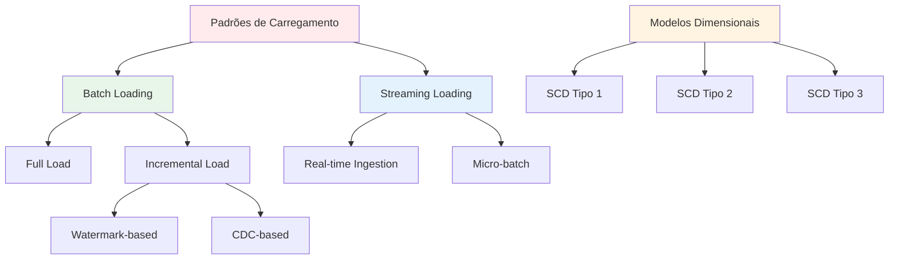
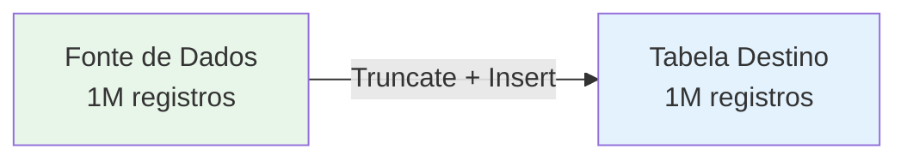
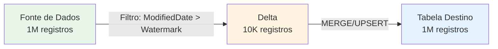
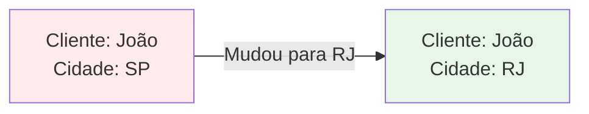
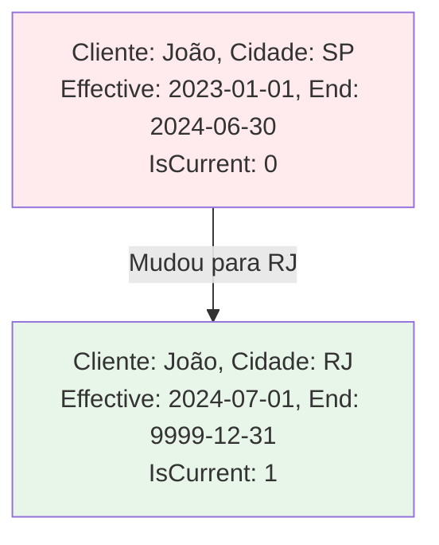
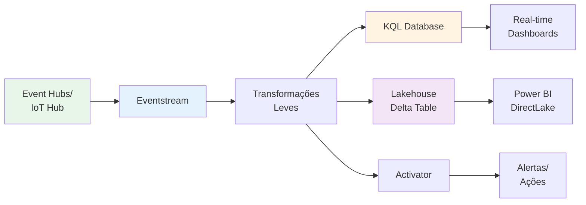

# 2.1 Projetar e implementar padrões de carregamento

Projetar o padrão de carregamento de dados correto é uma **decisão fundamental** na engenharia de dados, pois impacta diretamente a **eficiência, custo, latência e qualidade** da sua solução de análise. O Microsoft Fabric suporta uma variedade de padrões para lidar com dados em lote (batch) e em tempo real (streaming), além de fornecer as ferramentas para construir modelos dimensionais eficientes e escaláveis.

## Visão Geral dos Padrões de Carregamento



---

## 1. Cargas de Dados Completas e Incrementais

### 1.1 Comparação Detalhada

| Aspecto | Full Load | Incremental Load |
|---------|-----------|------------------|
| **Definição** | Todos os dados são apagados e recarregados | Apenas dados novos/modificados são carregados |
| **Performance** | Lenta para grandes volumes | Rápida (apenas deltas) |
| **Custo** | Alto (processa tudo sempre) | Baixo (processa apenas mudanças) |
| **Complexidade** | Baixa (simples de implementar) | Média a Alta (requer lógica de detecção) |
| **Histórico** | Não preserva histórico | Pode preservar histórico (SCD Tipo 2) |
| **Idempotência** | Sim (sempre mesmo resultado) | Depende da implementação |
| **Quando Usar** | Tabelas pequenas, dados que mudam completamente | Tabelas grandes, dados que mudam parcialmente |

### 1.2 Full Load (Carga Completa)

#### Conceito



#### Implementação - PySpark

```python
# Full Load - Sobrescrever completamente a tabela
from pyspark.sql import SparkSession

spark = SparkSession.builder.appName("FullLoad").getOrCreate()

# Ler dados da fonte
df_source = spark.read \
    .format("jdbc") \
    .option("url", "jdbc:sqlserver://source-server.database.windows.net:1433") \
    .option("dbtable", "dbo.sales") \
    .option("user", "username") \
    .option("password", "password") \
    .load()

# Escrever no Lakehouse (modo overwrite = full load)
df_source.write \
    .format("delta") \
    .mode("overwrite") \
    .option("overwriteSchema", "true") \
    .saveAsTable("lakehouse.bronze_sales")

print(f"Full load completed: {df_source.count()} rows loaded")
```

#### Implementação - SQL (Warehouse)

```sql
-- Full Load - Truncate e Insert
BEGIN TRANSACTION;

-- Passo 1: Limpar tabela de destino
TRUNCATE TABLE dbo.dim_product;

-- Passo 2: Carregar todos os dados
INSERT INTO dbo.dim_product (
    product_id,
    product_name,
    category,
    price,
    load_date
)
SELECT 
    product_id,
    product_name,
    category,
    price,
    GETDATE() AS load_date
FROM staging.stg_product;

COMMIT TRANSACTION;
```

#### Quando Usar Full Load

✅ **Use quando**:
- Tabela pequena (< 1 milhão de registros)
- Dados mudam completamente (ex: tabela de feriados)
- Simplicidade é mais importante que performance
- Carga inicial (primeira vez)
- Dados de referência estáticos

❌ **Evite quando**:
- Tabela grande (> 10 milhões de registros)
- Apenas pequena porcentagem muda
- Precisa preservar histórico
- Janela de carga limitada

### 1.3 Incremental Load (Carga Incremental)

#### Conceito



#### Padrão 1: Watermark-Based Incremental Load

**Conceito**: Usar uma coluna de timestamp para identificar registros novos/modificados.

**Pré-requisitos**:
- Tabela de origem tem coluna de timestamp (ex: `ModifiedDate`, `UpdatedAt`)
- Tabela de controle para armazenar último watermark

**Implementação Completa**:

```python
# Incremental Load com Watermark - PySpark
from pyspark.sql import SparkSession
from pyspark.sql.functions import col, max as spark_max
from datetime import datetime

spark = SparkSession.builder.appName("IncrementalLoad").getOrCreate()

# Passo 1: Obter último watermark
watermark_df = spark.read.table("control.watermark") \
    .filter(col("table_name") == "sales") \
    .select("last_watermark")

if watermark_df.count() == 0:
    # Primeira execução - carregar tudo
    last_watermark = "1900-01-01"
else:
    last_watermark = watermark_df.first()["last_watermark"]

print(f"Last watermark: {last_watermark}")

# Passo 2: Ler apenas dados novos/modificados
df_incremental = spark.read \
    .format("jdbc") \
    .option("url", "jdbc:sqlserver://source-server.database.windows.net:1433") \
    .option("dbtable", "dbo.sales") \
    .option("user", "username") \
    .option("password", "password") \
    .load() \
    .filter(col("ModifiedDate") > last_watermark)

print(f"Incremental records: {df_incremental.count()}")

# Passo 3: MERGE no destino (Delta Lake)
from delta.tables import DeltaTable

# Ler tabela Delta existente
delta_table = DeltaTable.forName(spark, "lakehouse.bronze_sales")

# MERGE (upsert)
delta_table.alias("target").merge(
    df_incremental.alias("source"),
    "target.sale_id = source.sale_id"
).whenMatchedUpdateAll() \
 .whenNotMatchedInsertAll() \
 .execute()

# Passo 4: Atualizar watermark
new_watermark = df_incremental.agg(spark_max("ModifiedDate")).first()[0]

if new_watermark:
    spark.sql(f"""
        MERGE INTO control.watermark AS target
        USING (SELECT 'sales' AS table_name, '{new_watermark}' AS last_watermark) AS source
        ON target.table_name = source.table_name
        WHEN MATCHED THEN UPDATE SET target.last_watermark = source.last_watermark
        WHEN NOT MATCHED THEN INSERT (table_name, last_watermark) VALUES (source.table_name, source.last_watermark)
    """)
    
    print(f"Watermark updated to: {new_watermark}")
```

**Tabela de Controle de Watermark**:

```sql
-- Criar tabela de controle
CREATE TABLE control.watermark (
    table_name VARCHAR(100) PRIMARY KEY,
    last_watermark DATETIME2,
    updated_at DATETIME2 DEFAULT GETDATE()
);

-- Inserir watermark inicial
INSERT INTO control.watermark (table_name, last_watermark)
VALUES ('sales', '2024-01-01 00:00:00');
```

#### Padrão 2: ID Sequencial (Auto-increment)

**Quando usar**: Quando não há coluna de timestamp, mas há ID sequencial.

```python
# Incremental Load com ID Sequencial
# Obter último ID processado
last_id = spark.read.table("control.watermark") \
    .filter(col("table_name") == "sales") \
    .select("last_id").first()["last_id"]

# Carregar apenas IDs maiores
df_incremental = spark.read \
    .format("jdbc") \
    .option("dbtable", "dbo.sales") \
    .load() \
    .filter(col("sale_id") > last_id)

# ... resto do processo similar ao watermark
```

---

## 2. Change Data Capture (CDC)

**CDC** é uma técnica avançada onde o **próprio banco de dados de origem** rastreia e fornece as alterações (INSERT, UPDATE, DELETE), tornando o processo de identificação de deltas **muito mais eficiente**.

### 2.1 Tipos de CDC

| Tipo | Como Funciona | Quando Usar |
|------|---------------|-------------|
| **Log-based CDC** | Lê transaction log do banco | SQL Server, Oracle, PostgreSQL |
| **Trigger-based CDC** | Triggers capturam mudanças | Qualquer banco que suporte triggers |
| **Timestamp-based CDC** | Coluna de timestamp (não é CDC verdadeiro) | Quando CDC nativo não está disponível |

### 2.2 CDC no SQL Server

#### Habilitando CDC

```sql
-- Habilitar CDC no banco de dados
USE SalesDB;
GO

EXEC sys.sp_cdc_enable_db;
GO

-- Habilitar CDC em uma tabela específica
EXEC sys.sp_cdc_enable_table
    @source_schema = N'dbo',
    @source_name = N'sales',
    @role_name = NULL,
    @supports_net_changes = 1;
GO

-- Verificar se CDC está habilitado
SELECT 
    name,
    is_cdc_enabled
FROM sys.databases
WHERE name = 'SalesDB';

SELECT 
    name,
    is_tracked_by_cdc
FROM sys.tables
WHERE name = 'sales';
```

#### Consultando Mudanças CDC

```sql
-- Obter mudanças desde o último LSN (Log Sequence Number)
DECLARE @from_lsn binary(10), @to_lsn binary(10);

-- LSN inicial (última execução)
SET @from_lsn = sys.fn_cdc_get_min_lsn('dbo_sales');

-- LSN atual
SET @to_lsn = sys.fn_cdc_get_max_lsn();

-- Obter todas as mudanças
SELECT 
    __$operation AS operation, -- 1=Delete, 2=Insert, 3=Update (before), 4=Update (after)
    __$start_lsn AS lsn,
    __$update_mask AS update_mask,
    sale_id,
    customer_id,
    product_id,
    sale_date,
    amount
FROM cdc.fn_cdc_get_all_changes_dbo_sales(@from_lsn, @to_lsn, 'all')
ORDER BY __$start_lsn;
```

### 2.3 Processando CDC no Fabric

```python
# Processar CDC com PySpark
from pyspark.sql import SparkSession
from pyspark.sql.functions import col, when

spark = SparkSession.builder.appName("CDC_Processing").getOrCreate()

# Ler mudanças CDC da fonte
df_cdc = spark.read \
    .format("jdbc") \
    .option("url", "jdbc:sqlserver://source-server.database.windows.net:1433") \
    .option("dbtable", """
        (SELECT 
            __$operation AS operation,
            sale_id,
            customer_id,
            product_id,
            sale_date,
            amount
        FROM cdc.fn_cdc_get_all_changes_dbo_sales(
            sys.fn_cdc_get_min_lsn('dbo_sales'),
            sys.fn_cdc_get_max_lsn(),
            'all'
        )) AS cdc_changes
    """) \
    .load()

# Separar por tipo de operação
df_inserts = df_cdc.filter(col("operation") == 2)  # Inserts
df_updates = df_cdc.filter(col("operation") == 4)  # Updates (after image)
df_deletes = df_cdc.filter(col("operation") == 1)  # Deletes

# Aplicar no Delta Lake
from delta.tables import DeltaTable

delta_table = DeltaTable.forName(spark, "lakehouse.bronze_sales")

# Processar deletes
if df_deletes.count() > 0:
    delta_table.alias("target").merge(
        df_deletes.alias("source"),
        "target.sale_id = source.sale_id"
    ).whenMatchedDelete().execute()

# Processar inserts e updates
df_upserts = df_inserts.union(df_updates)

if df_upserts.count() > 0:
    delta_table.alias("target").merge(
        df_upserts.alias("source"),
        "target.sale_id = source.sale_id"
    ).whenMatchedUpdateAll() \
     .whenNotMatchedInsertAll() \
     .execute()

print(f"CDC processing completed:")
print(f"  Inserts: {df_inserts.count()}")
print(f"  Updates: {df_updates.count()}")
print(f"  Deletes: {df_deletes.count()}")
```

---

## 3. Slowly Changing Dimensions (SCD)

**SCD** define como gerenciar alterações em dimensões ao longo do tempo.

### 3.1 SCD Tipo 1 (Overwrite)

**Conceito**: Sobrescrever o valor antigo. **Nenhuma história é mantida**.

**Quando usar**: Quando correções de dados ou quando histórico não é importante.



**Implementação - SQL**:

```sql
-- SCD Tipo 1 - Simples UPDATE
UPDATE dbo.dim_customer
SET 
    city = 'Rio de Janeiro',
    state = 'RJ',
    modified_date = GETDATE()
WHERE customer_id = 'CUST001';
```

**Implementação - PySpark**:

```python
# SCD Tipo 1 - MERGE com update
from delta.tables import DeltaTable

delta_table = DeltaTable.forName(spark, "lakehouse.dim_customer")

df_updates = spark.read.table("staging.stg_customer_updates")

delta_table.alias("target").merge(
    df_updates.alias("source"),
    "target.customer_id = source.customer_id"
).whenMatchedUpdate(set = {
    "city": "source.city",
    "state": "source.state",
    "modified_date": "current_timestamp()"
}).whenNotMatchedInsertAll().execute()
```

### 3.2 SCD Tipo 2 (New Row - Histórico Completo)

**Conceito**: Adicionar **nova linha** para cada alteração, preservando todo o histórico.

**Quando usar**: Quando precisa rastrear histórico completo de mudanças.



**Estrutura da Tabela**:

```sql
CREATE TABLE dbo.dim_customer (
    customer_key INT IDENTITY(1,1) PRIMARY KEY,  -- Surrogate key
    customer_id VARCHAR(50) NOT NULL,             -- Natural key
    customer_name VARCHAR(200),
    city VARCHAR(100),
    state VARCHAR(50),
    effective_date DATE NOT NULL,                 -- Data de início
    end_date DATE NOT NULL,                       -- Data de fim
    is_current BIT NOT NULL DEFAULT 1,            -- Flag de linha atual
    created_date DATETIME2 DEFAULT GETDATE(),
    modified_date DATETIME2 DEFAULT GETDATE()
);

-- Índice para performance
CREATE INDEX idx_customer_id_current 
ON dbo.dim_customer(customer_id, is_current);
```

**Implementação - PySpark (Completa)**:

```python
# SCD Tipo 2 - Implementação Completa com PySpark
from pyspark.sql import SparkSession
from pyspark.sql.functions import col, lit, current_date, when, max as spark_max
from delta.tables import DeltaTable
from datetime import datetime, timedelta

spark = SparkSession.builder.appName("SCD_Type2").getOrCreate()

# Ler dados novos da staging
df_source = spark.read.table("staging.stg_customer")

# Ler dimensão existente
df_target = spark.read.table("lakehouse.dim_customer") \
    .filter(col("is_current") == 1)  # Apenas linhas atuais

# Identificar mudanças (comparar atributos)
df_changes = df_source.alias("src").join(
    df_target.alias("tgt"),
    col("src.customer_id") == col("tgt.customer_id"),
    "left"
).select(
    col("src.*"),
    col("tgt.customer_key"),
    col("tgt.effective_date").alias("old_effective_date"),
    # Detectar se houve mudança
    when(
        (col("src.city") != col("tgt.city")) |
        (col("src.state") != col("tgt.state")) |
        (col("tgt.customer_key").isNull()),  # Novo cliente
        lit(True)
    ).otherwise(lit(False)).alias("has_changed")
)

# Separar em novos, alterados e inalterados
df_new = df_changes.filter(col("customer_key").isNull())
df_updated = df_changes.filter(
    (col("customer_key").isNotNull()) & (col("has_changed") == True)
)

print(f"New customers: {df_new.count()}")
print(f"Updated customers: {df_updated.count()}")

# Processar SCD Tipo 2
delta_table = DeltaTable.forName(spark, "lakehouse.dim_customer")

# Passo 1: Expirar linhas antigas (set is_current = 0, end_date = hoje)
if df_updated.count() > 0:
    delta_table.alias("target").merge(
        df_updated.select("customer_id").alias("source"),
        "target.customer_id = source.customer_id AND target.is_current = 1"
    ).whenMatchedUpdate(set = {
        "is_current": lit(0),
        "end_date": current_date(),
        "modified_date": lit(datetime.now())
    }).execute()

# Passo 2: Inserir novas linhas (novos clientes + versões atualizadas)
df_to_insert = df_new.union(df_updated).select(
    col("customer_id"),
    col("customer_name"),
    col("city"),
    col("state"),
    current_date().alias("effective_date"),
    lit("9999-12-31").cast("date").alias("end_date"),
    lit(1).alias("is_current"),
    lit(datetime.now()).alias("created_date"),
    lit(datetime.now()).alias("modified_date")
)

df_to_insert.write \
    .format("delta") \
    .mode("append") \
    .saveAsTable("lakehouse.dim_customer")

print(f"SCD Type 2 processing completed: {df_to_insert.count()} rows inserted")
```

**Consulta para Análise Histórica**:

```sql
-- Ver histórico completo de um cliente
SELECT 
    customer_key,
    customer_id,
    customer_name,
    city,
    state,
    effective_date,
    end_date,
    is_current,
    DATEDIFF(day, effective_date, end_date) AS days_active
FROM dbo.dim_customer
WHERE customer_id = 'CUST001'
ORDER BY effective_date;

-- Ver estado do cliente em uma data específica (Point-in-Time query)
SELECT 
    customer_key,
    customer_id,
    customer_name,
    city,
    state
FROM dbo.dim_customer
WHERE customer_id = 'CUST001'
  AND '2024-03-15' BETWEEN effective_date AND end_date;
```

### 3.3 SCD Tipo 3 (Previous Value Column)

**Conceito**: Manter apenas a **versão anterior** em colunas adicionais.

**Quando usar**: Quando precisa apenas da versão anterior (não histórico completo).

```sql
-- Estrutura SCD Tipo 3
CREATE TABLE dbo.dim_customer_type3 (
    customer_key INT IDENTITY(1,1) PRIMARY KEY,
    customer_id VARCHAR(50) NOT NULL,
    customer_name VARCHAR(200),
    current_city VARCHAR(100),
    previous_city VARCHAR(100),
    city_change_date DATE,
    current_state VARCHAR(50),
    previous_state VARCHAR(50),
    state_change_date DATE
);

-- Update para SCD Tipo 3
UPDATE dbo.dim_customer_type3
SET 
    previous_city = current_city,
    current_city = 'Rio de Janeiro',
    city_change_date = GETDATE(),
    previous_state = current_state,
    current_state = 'RJ',
    state_change_date = GETDATE()
WHERE customer_id = 'CUST001';
```

### 3.4 Comparação SCD

| Tipo | Histórico | Complexidade | Espaço | Quando Usar |
|------|-----------|--------------|--------|-------------|
| **Tipo 1** | Nenhum | Baixa | Mínimo | Correções, dados não críticos |
| **Tipo 2** | Completo | Alta | Alto | Análise histórica completa |
| **Tipo 3** | Apenas anterior | Média | Médio | Apenas comparação antes/depois |

---

## 4. Padrões de Carregamento para Streaming

### 4.1 Arquitetura de Streaming no Fabric



### 4.2 Eventstream

**Quando usar**: Ingestão e transformações leves de streaming.

**Capacidades**:
- Ingestão de Event Hubs, IoT Hub, Kafka
- Transformações leves (filtro, enriquecimento)
- Roteamento para múltiplos destinos
- Interface low-code

**Exemplo de Configuração**:

```
Eventstream: IoT_Telemetry_Stream
├── Source: Azure IoT Hub
├── Transformations:
│   ├── Filter: temperature > 80
│   ├── Enrich: Add location from lookup table
│   └── Aggregate: 5-minute tumbling window
└── Destinations:
    ├── KQL Database (real-time monitoring)
    ├── Lakehouse (historical analysis)
    └── Activator (temperature alerts)
```

### 4.3 Spark Structured Streaming

**Quando usar**: Transformações complexas, joins com dados históricos, agregações avançadas.

**Exemplo Completo**:

```python
# Structured Streaming - Ingestão de Event Hub para Delta Lake
from pyspark.sql import SparkSession
from pyspark.sql.functions import col, from_json, window, avg, max as spark_max
from pyspark.sql.types import StructType, StructField, StringType, DoubleType, TimestampType

spark = SparkSession.builder.appName("StreamingETL").getOrCreate()

# Definir schema dos eventos
event_schema = StructType([
    StructField("device_id", StringType(), True),
    StructField("temperature", DoubleType(), True),
    StructField("humidity", DoubleType(), True),
    StructField("timestamp", TimestampType(), True),
    StructField("location", StringType(), True)
])

# Ler stream do Event Hub
df_stream = spark.readStream \
    .format("eventhubs") \
    .option("eventhubs.connectionString", "Endpoint=sb://...") \
    .option("eventhubs.consumerGroup", "$Default") \
    .load()

# Parse JSON e extrair campos
df_parsed = df_stream.select(
    from_json(col("body").cast("string"), event_schema).alias("data")
).select("data.*")

# Transformações
df_transformed = df_parsed \
    .filter(col("temperature").isNotNull()) \
    .withWatermark("timestamp", "10 minutes")  # Late data handling

# Agregação em janela de tempo (5 minutos)
df_aggregated = df_transformed.groupBy(
    window(col("timestamp"), "5 minutes"),
    col("device_id"),
    col("location")
).agg(
    avg("temperature").alias("avg_temperature"),
    spark_max("temperature").alias("max_temperature"),
    avg("humidity").alias("avg_humidity")
)

# Escrever no Delta Lake (append mode)
query = df_aggregated.writeStream \
    .format("delta") \
    .outputMode("append") \
    .option("checkpointLocation", "/lakehouse/checkpoints/iot_telemetry") \
    .option("mergeSchema", "true") \
    .toTable("lakehouse.silver_iot_telemetry")

query.awaitTermination()
```

### 4.4 Padrões de Streaming

#### Padrão 1: Append-Only (Mais Simples)

**Quando usar**: Eventos imutáveis (logs, telemetria).

```python
# Append-only streaming
df_stream.writeStream \
    .format("delta") \
    .outputMode("append") \
    .toTable("lakehouse.events")
```

#### Padrão 2: Upsert (MERGE em Streaming)

**Quando usar**: Atualizar estado baseado em eventos.

```python
# Streaming MERGE (foreachBatch)
def upsert_to_delta(batch_df, batch_id):
    from delta.tables import DeltaTable
    
    delta_table = DeltaTable.forName(spark, "lakehouse.device_status")
    
    delta_table.alias("target").merge(
        batch_df.alias("source"),
        "target.device_id = source.device_id"
    ).whenMatchedUpdateAll() \
     .whenNotMatchedInsertAll() \
     .execute()

df_stream.writeStream \
    .foreachBatch(upsert_to_delta) \
    .option("checkpointLocation", "/checkpoints/device_status") \
    .start()
```

#### Padrão 3: Aggregation (Windowing)

**Quando usar**: Métricas em tempo real (média, contagem, etc.).

```python
# Windowed aggregation
from pyspark.sql.functions import window, count

df_windowed = df_stream \
    .withWatermark("timestamp", "10 minutes") \
    .groupBy(
        window(col("timestamp"), "5 minutes", "1 minute"),  # 5-min window, 1-min slide
        col("device_id")
    ).agg(
        count("*").alias("event_count"),
        avg("temperature").alias("avg_temp")
    )

df_windowed.writeStream \
    .format("delta") \
    .outputMode("append") \
    .toTable("lakehouse.device_metrics")
```

---

## 5. Best Practices - Padrões de Carregamento

### ✅ Batch Loading

1. **Escolha o Padrão Correto**:
   - Full Load: Apenas para tabelas pequenas
   - Incremental Load: Padrão para tabelas grandes
   - CDC: Quando disponível e precisa de deletes

2. **Watermark Management**:
   - Sempre armazene watermark em tabela de controle
   - Use transações para garantir consistência
   - Considere timezone (use UTC)

3. **MERGE Performance**:
   - Use particionamento adequado
   - Crie índices em colunas de join
   - Considere batch size (não muito grande)

4. **Idempotência**:
   - Pipelines devem ser idempotentes
   - Suportar re-execução sem duplicatas
   - Use MERGE em vez de INSERT

### ✅ SCD

1. **SCD Tipo 2**:
   - Use surrogate keys (IDENTITY, UUID)
   - Sempre tenha is_current flag
   - Use end_date = '9999-12-31' para linhas atuais
   - Índice em (natural_key, is_current)

2. **Performance**:
   - Particione por effective_date se tabela muito grande
   - Considere compressão (Delta Lake)
   - Vacuum regularmente

### ✅ Streaming

1. **Checkpoint Management**:
   - Sempre configure checkpointLocation
   - Não delete checkpoints (perda de estado)
   - Backup checkpoints antes de mudanças

2. **Watermarking**:
   - Configure watermark para late data
   - Balance entre latência e completude
   - Típico: 10-30 minutos

3. **Monitoring**:
   - Monitore lag do stream
   - Alertas para falhas
   - Track throughput

---

## Referências e Recursos

### Documentação Oficial

1. [Incremental Data Loading](https://learn.microsoft.com/azure/data-factory/tutorial-incremental-copy-portal)
2. [Change Data Capture (CDC)](https://learn.microsoft.com/sql/relational-databases/track-changes/about-change-data-capture-sql-server)
3. [Delta Lake MERGE](https://docs.delta.io/latest/delta-update.html#upsert-into-a-table-using-merge)
4. [Eventstream Overview](https://learn.microsoft.com/fabric/real-time-intelligence/event-streams-overview)
5. [Structured Streaming](https://spark.apache.org/docs/latest/structured-streaming-programming-guide.html)
6. [Star Schema](https://learn.microsoft.com/power-bi/guidance/star-schema)
7. [Guia de Estudo DP-700](https://learn.microsoft.com/credentials/certifications/resources/study-guides/dp-700)

---

## Pontos-Chave para o Exame DP-700

🎯 **Memorize**:
- **Full Load**: Truncate + Insert, simples mas ineficiente para grandes volumes
- **Incremental Load**: Apenas deltas, usa watermark ou CDC
- **Watermark**: Coluna de timestamp para identificar mudanças
- **CDC**: Banco rastreia mudanças (INSERT, UPDATE, DELETE)
- **SCD Tipo 1**: Overwrite (sem histórico)
- **SCD Tipo 2**: New Row (histórico completo, surrogate key, effective_date, is_current)
- **SCD Tipo 3**: Previous value column (apenas versão anterior)
- **MERGE**: Upsert operation (INSERT + UPDATE em uma operação)
- **Eventstream**: Low-code streaming, transformações leves
- **Structured Streaming**: Code-first, transformações complexas
- **Watermark (Streaming)**: Late data handling

🎯 **Entenda**:
- Quando usar Full Load vs Incremental Load
- Como implementar SCD Tipo 2 passo a passo
- Diferença entre watermark-based e CDC-based incremental load
- Como MERGE funciona (match/not match)
- Quando usar Eventstream vs Structured Streaming
- Como configurar windowing em streaming
- Importância de checkpoints em streaming

