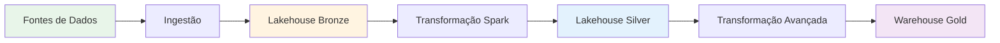

# 2.2 Ingerir e transformar dados em lote

A ingestão e transformação de dados em lote (batch) é o processo mais comum na engenharia de dados, onde grandes volumes de dados são processados em intervalos programados. O Microsoft Fabric oferece um conjunto rico e integrado de ferramentas para executar essas tarefas de forma **eficiente, escalável e otimizada**, desde a escolha do armazenamento até a transformação final dos dados.

## Visão Geral do Batch Processing



---

## 1. Escolhendo Armazenamento e Ferramentas

### 1.1 Comparação de Armazenamento

| Aspecto | Lakehouse | Data Warehouse |
|---------|-----------|----------------|
| **Formato** | Delta Lake (Parquet + log) | Proprietary columnar |
| **Acesso** | Spark, SQL Endpoint, Power BI | T-SQL, Power BI |
| **Melhor para** | Dados brutos, semi-estruturados, ML | Dados curados, modelos dimensionais |
| **Performance** | Excelente para scan completo | Excelente para queries pontuais |
| **Custo** | Menor (armazenamento OneLake) | Maior (compute dedicado) |
| **Escalabilidade** | Horizontal (Spark) | Vertical + Horizontal |
| **Schema** | Schema-on-read | Schema-on-write |
| **Camadas** | Bronze, Silver | Gold |

### 1.2 Ferramentas de Transformação

| Ferramenta | Quando Usar | Vantagens | Desvantagens |
|------------|-------------|-----------|--------------|
| **Dataflow Gen2** | Transformações simples, usuários de Power BI | Low-code, familiar | Limitado para grandes volumes |
| **Notebooks (PySpark)** | Transformações complexas, grandes volumes | Flexível, escalável | Requer conhecimento de Spark |
| **T-SQL (Warehouse)** | Transformações no DW, usuários SQL | Familiar, otimizado | Apenas no Warehouse |
| **KQL** | Análise exploratória, séries temporais | Rápido para análise ad-hoc | Menos comum para ETL |

---

## 2. Otimizações Spark

### 2.1 Particionamento

**Conceito**: Dividir dados em partições para processamento paralelo.

#### Particionamento por Coluna

```python
# Particionar por data ao escrever
df_sales.write \
    .format("delta") \
    .partitionBy("sale_date") \
    .mode("append") \
    .saveAsTable("lakehouse.sales_partitioned")

# Resultado: Estrutura de pastas
# /sales_partitioned/
#   sale_date=2024-01-01/
#   sale_date=2024-01-02/
#   sale_date=2024-01-03/
```

**Quando usar**:
- ✅ Coluna com cardinalidade média (100-10.000 valores únicos)
- ✅ Queries frequentemente filtram por essa coluna
- ❌ Evite alta cardinalidade (ex: customer_id com milhões de valores)
- ❌ Evite baixa cardinalidade (ex: status com 3 valores)

#### Reparticionamento em Memória

```python
# Reparticionar para otimizar processamento
df_large = spark.read.table("lakehouse.large_table")

# Aumentar partições para paralelismo
df_repartitioned = df_large.repartition(200)

# Particionar por coluna específica
df_by_region = df_large.repartition("region")

# Coalesce (reduzir partições - mais eficiente que repartition)
df_small = df_large.coalesce(10)
```

**Regra Geral**:
- Partições ideais: 2-4x número de cores
- Tamanho ideal por partição: 128MB - 1GB

### 2.2 Caching e Persistence

```python
from pyspark import StorageLevel

# Cache em memória (padrão)
df_cached = df.cache()

# Persist com nível de armazenamento específico
df.persist(StorageLevel.MEMORY_AND_DISK)

# Níveis disponíveis:
# - MEMORY_ONLY: Apenas memória
# - MEMORY_AND_DISK: Memória + disco se não couber
# - DISK_ONLY: Apenas disco
# - MEMORY_ONLY_SER: Memória serializada (menos espaço)
# - MEMORY_AND_DISK_SER: Memória serializada + disco

# Liberar cache quando não precisar mais
df.unpersist()
```

**Quando usar cache**:
- ✅ DataFrame usado múltiplas vezes
- ✅ Transformações custosas antes do cache
- ❌ DataFrame usado apenas uma vez
- ❌ Dados muito grandes (não cabem em memória)

### 2.3 Broadcast Joins

**Problema**: Joins de tabelas grandes são custosos (shuffle de dados).

**Solução**: Broadcast da tabela pequena para todos os workers.

```python
from pyspark.sql.functions import broadcast

# Tabela grande: fact_sales (100M registros)
df_sales = spark.read.table("lakehouse.fact_sales")

# Tabela pequena: dim_product (10K registros)
df_product = spark.read.table("lakehouse.dim_product")

# Join normal (shuffle - lento)
df_joined_slow = df_sales.join(df_product, "product_id")

# Broadcast join (rápido)
df_joined_fast = df_sales.join(
    broadcast(df_product), 
    "product_id"
)
```

**Limite**: Tabela broadcast deve ser < 10GB (configurável).

**Auto-broadcast**: Spark automaticamente faz broadcast se tabela < 10MB.

### 2.4 Predicate Pushdown

**Conceito**: Filtrar dados na fonte antes de carregar.

```python
# Ruim: Carrega tudo, depois filtra
df_all = spark.read.table("lakehouse.sales")
df_filtered = df_all.filter(col("sale_date") == "2024-01-15")

# Bom: Filtra na leitura (predicate pushdown)
df_filtered = spark.read.table("lakehouse.sales") \
    .filter(col("sale_date") == "2024-01-15")

# Melhor: Se tabela particionada por sale_date
# Spark lê apenas a partição relevante
```

### 2.5 Column Pruning

**Conceito**: Ler apenas colunas necessárias.

```python
# Ruim: Lê todas as colunas
df_all = spark.read.table("lakehouse.sales")
df_result = df_all.select("product_id", "amount")

# Bom: Lê apenas colunas necessárias
df_result = spark.read.table("lakehouse.sales") \
    .select("product_id", "amount")
```

**Benefício**: Reduz I/O significativamente (formato colunar).

---

## 3. Atalhos (Shortcuts)

### 3.1 Tipos de Shortcuts

| Tipo | Fonte | Quando Usar |
|------|-------|-------------|
| **OneLake Shortcut** | Outro Lakehouse no Fabric | Compartilhar dados entre workspaces |
| **ADLS Gen2 Shortcut** | Azure Data Lake Storage | Acessar dados externos sem cópia |
| **S3 Shortcut** | Amazon S3 | Acessar dados na AWS |

### 3.2 Criando Shortcuts

**Via UI**:
1. Lakehouse → Files → New shortcut
2. Selecionar tipo (OneLake, ADLS, S3)
3. Configurar conexão
4. Especificar caminho

**Via API (exemplo)**:
```python
# Criar shortcut via Fabric REST API
import requests

url = "https://api.fabric.microsoft.com/v1/workspaces/{workspace_id}/lakehouses/{lakehouse_id}/shortcuts"

payload = {
    "name": "external_data",
    "path": "/Files/external",
    "target": {
        "type": "AdlsGen2",
        "connectionId": "{connection_id}",
        "location": "https://storageaccount.dfs.core.windows.net/container/path"
    }
}

response = requests.post(url, json=payload, headers=headers)
```

### 3.3 Shortcuts vs Cópia de Dados

| Aspecto | Shortcut | Cópia |
|---------|----------|-------|
| **Latência** | Instantânea | Depende do volume |
| **Armazenamento** | Não duplica | Duplica dados |
| **Custo** | Menor | Maior |
| **Performance** | Pode ser mais lenta (rede) | Mais rápida (local) |
| **Atualização** | Sempre atual | Precisa re-copiar |
| **Quando usar** | Dados que mudam frequentemente | Dados estáticos, performance crítica |

---

## 4. Espelhamento (Mirroring)

### 4.1 Fontes Suportadas

| Fonte | Latência | Quando Usar |
|-------|----------|-------------|
| **Azure SQL DB** | Near real-time | Dados operacionais SQL |
| **Snowflake** | Near real-time | Migração de Snowflake |
| **Azure Cosmos DB** | Near real-time | Dados NoSQL |

### 4.2 Configurando Mirroring

**Pré-requisitos**:
- Banco de origem deve ter CDC habilitado (SQL Server)
- Permissões adequadas

**Passos**:
1. Criar Mirrored Database no Fabric
2. Configurar conexão com fonte
3. Selecionar tabelas para espelhar
4. Iniciar replicação

**Exemplo - Azure SQL DB**:
```sql
-- Habilitar CDC no banco de origem
USE SourceDB;
EXEC sys.sp_cdc_enable_db;

-- Habilitar CDC em tabelas específicas
EXEC sys.sp_cdc_enable_table
    @source_schema = 'dbo',
    @source_name = 'customers',
    @role_name = NULL;
```

### 4.3 Mirroring vs Shortcuts vs Pipelines

| Aspecto | Mirroring | Shortcuts | Pipelines |
|---------|-----------|-----------|-----------|
| **Latência** | Near real-time | Real-time | Batch (agendado) |
| **Transformação** | Não | Não | Sim |
| **Fontes** | Bancos específicos | Arquivos | Centenas de fontes |
| **Custo** | Médio | Baixo | Variável |
| **Complexidade** | Baixa | Baixa | Média |

---

## 5. Transformações em Lote

### 5.1 Desnormalização

**Quando usar**: Simplificar queries, melhorar performance.

```python
# Exemplo: Desnormalizar vendas com informações de produto e cliente
df_sales = spark.read.table("lakehouse.fact_sales")
df_product = spark.read.table("lakehouse.dim_product")
df_customer = spark.read.table("lakehouse.dim_customer")

df_denormalized = df_sales \
    .join(df_product, "product_id") \
    .join(df_customer, "customer_id") \
    .select(
        "sale_id",
        "sale_date",
        "customer_name",
        "customer_city",
        "product_name",
        "product_category",
        "quantity",
        "amount"
    )

df_denormalized.write \
    .format("delta") \
    .mode("overwrite") \
    .saveAsTable("lakehouse.sales_denormalized")
```

### 5.2 Agregações

```python
from pyspark.sql.functions import sum, avg, count, max as spark_max

# Agregar vendas por produto e mês
df_aggregated = df_sales.groupBy(
    "product_id",
    year("sale_date").alias("year"),
    month("sale_date").alias("month")
).agg(
    sum("amount").alias("total_sales"),
    avg("amount").alias("avg_sale"),
    count("*").alias("num_transactions"),
    spark_max("amount").alias("max_sale")
)

# Salvar como tabela agregada
df_aggregated.write \
    .format("delta") \
    .mode("overwrite") \
    .saveAsTable("lakehouse.sales_monthly_summary")
```

### 5.3 Tratamento de Duplicatas

```python
from pyspark.sql.window import Window
from pyspark.sql.functions import row_number

# Identificar duplicatas usando ROW_NUMBER
window_spec = Window.partitionBy("customer_id", "sale_date").orderBy(col("created_at").desc())

df_with_row_num = df_sales.withColumn("row_num", row_number().over(window_spec))

# Manter apenas a primeira ocorrência
df_deduplicated = df_with_row_num.filter(col("row_num") == 1).drop("row_num")

# Alternativa: distinct (se todas as colunas devem ser únicas)
df_distinct = df_sales.distinct()
```

### 5.4 Tratamento de Nulos

```python
from pyspark.sql.functions import coalesce, lit, when

# Preencher nulos com valor padrão
df_filled = df.fillna({
    "quantity": 0,
    "customer_name": "Unknown",
    "discount": 0.0
})

# Usar coalesce para substituir nulos
df_coalesced = df.withColumn(
    "email",
    coalesce(col("email"), lit("no-email@example.com"))
)

# Lógica condicional
df_conditional = df.withColumn(
    "status",
    when(col("amount") > 1000, "High Value")
    .when(col("amount") > 100, "Medium Value")
    .otherwise("Low Value")
)

# Remover linhas com nulos em colunas críticas
df_no_nulls = df.dropna(subset=["customer_id", "product_id"])
```

### 5.5 Late-Arriving Data

**Estratégia 1: Janela de Tolerância**

```python
# Processar dados dos últimos 7 dias (incluindo late arrivals)
from datetime import datetime, timedelta

lookback_days = 7
cutoff_date = (datetime.now() - timedelta(days=lookback_days)).strftime("%Y-%m-%d")

df_with_late = spark.read.table("lakehouse.bronze_sales") \
    .filter(col("sale_date") >= cutoff_date)

# MERGE para atualizar dados existentes
from delta.tables import DeltaTable

delta_table = DeltaTable.forName(spark, "lakehouse.silver_sales")

delta_table.alias("target").merge(
    df_with_late.alias("source"),
    "target.sale_id = source.sale_id"
).whenMatchedUpdateAll() \
 .whenNotMatchedInsertAll() \
 .execute()
```

---

## 6. Best Practices - Batch Processing

### ✅ Performance

1. **Particionamento**:
   - Particione por coluna de filtro frequente
   - Cardinalidade ideal: 100-10.000 valores
   - Evite over-partitioning (muitas partições pequenas)

2. **Caching**:
   - Cache DataFrames usados múltiplas vezes
   - Libere cache quando não precisar mais
   - Monitore uso de memória

3. **Joins**:
   - Use broadcast para tabelas pequenas (< 10GB)
   - Particione ambas as tabelas pela chave de join
   - Evite cross joins

4. **Leitura/Escrita**:
   - Use column pruning (selecione apenas colunas necessárias)
   - Use predicate pushdown (filtre na leitura)
   - Escreva em formato Delta Lake (otimizado)

### ✅ Escalabilidade

1. **Tamanho de Arquivos**:
   - Ideal: 128MB - 1GB por arquivo
   - Use OPTIMIZE para compactar arquivos pequenos
   - Use Z-ORDER para co-localizar dados relacionados

2. **Paralelismo**:
   - Configure número de partições adequado
   - Use repartition antes de operações custosas
   - Monitore skew de dados

### ✅ Confiabilidade

1. **Idempotência**:
   - Use MERGE em vez de INSERT
   - Suporte re-execução sem duplicatas
   - Mantenha logs de execução

2. **Qualidade de Dados**:
   - Valide dados na entrada
   - Trate nulos e duplicatas
   - Implemente data quality checks

---

## Referências e Recursos

### Documentação Oficial

1. [Dataflows Gen2](https://learn.microsoft.com/fabric/data-factory/dataflows-gen2-overview)
2. [Mirroring Overview](https://learn.microsoft.com/fabric/database/mirroring/mirroring-overview)
3. [OneLake Shortcuts](https://learn.microsoft.com/fabric/onelake/onelake-shortcuts)
4. [Spark Performance Tuning](https://spark.apache.org/docs/latest/sql-performance-tuning.html)
5. [Delta Lake Optimization](https://docs.delta.io/latest/optimizations-oss.html)
6. [Guia de Estudo DP-700](https://learn.microsoft.com/credentials/certifications/resources/study-guides/dp-700)

---

## Pontos-Chave para o Exame DP-700

🎯 **Memorize**:
- **Lakehouse**: Bronze/Silver, Delta Lake, Spark
- **Warehouse**: Gold, T-SQL, modelos dimensionais
- **Particionamento**: Cardinalidade média (100-10K valores)
- **Broadcast Join**: Tabela pequena (< 10GB)
- **Cache**: DataFrame usado múltiplas vezes
- **Shortcuts**: Referência virtual, não copia dados
- **Mirroring**: Near real-time, CDC-based, fontes específicas
- **Predicate Pushdown**: Filtrar na leitura
- **Column Pruning**: Ler apenas colunas necessárias

🎯 **Entenda**:
- Quando usar Lakehouse vs Warehouse
- Como otimizar joins (broadcast, partitioning)
- Diferença entre Shortcuts, Mirroring e Pipelines
- Como tratar duplicatas (ROW_NUMBER)
- Como tratar nulos (fillna, coalesce)
- Estratégias para late-arriving data
- Quando usar cache vs persist

