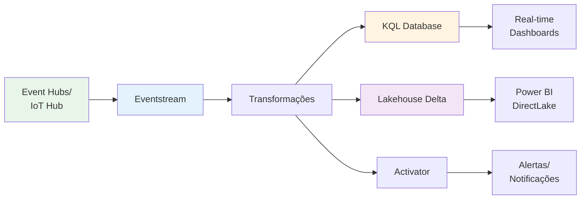
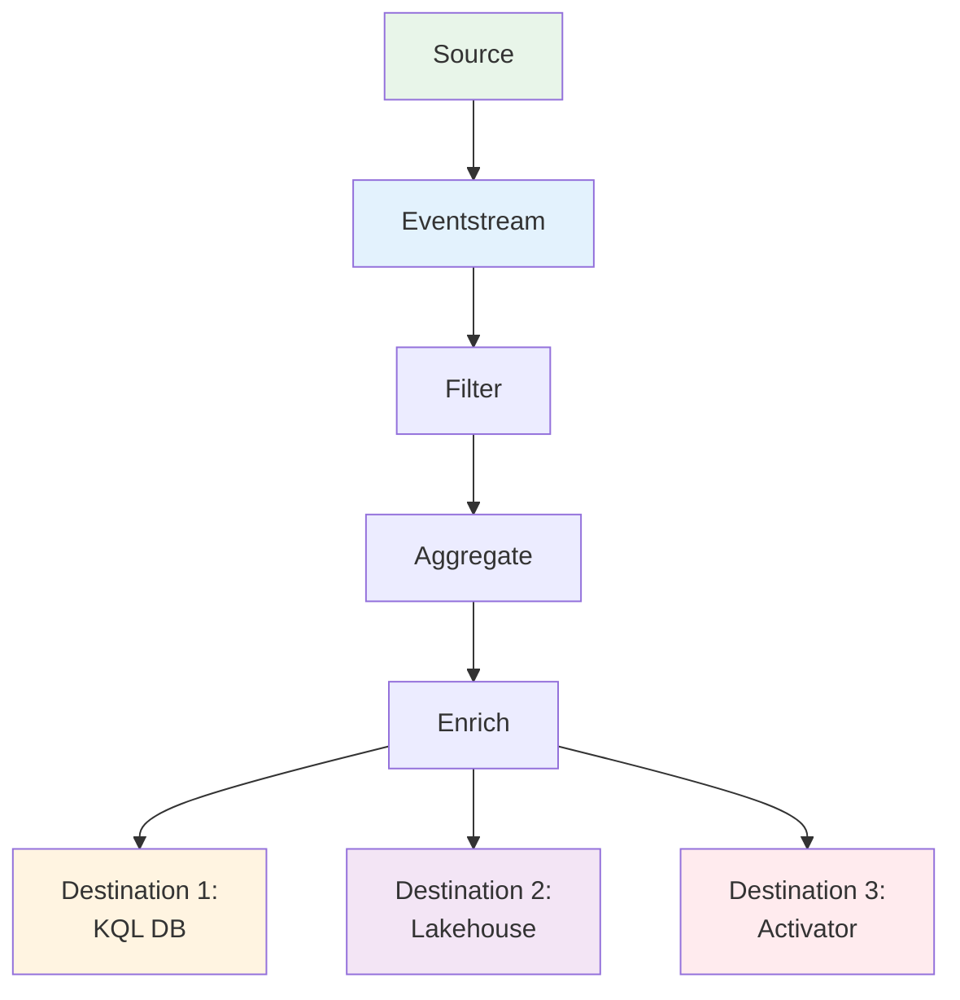
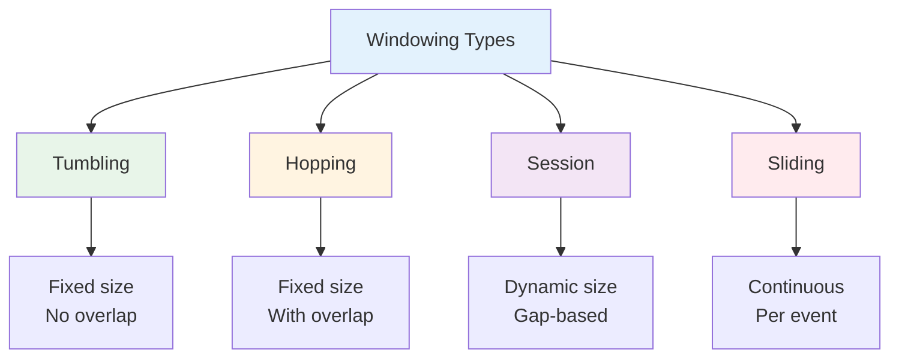
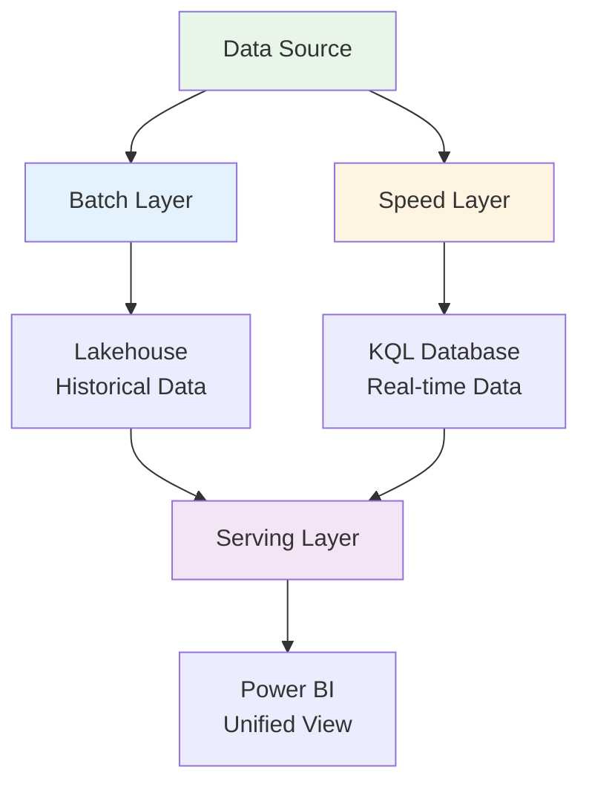
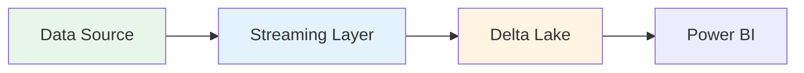

# 2.3 Ingerir e transformar dados de streaming

A ingestão e transformação de dados de streaming (em tempo real) é uma capacidade **crítica** para organizações que precisam reagir instantaneamente a novos eventos, como detecção de fraudes, monitoramento de IoT, análise de cliques ou alertas operacionais. O Microsoft Fabric, através da sua experiência de **Real-Time Intelligence**, fornece um conjunto de ferramentas poderosas e integradas para lidar com fluxos de dados contínuos.

## Visão Geral do Streaming no Fabric



---

## 1. Escolhendo Mecanismo e Armazenamento

### 1.1 Mecanismos de Streaming

| Mecanismo | Abordagem | Quando Usar | Vantagens | Limitações |
|-----------|-----------|-------------|-----------|------------|
| **Eventstream** | Low-code visual | Transformações simples | Interface visual, fácil | Transformações limitadas |
| **Structured Streaming** | Code-first (PySpark) | Transformações complexas | Flexível, poderoso | Requer conhecimento Spark |
| **KQL Update Policies** | KQL-based | Transformações no KQL DB | Otimizado para séries temporais | Apenas no KQL Database |

### 1.2 Armazenamento de Streaming

| Armazenamento | Latência | Melhor Para | Limitações |
|---------------|----------|-------------|------------|
| **KQL Database** | Milissegundos | Análise em tempo real, dashboards | Não suporta ACID completo |
| **Lakehouse (Delta)** | Segundos | Análise histórica, BI | Latência maior |
| **Warehouse** | Minutos | Relatórios consolidados | Não otimizado para streaming |

---

## 2. Eventstream

### 2.1 Arquitetura do Eventstream



### 2.2 Fontes Suportadas

| Fonte | Descrição | Quando Usar |
|-------|-----------|-------------|
| **Azure Event Hubs** | Ingestão de eventos em larga escala | Telemetria, logs, eventos |
| **Azure IoT Hub** | Dispositivos IoT | Sensores, dispositivos conectados |
| **Sample Data** | Dados de teste | Desenvolvimento, POC |
| **Custom App** | Aplicação customizada | Eventos de aplicações |

### 2.3 Transformações no Eventstream

#### Filter (Filtrar)

```
Exemplo: Filtrar apenas eventos com temperatura > 80
Condição: temperature > 80
```

#### Manage Fields (Gerenciar Campos)

```
Operações:
- Add: Adicionar campo calculado
- Remove: Remover campos desnecessários
- Rename: Renomear campos
```

#### Aggregate (Agregar)

```
Configuração:
- Window: Tumbling, 5 minutes
- Group by: device_id
- Aggregations:
  - AVG(temperature)
  - MAX(temperature)
  - COUNT(*)
```

#### Join (Juntar)

```
Enriquecer eventos com dados de referência:
- Stream: IoT events
- Reference: Device metadata (KQL table)
- Join key: device_id
```

### 2.4 Destinos

| Destino | Quando Usar | Configuração |
|---------|-------------|--------------|
| **KQL Database** | Análise em tempo real | Tabela, mapeamento de colunas |
| **Lakehouse** | Análise histórica | Tabela Delta, modo append |
| **Activator** | Alertas e ações | Condições de trigger |
| **Custom App** | Integração externa | Webhook, API |

---

## 3. Spark Structured Streaming

### 3.1 Conceitos Fundamentais

**Structured Streaming** trata o fluxo como uma **tabela infinita** que é continuamente anexada.

```python
# Leitura de stream
df_stream = spark.readStream \
    .format("eventhubs") \
    .option("eventhubs.connectionString", connection_string) \
    .load()

# Transformações (mesma API que batch)
df_transformed = df_stream.select(...).filter(...).groupBy(...)

# Escrita de stream
query = df_transformed.writeStream \
    .format("delta") \
    .outputMode("append") \
    .option("checkpointLocation", "/checkpoints/my_stream") \
    .toTable("lakehouse.my_table")
```

### 3.2 Output Modes

| Mode | Descrição | Quando Usar |
|------|-----------|-------------|
| **Append** | Apenas novas linhas | Eventos imutáveis |
| **Complete** | Toda a tabela de resultado | Agregações pequenas |
| **Update** | Apenas linhas atualizadas | Agregações com updates |

### 3.3 Exemplo Completo - IoT Telemetry

```python
from pyspark.sql import SparkSession
from pyspark.sql.functions import *
from pyspark.sql.types import *

spark = SparkSession.builder.appName("IoT_Streaming").getOrCreate()

# Schema dos eventos
schema = StructType([
    StructField("device_id", StringType()),
    StructField("temperature", DoubleType()),
    StructField("humidity", DoubleType()),
    StructField("timestamp", TimestampType())
])

# Ler stream do Event Hub
df_stream = spark.readStream \
    .format("eventhubs") \
    .option("eventhubs.connectionString", "Endpoint=sb://...") \
    .load()

# Parse JSON
df_parsed = df_stream.select(
    from_json(col("body").cast("string"), schema).alias("data")
).select("data.*")

# Transformações
df_transformed = df_parsed \
    .filter(col("temperature").isNotNull()) \
    .withColumn("temp_category", 
        when(col("temperature") > 80, "High")
        .when(col("temperature") > 60, "Medium")
        .otherwise("Normal")
    )

# Escrever no Delta Lake
query = df_transformed.writeStream \
    .format("delta") \
    .outputMode("append") \
    .option("checkpointLocation", "/lakehouse/checkpoints/iot") \
    .option("mergeSchema", "true") \
    .toTable("lakehouse.iot_telemetry")

query.awaitTermination()
```

---

## 4. Windowing (Funções de Janela)

### 4.1 Tipos de Janelas



### 4.2 Tumbling Window (Janela Deslizante)

**Conceito**: Janelas de tamanho fixo, sem sobreposição.

```python
from pyspark.sql.functions import window, avg, count

# Agregar a cada 5 minutos
df_windowed = df_stream \
    .withWatermark("timestamp", "10 minutes") \
    .groupBy(
        window(col("timestamp"), "5 minutes"),
        col("device_id")
    ).agg(
        avg("temperature").alias("avg_temp"),
        count("*").alias("event_count")
    )

# Resultado:
# window: [2024-01-01 10:00:00, 2024-01-01 10:05:00]
# window: [2024-01-01 10:05:00, 2024-01-01 10:10:00]
```

### 4.3 Hopping Window (Janela Saltitante)

**Conceito**: Janelas com sobreposição.

```python
# Janela de 10 minutos, avança a cada 5 minutos
df_hopping = df_stream \
    .withWatermark("timestamp", "10 minutes") \
    .groupBy(
        window(col("timestamp"), "10 minutes", "5 minutes"),
        col("device_id")
    ).agg(
        avg("temperature").alias("avg_temp_10min")
    )

# Resultado:
# window: [10:00, 10:10]
# window: [10:05, 10:15]  <- Sobreposição
# window: [10:10, 10:20]
```

### 4.4 Session Window

**Conceito**: Janelas baseadas em inatividade.

```python
# Session window com gap de 30 minutos
# Disponível no Eventstream, não diretamente no Spark
# Implementação manual:
from pyspark.sql.window import Window

window_spec = Window.partitionBy("user_id").orderBy("timestamp")

df_sessions = df_stream \
    .withColumn("prev_timestamp", lag("timestamp").over(window_spec)) \
    .withColumn("time_diff", 
        (col("timestamp").cast("long") - col("prev_timestamp").cast("long")) / 60
    ) \
    .withColumn("new_session", 
        when(col("time_diff") > 30, 1).otherwise(0)
    )
```

---

## 5. Watermarking (Tratamento de Late Data)

### 5.1 Conceito

**Watermark** define quanto tempo esperar por dados atrasados.

```python
# Watermark de 10 minutos
df_with_watermark = df_stream \
    .withWatermark("timestamp", "10 minutes") \
    .groupBy(
        window(col("timestamp"), "5 minutes"),
        col("device_id")
    ).agg(avg("temperature"))

# Comportamento:
# - Eventos até 10 minutos atrasados são incluídos
# - Eventos > 10 minutos atrasados são descartados
# - Permite liberar memória de janelas antigas
```

### 5.2 Configuração de Watermark

| Watermark | Latência | Completude | Quando Usar |
|-----------|----------|------------|-------------|
| 1 minuto | Baixa | Baixa | Dashboards real-time |
| 10 minutos | Média | Média | Análise operacional |
| 1 hora | Alta | Alta | Relatórios precisos |

---

## 6. KQL Database

### 6.1 Ingestão no KQL Database

```python
# Via Eventstream (configuração visual)
Source: Azure Event Hubs
Destination: KQL Database
  - Database: telemetry_db
  - Table: iot_events
  - Mapping: json_mapping
```

### 6.2 Update Policies (Transformações KQL)

**Conceito**: Transformar dados automaticamente ao serem ingeridos.

```kql
// Criar tabela de destino
.create table iot_events_processed (
    device_id: string,
    avg_temperature: real,
    event_count: long,
    window_start: datetime,
    window_end: datetime
)

// Criar update policy
.alter table iot_events_processed policy update 
@'[{
    "IsEnabled": true,
    "Source": "iot_events",
    "Query": "iot_events | summarize avg_temperature = avg(temperature), event_count = count() by device_id, bin(timestamp, 5m) | extend window_start = timestamp, window_end = timestamp + 5m",
    "IsTransactional": false,
    "PropagateIngestionProperties": false
}]'
```

### 6.3 Queries KQL para Streaming

```kql
// Últimos 5 minutos de eventos
iot_events
| where timestamp > ago(5m)
| summarize avg(temperature), max(temperature) by device_id

// Detecção de anomalias
iot_events
| where timestamp > ago(1h)
| summarize avg_temp = avg(temperature), stdev_temp = stdev(temperature) by device_id
| extend anomaly = abs(avg_temp - 70) > (3 * stdev_temp)
| where anomaly == true

// Série temporal
iot_events
| where timestamp > ago(24h)
| make-series avg_temp = avg(temperature) on timestamp step 1h by device_id
| render timechart
```

---

## 7. Atalhos Acelerados vs Não Acelerados

### 7.1 Comparação

| Tipo | Performance | Latência | Custo | Quando Usar |
|------|-------------|----------|-------|-------------|
| **Acelerado** | Muito rápida | Baixa | Maior | Dashboards críticos |
| **Não Acelerado** | Mais lenta | Alta | Menor | Análise ad-hoc |

### 7.2 Configuração

```
Criar Shortcut no KQL Database:
1. KQL Database → Shortcuts → New
2. Selecionar fonte (OneLake, ADLS)
3. Escolher tipo:
   - Accelerated: Cache habilitado
   - Non-accelerated: Sem cache
```

---

## 8. Padrões de Streaming

### 8.1 Lambda Architecture



### 8.2 Kappa Architecture



---

## 9. Best Practices - Streaming

### ✅ Performance

1. **Watermarking**:
   - Configure watermark adequado (10-30 min típico)
   - Balance latência vs completude
   - Monitore late data metrics

2. **Particionamento**:
   - Particione por chave de agregação
   - Evite skew de dados
   - Use repartition antes de agregações

3. **Checkpointing**:
   - Sempre configure checkpointLocation
   - Não delete checkpoints (perda de estado)
   - Backup antes de mudanças

### ✅ Confiabilidade

1. **Exactly-Once Semantics**:
   - Delta Lake garante exactly-once
   - Use idempotent operations
   - Monitore duplicatas

2. **Error Handling**:
   - Configure retry policy
   - Dead letter queue para erros
   - Alertas para falhas

### ✅ Escalabilidade

1. **Throughput**:
   - Monitore lag do stream
   - Scale out workers conforme necessário
   - Use auto-scaling quando disponível

2. **State Management**:
   - Minimize estado em agregações
   - Use watermark para limpar estado antigo
   - Considere state store size

---

## Referências e Recursos

1. [Real-Time Intelligence](https://learn.microsoft.com/fabric/real-time-intelligence/overview)
2. [Eventstream](https://learn.microsoft.com/fabric/real-time-intelligence/event-streams-overview)
3. [Structured Streaming](https://spark.apache.org/docs/latest/structured-streaming-programming-guide.html)
4. [KQL Database](https://learn.microsoft.com/fabric/real-time-intelligence/create-database)
5. [Guia de Estudo DP-700](https://learn.microsoft.com/credentials/certifications/resources/study-guides/dp-700)

---

## Pontos-Chave para o Exame DP-700

🎯 **Memorize**:
- **Eventstream**: Low-code, transformações visuais
- **Structured Streaming**: Code-first, PySpark
- **KQL Database**: Otimizado para séries temporais, análise real-time
- **Watermark**: Tratamento de late data (10-30 min típico)
- **Tumbling Window**: Tamanho fixo, sem sobreposição
- **Hopping Window**: Tamanho fixo, com sobreposição
- **Session Window**: Baseado em gap de inatividade
- **Output Modes**: Append, Complete, Update
- **Checkpoint**: Obrigatório para fault tolerance

🎯 **Entenda**:
- Quando usar Eventstream vs Structured Streaming
- Como configurar windowing (tumbling, hopping)
- Importância de watermarking
- KQL Update Policies para transformações
- Diferença entre atalhos acelerados e não acelerados
- Lambda vs Kappa architecture

