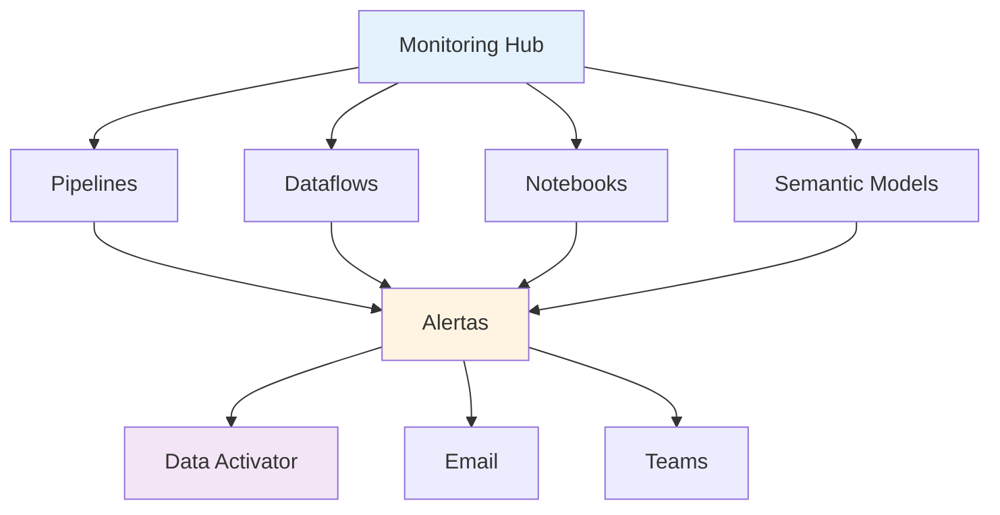
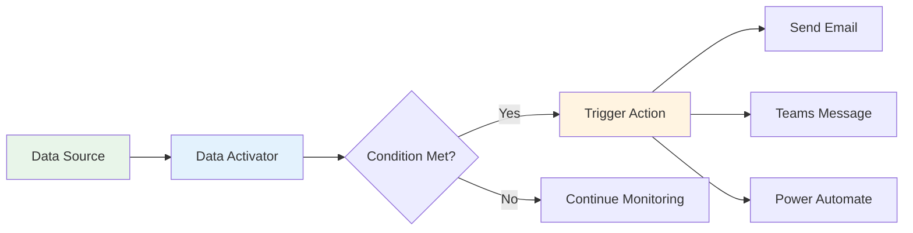

# 3.1 Monitorar itens do Fabric

O monitoramento proativo é uma disciplina **crucial** na engenharia de dados para garantir a **confiabilidade, desempenho e integridade** das soluções de análise. O Microsoft Fabric fornece ferramentas centralizadas e específicas para monitorar a saúde e o status de todos os itens, desde a ingestão até a entrega dos dados.

## Visão Geral do Monitoramento



---

## 1. Monitoring Hub

### 1.1 Visão Geral

O **Monitoring Hub** é o ponto centralizado para monitorar todas as execuções no Fabric.

**Acesso**: Workspace → Monitoring Hub (ícone de sino)

**O que monitora**:
- Pipelines
- Dataflows Gen2
- Notebooks
- Semantic Models (datasets)
- Spark Jobs

### 1.2 Informações Disponíveis

| Informação | Descrição |
|------------|-----------|
| **Status** | Succeeded, Failed, In Progress, Cancelled |
| **Duração** | Tempo total de execução |
| **Início/Fim** | Timestamps de início e fim |
| **Triggered By** | Manual, Schedule, Event |
| **Run ID** | Identificador único da execução |

### 1.3 Filtros e Busca

```
Filtros disponíveis:
- Item type (Pipeline, Dataflow, Notebook)
- Status (All, Succeeded, Failed, In Progress)
- Time range (Last 24 hours, Last 7 days, Custom)
- Item name (busca por nome)
```

---

## 2. Monitoramento de Pipelines

### 2.1 Detalhes da Execução

**Visualização em Árvore**:
```
Pipeline: Daily_Sales_ETL
├── Copy_Sales_Data (Succeeded, 2m 15s)
├── Transform_Sales_Notebook (Succeeded, 5m 30s)
├── Load_DW_StoredProc (Succeeded, 1m 45s)
└── Send_Success_Notification (Succeeded, 5s)
```

### 2.2 Métricas por Atividade

#### Copy Activity

| Métrica | Descrição |
|---------|-----------|
| **Rows Read** | Número de linhas lidas da fonte |
| **Rows Written** | Número de linhas escritas no destino |
| **Data Read** | Volume de dados lido (MB/GB) |
| **Data Written** | Volume de dados escrito |
| **Throughput** | MB/s |
| **Duration** | Tempo total |
| **Queued Duration** | Tempo em fila |
| **Transfer Duration** | Tempo de transferência |

**Exemplo de Output**:
```json
{
  "rowsRead": 1500000,
  "rowsWritten": 1500000,
  "dataRead": 450.5,
  "dataWritten": 450.5,
  "throughput": 3.75,
  "duration": "00:02:00",
  "queuedDuration": "00:00:05",
  "transferDuration": "00:01:55"
}
```

#### Notebook Activity

| Métrica | Descrição |
|---------|-----------|
| **Spark Application ID** | ID da aplicação Spark |
| **Duration** | Tempo total |
| **Executor Count** | Número de executors |
| **Executor Cores** | Cores por executor |
| **Executor Memory** | Memória por executor |

### 2.3 Logs Detalhados

**Acessar Logs**:
1. Monitoring Hub → Selecionar execução do pipeline
2. Clicar na atividade específica
3. Aba "Output" → Ver JSON completo
4. Aba "Details" → Ver logs de erro

**Exemplo de Log de Erro**:
```
Error Code: 2200
Error Message: Failed to connect to source database
Details: Connection timeout after 30 seconds
Recommendation: Check network connectivity and firewall rules
```

---

## 3. Monitoramento de Dataflows

### 3.1 Refresh History

**Informações**:
- Status (Succeeded, Failed)
- Start time / End time
- Duration
- Rows processed
- Error message (se falhou)

### 3.2 Query Diagnostics

**Habilitar**:
1. Dataflow Gen2 → Settings
2. Enable "Query diagnostics"
3. Próxima execução gerará logs detalhados

**O que captura**:
- Tempo de cada etapa do Power Query
- Operações de fold (query folding)
- Tempo de conexão com fonte
- Tempo de escrita no destino

### 3.3 Métricas de Performance

| Métrica | O que Indica |
|---------|--------------|
| **Query Folding** | % de operações executadas na fonte |
| **Rows Processed** | Volume de dados |
| **Duration** | Tempo total |
| **Memory Usage** | Uso de memória |

---

## 4. Monitoramento de Notebooks

### 4.1 Spark UI

**Acessar**:
1. Monitoring Hub → Selecionar execução do notebook
2. Clicar em "Spark application"
3. Abre Spark UI completo

**Abas Principais**:

| Aba | O que Mostra |
|-----|--------------|
| **Jobs** | Lista de jobs Spark executados |
| **Stages** | Estágios de cada job |
| **Storage** | DataFrames cacheados |
| **Environment** | Configurações do Spark |
| **Executors** | Status dos executors |
| **SQL** | Queries SQL executadas |

### 4.2 Métricas de Job

```
Job ID: 0
Description: show at <command-123>
Status: SUCCEEDED
Duration: 2.5 min
Stages: 3
Tasks: 200 (200 succeeded)
```

### 4.3 Métricas de Stage

| Métrica | Descrição |
|---------|-----------|
| **Input** | Dados lidos (MB) |
| **Output** | Dados escritos (MB) |
| **Shuffle Read** | Dados shuffled lidos |
| **Shuffle Write** | Dados shuffled escritos |
| **Duration** | Tempo do stage |
| **Tasks** | Número de tasks |

### 4.4 Identificando Problemas

**Data Skew**:
```
Task 0: 10s
Task 1: 10s
Task 2: 120s  <- SKEW!
Task 3: 10s
```

**Solução**: Reparticionar por coluna com melhor distribuição.

**Spill to Disk**:
```
Shuffle Spill (Memory): 0 MB
Shuffle Spill (Disk): 500 MB  <- PROBLEMA!
```

**Solução**: Aumentar memória dos executors ou reduzir dados em memória.

---

## 5. Monitoramento de Semantic Models

### 5.1 Refresh History

**Acessar**:
1. Workspace → Semantic Model → Settings
2. Aba "Refresh history"

**Informações**:
- Refresh type (Scheduled, Manual, API)
- Status
- Start/End time
- Duration
- Error details

### 5.2 Performance Analyzer

**No Power BI Desktop**:
1. View → Performance Analyzer
2. Start recording
3. Refresh visual
4. Analisar tempo de cada operação

**Métricas**:
- DAX query time
- Visual display time
- Other time

### 5.3 DMV Queries (Advanced)

**Conectar via SSMS**:
```
Server: powerbi://api.powerbi.com/v1.0/myorg/[workspace-name]
Database: [dataset-name]
```

**Query de Exemplo**:
```sql
-- Ver últimas queries executadas
SELECT 
    COMMAND_TEXT,
    COMMAND_START_TIME,
    COMMAND_END_TIME,
    COMMAND_CPU_TIME_MS,
    COMMAND_ELAPSED_TIME_MS
FROM $SYSTEM.DISCOVER_COMMANDS
ORDER BY COMMAND_START_TIME DESC;
```

---

## 6. Configurar Alertas

### 6.1 Alertas de Pipeline

**Configuração**:
1. Pipeline → Settings → Alerts
2. Configurar condições:
   - On failure
   - On success
   - On completion
3. Adicionar destinatários (emails)

**Exemplo de Configuração**:
```json
{
  "alertType": "OnFailure",
  "recipients": [
    "data-team@company.com",
    "manager@company.com"
  ],
  "subject": "Pipeline Failed: Daily_Sales_ETL",
  "includeDetails": true
}
```

### 6.2 Data Activator

**Quando usar**: Alertas baseados em dados (não apenas status de execução).

**Cenários**:
- Métrica de negócio atinge threshold
- Número de erros em log excede limite
- Dados de streaming indicam anomalia

**Configuração**:



**Exemplo de Trigger**:
```
Data Source: KQL Database (error_logs table)
Condition: error_count > 100 in last 5 minutes
Action: Send Teams message to #data-alerts channel
Message: "⚠️ High error rate detected: {error_count} errors in last 5 min"
```

### 6.3 Alertas via Power Automate

**Integração**:
1. Pipeline → Add activity → Web
2. Chamar webhook do Power Automate
3. Power Automate processa e envia alerta customizado

**Exemplo de Flow**:
```
Trigger: HTTP request (webhook)
Action 1: Parse JSON (pipeline details)
Action 2: Condition (if status = failed)
Action 3: Send Teams adaptive card
Action 4: Create incident in ServiceNow
```

---

## 7. Métricas e KPIs de Monitoramento

### 7.1 SLA Tracking

| Métrica | Descrição | Target |
|---------|-----------|--------|
| **Pipeline Success Rate** | % de execuções bem-sucedidas | > 99% |
| **Average Duration** | Tempo médio de execução | < 30 min |
| **P95 Duration** | 95º percentil de duração | < 45 min |
| **Time to Detection** | Tempo até detectar falha | < 5 min |
| **Time to Resolution** | Tempo até resolver falha | < 2 hours |

### 7.2 Dashboard de Monitoramento

**Criar no Power BI**:

```
Data Source: Fabric Monitoring Hub (via API)
Visuals:
- Card: Success Rate (last 24h)
- Line Chart: Pipeline durations over time
- Table: Recent failures with error messages
- Bar Chart: Top 10 longest running pipelines
- Gauge: SLA compliance
```

---

## 8. Logs e Troubleshooting

### 8.1 Tipos de Logs

| Tipo | Onde Encontrar | O que Contém |
|------|----------------|--------------|
| **Pipeline Logs** | Monitoring Hub → Pipeline → Activity | Input/Output, Errors |
| **Notebook Logs** | Monitoring Hub → Notebook → Spark UI | Spark logs, stdout, stderr |
| **Dataflow Logs** | Dataflow → Refresh history | Query diagnostics |
| **System Logs** | Capacity Metrics App | Capacity usage, throttling |

### 8.2 Troubleshooting Common Issues

#### Pipeline Timeout

**Sintoma**: Pipeline cancela após X horas

**Causa**: Timeout configurado muito baixo

**Solução**:
```json
{
  "policy": {
    "timeout": "02:00:00"  // Aumentar timeout
  }
}
```

#### Out of Memory (Notebook)

**Sintoma**: `OutOfMemoryError` no Spark

**Causa**: Dados muito grandes para memória disponível

**Solução**:
```python
# Reduzir dados em memória
df.unpersist()

# Ou aumentar partições
df = df.repartition(400)

# Ou usar Spark pool maior
```

#### Dataflow Refresh Failure

**Sintoma**: Dataflow falha com "Query timeout"

**Causa**: Query muito complexa ou fonte lenta

**Solução**:
- Simplificar transformações
- Habilitar query folding
- Aumentar timeout da fonte

---

## 9. Best Practices - Monitoramento

### ✅ Proativo

1. **Configure Alertas**:
   - Sempre configure alertas para pipelines críticos
   - Use Data Activator para métricas de negócio
   - Defina SLAs claros

2. **Dashboards**:
   - Crie dashboard de monitoramento centralizado
   - Monitore tendências (não apenas status atual)
   - Compartilhe com stakeholders

3. **Logging**:
   - Log eventos importantes em tabelas
   - Inclua contexto (RunID, timestamp, parâmetros)
   - Retenha logs por período adequado (30-90 dias)

### ✅ Reativo

1. **Troubleshooting**:
   - Sempre verifique Monitoring Hub primeiro
   - Use Spark UI para problemas de performance
   - Analise logs completos (não apenas mensagem de erro)

2. **Documentação**:
   - Documente problemas comuns e soluções
   - Crie runbooks para incidentes
   - Mantenha knowledge base atualizada

---

## Referências e Recursos

1. [Monitoring Hub](https://learn.microsoft.com/fabric/data-factory/monitor-hub)
2. [Pipeline Alerts](https://learn.microsoft.com/fabric/data-factory/pipeline-alerts)
3. [Data Activator](https://learn.microsoft.com/fabric/data-activator/data-activator-overview)
4. [Spark UI Guide](https://spark.apache.org/docs/latest/web-ui.html)
5. [Guia de Estudo DP-700](https://learn.microsoft.com/credentials/certifications/resources/study-guides/dp-700)

---

## Pontos-Chave para o Exame DP-700

🎯 **Memorize**:
- **Monitoring Hub**: Ponto centralizado para monitorar tudo
- **Pipeline Alerts**: On failure, On success, On completion
- **Data Activator**: Alertas baseados em dados (não apenas status)
- **Spark UI**: Troubleshooting de performance de notebooks
- **Refresh History**: Monitorar Dataflows e Semantic Models
- **DMV Queries**: Análise avançada de Semantic Models
- **SLA Metrics**: Success rate, duration, P95

🎯 **Entenda**:
- Como acessar logs detalhados de cada tipo de item
- Diferença entre alertas de pipeline e Data Activator
- Como usar Spark UI para identificar data skew
- Métricas importantes de Copy Activity
- Como configurar alertas proativos
- Troubleshooting de problemas comuns

