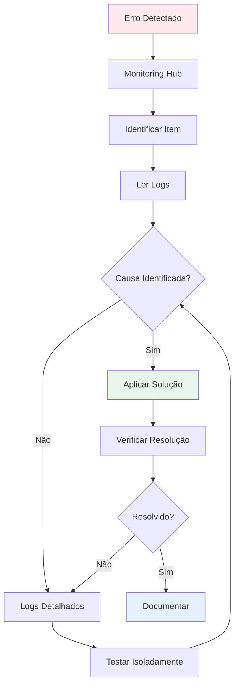

# 3.2 Identificar e resolver erros

A capacidade de identificar e resolver erros (troubleshooting) de forma **eficiente e sistemática** é uma habilidade essencial para um engenheiro de dados. Falhas são inevitáveis em sistemas complexos, e saber onde procurar os logs, como interpretar mensagens de erro e aplicar soluções é crucial para minimizar o tempo de inatividade e garantir a integridade dos dados.

## Metodologia de Troubleshooting



### Passos Sistemáticos

1. **Isolar o Problema**: Monitoring Hub → Identificar componente que falhou
2. **Ler Mensagem de Erro**: Atenção aos detalhes (error code, mensagem)
3. **Consultar Logs Detalhados**: Output da atividade, Spark UI, etc.
4. **Verificar Configurações**: Conexões, permissões, credenciais
5. **Testar Isoladamente**: Reproduzir erro com dados menores
6. **Aplicar Solução**: Corrigir causa raiz
7. **Documentar**: Registrar problema e solução

---

## 1. Erros de Pipeline

### 1.1 Copy Activity Errors

#### Error Code: 2200 - Connection Timeout

**Sintoma**:
```
Error Code: 2200
Error Message: Failed to connect to source database
Details: Connection timeout after 30 seconds
```

**Causas Comuns**:
- Firewall bloqueando conexão
- Credenciais incorretas
- Fonte de dados offline

**Solução**:
```
1. Verificar firewall rules (permitir IP do Fabric)
2. Testar credenciais manualmente
3. Verificar status da fonte de dados
4. Aumentar timeout se necessário:
   "policy": {
     "timeout": "00:05:00"
   }
```

#### Error Code: 2300 - Data Type Mismatch

**Sintoma**:
```
Error Code: 2300
Error Message: Column 'age' expects type INT but received STRING
```

**Solução**:
```python
# Opção 1: Converter na fonte (SQL)
SELECT 
    name,
    CAST(age AS INT) as age
FROM source_table

# Opção 2: Habilitar type conversion no mapping
"translator": {
    "type": "TabularTranslator",
    "typeConversion": true
}
```

#### Error Code: 2400 - Permission Denied

**Sintoma**:
```
Error Code: 2400
Error Message: Access denied to destination table
```

**Solução**:
```sql
-- Conceder permissões adequadas
GRANT INSERT, UPDATE ON schema.table TO [user@domain.com];

-- Verificar workspace roles
-- Admin, Member, Contributor têm permissões diferentes
```

### 1.2 Notebook Activity Errors

#### OutOfMemoryError

**Sintoma**:
```
java.lang.OutOfMemoryError: Java heap space
```

**Causas**:
- DataFrame muito grande em memória
- Cache excessivo
- Partições muito grandes

**Solução**:
```python
# 1. Liberar cache não usado
df.unpersist()

# 2. Aumentar partições
df = df.repartition(400)

# 3. Evitar collect() em dados grandes
# RUIM:
data = df.collect()  # Traz tudo para driver

# BOM:
df.write.format("delta").save("path")  # Escreve distribuído

# 4. Usar Spark pool maior
# Workspace Settings → Spark pools → Aumentar node size
```

#### Error: Table or View Not Found

**Sintoma**:
```
AnalysisException: Table or view not found: lakehouse.sales
```

**Solução**:
```python
# Verificar nome correto da tabela
spark.sql("SHOW TABLES IN lakehouse").show()

# Usar nome completo
df = spark.read.table("lakehouse.sales")

# Ou adicionar lakehouse ao notebook
# Notebook → Add lakehouse → Selecionar lakehouse correto
```

---

## 2. Erros de Dataflow

### 2.1 Credential Errors

**Sintoma**:
```
DataSource.Error: Authentication failed
```

**Solução**:
```
1. Dataflow → Settings → Data source credentials
2. Edit credentials → Re-enter password
3. Test connection
4. Save and refresh
```

### 2.2 Query Folding Issues

**Sintoma**: Refresh muito lento

**Causa**: Operações não estão sendo "folded" para a fonte

**Identificar**:
```
1. Enable Query Diagnostics
2. Verificar "Query Folding Indicators"
3. Operações após "Table.Buffer" não fazem fold
```

**Solução**:
```
# Reordenar operações para maximizar folding
# BOM (faz fold):
Source
→ Filter rows (WHERE na fonte)
→ Remove columns (SELECT na fonte)
→ Change type

# RUIM (não faz fold):
Source
→ Add custom column (M function)
→ Filter rows (executado no Fabric)
```

### 2.3 Memory Errors

**Sintoma**:
```
DataFormat.Error: Not enough memory to complete operation
```

**Solução**:
```
1. Reduzir volume de dados:
   - Filtrar na fonte
   - Remover colunas desnecessárias
   
2. Dividir em múltiplos dataflows:
   - Dataflow 1: Bronze → Silver (subset 1)
   - Dataflow 2: Bronze → Silver (subset 2)
   
3. Usar staging:
   - Dataflow 1: Extrai para staging
   - Dataflow 2: Transforma de staging
```

---

## 3. Erros de Notebook (Spark)

### 3.1 Library Errors

**Sintoma**:
```
ModuleNotFoundError: No module named 'pandas'
```

**Solução**:
```python
# Opção 1: Instalar inline (temporário)
%pip install pandas

# Opção 2: Adicionar ao Environment (permanente)
# Workspace → Settings → Spark environments
# → Create/Edit environment
# → Add library: pandas==2.0.0

# Opção 3: requirements.txt
# Upload requirements.txt para lakehouse
# Environment → Upload from file
```

### 3.2 Data Skew

**Sintoma**: Alguns tasks demoram muito mais que outros

**Identificar**:
```
Spark UI → Stages → Tasks
Task 0: 10s
Task 1: 10s
Task 2: 300s  ← SKEW!
Task 3: 10s
```

**Solução**:
```python
# 1. Reparticionar por coluna com melhor distribuição
df = df.repartition("region")  # Melhor distribuição

# 2. Salting (adicionar salt para distribuir)
from pyspark.sql.functions import rand, floor

df_salted = df.withColumn("salt", floor(rand() * 10))
df_processed = df_salted.repartition("customer_id", "salt")

# 3. Broadcast join para tabelas pequenas
df_result = df_large.join(broadcast(df_small), "key")
```

### 3.3 Shuffle Spill

**Sintoma**: Shuffle spill to disk muito alto

**Identificar**:
```
Spark UI → Stages → Shuffle Write
Shuffle Spill (Memory): 100 MB
Shuffle Spill (Disk): 5 GB  ← PROBLEMA!
```

**Solução**:
```python
# 1. Aumentar spark.sql.shuffle.partitions
spark.conf.set("spark.sql.shuffle.partitions", "400")

# 2. Aumentar memória dos executors
# Spark pool settings → Increase node size

# 3. Reduzir dados antes do shuffle
df_filtered = df.filter(col("date") >= "2024-01-01")  # Antes do join
df_result = df_filtered.join(df_other, "key")
```

---

## 4. Erros de KQL Database

### 4.1 Ingestion Failures

**Identificar**:
```kql
.show ingestion failures
| where FailedOn > ago(1h)
| project FailedOn, Database, Table, IngestionSourcePath, Details
```

**Erro Comum**: Schema Mismatch

**Sintoma**:
```
Error: Column 'timestamp' expects datetime but received string
```

**Solução**:
```kql
// Atualizar mapping para converter tipo
.create-or-alter table events ingestion json mapping 'json_mapping'
'['
'  {"column":"timestamp", "path":"$.timestamp", "datatype":"datetime", "transform":"DateTimeFromUnixSeconds"},'
'  {"column":"device_id", "path":"$.device_id", "datatype":"string"}'
']'
```

### 4.2 Query Timeout

**Sintoma**:
```
Request timeout: Query execution exceeded 5 minutes
```

**Solução**:
```kql
// 1. Adicionar filtro de tempo
events
| where timestamp > ago(1h)  // Reduz dados escaneados
| summarize count() by device_id

// 2. Usar materialized views
.create materialized-view EventsHourly on table events
{
    events
    | summarize count(), avg(temperature) by device_id, bin(timestamp, 1h)
}

// 3. Aumentar timeout (admin)
.alter database DatabaseName policy querythrottling 
'{"MaxMemoryConsumptionPerIterator": 5368709120, "MaxMemoryConsumptionPerQueryPerNode": 6442450944}'
```

---

## 5. Erros de Eventstream

### 5.1 Connection Errors

**Sintoma**: Eventstream não recebe dados

**Causas**:
- Event Hub connection string incorreta
- Shared access policy sem permissão "Listen"
- Network connectivity

**Solução**:
```
1. Verificar connection string:
   - Deve incluir EntityPath
   - Formato: Endpoint=sb://...;EntityPath=eventhub-name
   
2. Verificar permissions:
   - Event Hub → Shared access policies
   - Policy deve ter "Listen" permission
   
3. Testar conectividade:
   - Enviar evento de teste
   - Verificar Runtime logs do Eventstream
```

### 5.2 Transformation Errors

**Sintoma**: Dados não aparecem no destino

**Solução**:
```
1. Eventstream → Runtime logs
2. Verificar cada operador:
   - Filter: Condição está correta?
   - Aggregate: Window size adequado?
   - Join: Chave de join existe em ambos os lados?
   
3. Testar com Sample data:
   - Usar Sample data source
   - Verificar se transformação funciona
   - Depois trocar para fonte real
```

---

## 6. Erros de Warehouse (T-SQL)

### 6.1 Constraint Violations

**Sintoma**:
```
Error: Violation of PRIMARY KEY constraint 'PK_Sales'
Cannot insert duplicate key in object 'dbo.Sales'
```

**Solução**:
```sql
-- Opção 1: MERGE em vez de INSERT
MERGE INTO dbo.Sales AS target
USING source_data AS source
ON target.sale_id = source.sale_id
WHEN MATCHED THEN UPDATE SET ...
WHEN NOT MATCHED THEN INSERT ...;

-- Opção 2: Verificar duplicatas antes
IF NOT EXISTS (SELECT 1 FROM dbo.Sales WHERE sale_id = @sale_id)
BEGIN
    INSERT INTO dbo.Sales ...
END
```

### 6.2 Permission Errors

**Sintoma**:
```
Error: The SELECT permission was denied on the object 'Sales'
```

**Solução**:
```sql
-- Conceder permissões
GRANT SELECT ON dbo.Sales TO [user@domain.com];

-- Ou adicionar a role
ALTER ROLE db_datareader ADD MEMBER [user@domain.com];

-- Verificar permissões atuais
SELECT 
    dp.name AS principal_name,
    dp.type_desc,
    o.name AS object_name,
    p.permission_name
FROM sys.database_permissions p
JOIN sys.database_principals dp ON p.grantee_principal_id = dp.principal_id
JOIN sys.objects o ON p.major_id = o.object_id;
```

---

## 7. Erros de Shortcuts

### 7.1 Path Not Found

**Sintoma**:
```
Error: Path '/Files/external_data' not found
```

**Solução**:
```
1. Verificar se fonte ainda existe:
   - ADLS: Verificar container e path
   - OneLake: Verificar lakehouse e path
   
2. Recriar shortcut:
   - Lakehouse → Shortcuts → Delete old
   - Create new → Apontar para path correto
   
3. Verificar permissões:
   - ADLS: Storage Blob Data Reader
   - OneLake: Workspace access
```

---

## 8. Error Codes Reference

### Pipeline Error Codes

| Code | Descrição | Solução Rápida |
|------|-----------|----------------|
| 2200 | Connection timeout | Verificar firewall, credenciais |
| 2300 | Data type mismatch | Converter tipos, habilitar type conversion |
| 2400 | Permission denied | Conceder permissões adequadas |
| 2500 | Source not found | Verificar nome da fonte |
| 2600 | Destination full | Limpar espaço, aumentar quota |

### Spark Error Codes

| Erro | Causa | Solução |
|------|-------|---------|
| OutOfMemoryError | Memória insuficiente | Aumentar pool, repartition, unpersist |
| AnalysisException | Tabela não encontrada | Verificar nome, adicionar lakehouse |
| FileNotFoundException | Arquivo não existe | Verificar path, permissões |
| ParseException | Erro de sintaxe SQL | Corrigir sintaxe |

---

## 9. Debugging Strategies

### 9.1 Pipeline Debugging

```
1. Habilitar Debug mode:
   - Pipeline → Debug
   - Executa sem salvar
   
2. Usar breakpoints:
   - Adicionar atividade "Wait" após cada etapa
   - Verificar dados intermediários
   
3. Testar com dados pequenos:
   - Filtrar fonte: TOP 100
   - Verificar se lógica funciona
   - Depois remover filtro
```

### 9.2 Notebook Debugging

```python
# 1. Usar display() para inspecionar
display(df.limit(10))

# 2. Verificar schema
df.printSchema()

# 3. Contar registros em cada etapa
print(f"After filter: {df_filtered.count()}")
print(f"After join: {df_joined.count()}")

# 4. Usar explain() para ver plano de execução
df.explain(True)

# 5. Checkpoint intermediário
df.write.format("delta").mode("overwrite").save("/tmp/checkpoint1")
df_checkpoint = spark.read.format("delta").load("/tmp/checkpoint1")
```

---

## 10. Best Practices - Error Resolution

### ✅ Prevenção

1. **Validação de Dados**:
   - Validar schema na entrada
   - Verificar nulos em colunas críticas
   - Implementar data quality checks

2. **Testing**:
   - Testar com dados pequenos primeiro
   - Usar ambientes de DEV/TEST
   - Validar antes de produção

3. **Monitoramento**:
   - Configurar alertas proativos
   - Monitorar métricas de performance
   - Revisar logs regularmente

### ✅ Resolução

1. **Documentação**:
   - Documentar erros comuns e soluções
   - Criar runbooks para incidentes
   - Manter knowledge base atualizada

2. **Comunicação**:
   - Notificar stakeholders sobre incidentes
   - Comunicar ETA de resolução
   - Documentar post-mortem

---

## Referências e Recursos

1. [Monitoring Hub](https://learn.microsoft.com/fabric/data-factory/monitor-hub)
2. [Pipeline Troubleshooting](https://learn.microsoft.com/azure/data-factory/troubleshoot-guide)
3. [Spark Troubleshooting](https://spark.apache.org/docs/latest/sql-performance-tuning.html)
4. [KQL Management Commands](https://learn.microsoft.com/azure/data-explorer/kusto/management/)
5. [Guia de Estudo DP-700](https://learn.microsoft.com/credentials/certifications/resources/study-guides/dp-700)

---

## Pontos-Chave para o Exame DP-700

🎯 **Memorize**:
- **Monitoring Hub**: Primeiro lugar para troubleshooting
- **Error Codes**: 2200 (connection), 2300 (type mismatch), 2400 (permission)
- **OutOfMemoryError**: Aumentar pool, repartition, unpersist
- **Query Folding**: Reordenar operações para maximizar fold
- **Data Skew**: Reparticionar por coluna com melhor distribuição
- **Spark UI**: Identificar problemas de performance
- **.show ingestion failures**: Troubleshooting KQL ingestion

🎯 **Entenda**:
- Metodologia sistemática de troubleshooting
- Como ler e interpretar mensagens de erro
- Diferença entre erros de configuração vs código
- Como usar logs detalhados (Output, Spark UI)
- Estratégias de debugging (isolamento, teste)
- Quando escalar vs quando aumentar partições

