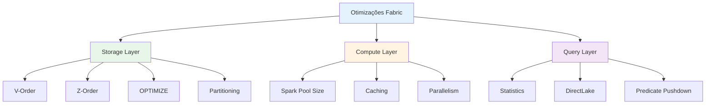
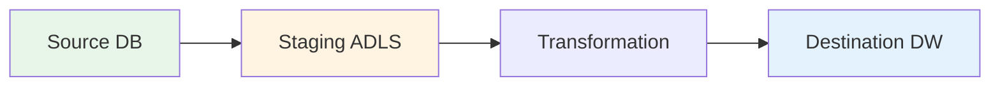

# 3.3 Otimizar desempenho

A otimização de desempenho é o processo **contínuo e estratégico** de ajustar e refinar sua solução de análise para garantir que as consultas sejam rápidas, os processos de ingestão sejam eficientes e os custos de recursos sejam minimizados. O Microsoft Fabric oferece várias alavancas de otimização em seus diferentes componentes, desde a camada de armazenamento até o motor de processamento.

## Visão Geral das Otimizações



---

## 1. Otimizar Tabelas Delta Lake

### 1.1 OPTIMIZE (Compactação)

**Problema**: Muitos arquivos pequenos degradam performance.

**Solução**: Compactar arquivos pequenos em arquivos maiores.

```sql
-- Compactar tabela inteira
OPTIMIZE lakehouse.sales;

-- Compactar partição específica
OPTIMIZE lakehouse.sales
WHERE sale_date >= '2024-01-01';

-- Ver estatísticas de otimização
DESCRIBE HISTORY lakehouse.sales;
```

**Quando executar**:
- Após múltiplas inserções pequenas
- Após streaming contínuo
- Quando número de arquivos > 1000
- Quando tamanho médio de arquivo < 128MB

**Métricas**:
```
Before OPTIMIZE:
- Files: 5,000
- Avg file size: 10 MB
- Query time: 45s

After OPTIMIZE:
- Files: 50
- Avg file size: 1 GB
- Query time: 8s (5.6x faster!)
```

### 1.2 V-Order

**O que é**: Algoritmo proprietário da Microsoft para otimizar layout de dados em Parquet.

**Benefícios**:
- Compressão melhorada (~30-50%)
- Queries mais rápidas (~30-50%)
- Habilitado por padrão no Fabric

**Configuração**:
```python
# V-Order é habilitado automaticamente
# Para verificar se está ativo:
spark.conf.get("spark.sql.parquet.vorder.enabled")  # true

# Para desabilitar (não recomendado):
spark.conf.set("spark.sql.parquet.vorder.enabled", "false")
```

**Quando V-Order é aplicado**:
- Durante escrita de dados (INSERT, MERGE, CTAS)
- Durante OPTIMIZE
- Não é aplicado em leituras

### 1.3 Z-Order

**O que é**: Técnica de co-localização de dados relacionados.

**Quando usar**:
- Colunas frequentemente usadas em filtros (WHERE)
- Colunas usadas em joins
- Colunas com cardinalidade média-alta

```sql
-- Z-Order por uma coluna
OPTIMIZE lakehouse.sales
ZORDER BY (customer_id);

-- Z-Order por múltiplas colunas (máximo 4)
OPTIMIZE lakehouse.sales
ZORDER BY (sale_date, region);

-- Z-Order em partição específica
OPTIMIZE lakehouse.sales
WHERE sale_date >= '2024-01-01'
ZORDER BY (customer_id);
```

**Comparação de Performance**:

| Cenário | Sem Z-Order | Com Z-Order | Melhoria |
|---------|-------------|-------------|----------|
| Query filtrada por customer_id | 30s | 5s | 6x |
| Query filtrada por sale_date | 25s | 4s | 6.25x |
| Query sem filtro | 40s | 38s | 5% |

**Limitações**:
- Máximo 4 colunas
- Não funciona bem com colunas de baixa cardinalidade
- Requer re-execução periódica (dados novos não são Z-ordered)

### 1.4 VACUUM

**O que é**: Remove arquivos antigos não referenciados.

**Quando usar**:
- Após múltiplos OPTIMIZE
- Após muitas operações de UPDATE/DELETE
- Para economizar custos de armazenamento

```sql
-- VACUUM com retenção padrão (7 dias)
VACUUM lakehouse.sales;

-- VACUUM com retenção customizada
VACUUM lakehouse.sales RETAIN 168 HOURS;  -- 7 dias

-- Dry run (ver o que seria deletado)
VACUUM lakehouse.sales DRY RUN;
```

**⚠️ IMPORTANTE**:
- Não execute VACUUM com retenção < 7 dias
- Time travel não funciona para dados deletados
- Sempre faça backup antes

### 1.5 Particionamento

**Estratégias de Particionamento**:

| Estratégia | Quando Usar | Exemplo |
|------------|-------------|---------|
| **Por Data** | Dados com timestamp | `sale_date` |
| **Por Região** | Dados geográficos | `country`, `region` |
| **Por Categoria** | Dados categóricos | `product_category` |
| **Híbrido** | Combinação | `sale_date`, `region` |

**Implementação**:
```python
# Particionar ao escrever
df.write \
    .format("delta") \
    .partitionBy("sale_date", "region") \
    .mode("append") \
    .saveAsTable("lakehouse.sales")

# Verificar partições
spark.sql("SHOW PARTITIONS lakehouse.sales").show()
```

**Regras de Ouro**:
- Cardinalidade ideal: 100-10.000 partições
- Tamanho ideal por partição: 1GB
- Evite over-partitioning (muitas partições pequenas)
- Evite under-partitioning (poucas partições grandes)

---

## 2. Otimizar Pipelines

### 2.1 Copy Activity Performance

**Configurações Críticas**:

| Configuração | Descrição | Recomendação |
|--------------|-----------|--------------|
| **DIU (Data Integration Units)** | Unidades de compute | 4-256 (auto-scale) |
| **Parallel Copies** | Threads paralelas | 4-32 |
| **Degree of Copy Parallelism** | Paralelismo de cópia | Auto |

**Exemplo de Configuração**:
```json
{
  "source": {...},
  "sink": {...},
  "parallelCopies": 32,
  "dataIntegrationUnits": 256,
  "enableStaging": true,
  "stagingSettings": {
    "linkedServiceName": "ADLSGen2",
    "path": "staging/temp"
  }
}
```

### 2.2 Staged Copy

**Quando usar**:
- Fonte e destino em regiões diferentes
- Transformações complexas durante cópia
- Melhorar throughput



### 2.3 Best Practices

1. **Filtrar na Fonte**:
```sql
-- BOM: Filtrar no SQL source
SELECT * FROM sales WHERE sale_date >= '2024-01-01'

-- RUIM: Copiar tudo e filtrar depois
```

2. **Usar Partições**:
- Habilitar partitioned copy
- Configurar partition column
- Ajustar número de partições

3. **Monitorar Performance**:
- Verificar throughput (MB/s)
- Identificar gargalos (source vs sink)
- Ajustar DIU conforme necessário

---

## 3. Otimizar Data Warehouse

### 3.1 Statistics

**Por que são importantes**: Otimizador de queries usa statistics para criar planos eficientes.

**Criar Statistics**:
```sql
-- Criar statistics em coluna específica
CREATE STATISTICS stats_customer_id 
ON dbo.Sales(customer_id);

-- Criar statistics em múltiplas colunas
CREATE STATISTICS stats_date_region 
ON dbo.Sales(sale_date, region);

-- Atualizar statistics
UPDATE STATISTICS dbo.Sales;

-- Ver statistics existentes
SELECT 
    s.name AS stats_name,
    c.name AS column_name,
    s.stats_date AS last_updated
FROM sys.stats s
JOIN sys.stats_columns sc ON s.stats_id = sc.stats_id
JOIN sys.columns c ON sc.column_id = c.column_id
WHERE s.object_id = OBJECT_ID('dbo.Sales');
```

**Quando criar**:
- Colunas em WHERE clauses
- Colunas em JOIN conditions
- Colunas em GROUP BY
- Após cargas grandes de dados

### 3.2 Indexing

**Tipos de Índices**:

| Tipo | Quando Usar | Performance |
|------|-------------|-------------|
| **Clustered Columnstore** | Tabelas grandes (> 60M rows) | Excelente para scans |
| **Clustered Index** | Tabelas pequenas, queries pontuais | Excelente para seeks |
| **Nonclustered Index** | Queries específicas | Bom para filtros |

**Exemplo**:
```sql
-- Criar clustered columnstore (padrão no Fabric)
CREATE CLUSTERED COLUMNSTORE INDEX cci_sales 
ON dbo.Sales;

-- Criar nonclustered index
CREATE NONCLUSTERED INDEX idx_customer 
ON dbo.Sales(customer_id);
```

### 3.3 Materialized Views

**Quando usar**: Queries complexas executadas frequentemente.

```sql
-- Criar materialized view
CREATE MATERIALIZED VIEW mv_sales_summary AS
SELECT 
    sale_date,
    region,
    SUM(amount) AS total_sales,
    COUNT(*) AS num_transactions
FROM dbo.Sales
GROUP BY sale_date, region;

-- Refresh materialized view
ALTER MATERIALIZED VIEW mv_sales_summary REBUILD;
```

---

## 4. Otimizar Spark

### 4.1 Spark Pool Configuration

**Node Families**:

| Family | Quando Usar | Características |
|--------|-------------|-----------------|
| **Memory Optimized** | ETL, large datasets | Alta memória/core |
| **Compute Optimized** | CPU-intensive | Alta CPU/core |

**Node Sizes**:
- Small: 4 cores, 32GB RAM
- Medium: 8 cores, 64GB RAM
- Large: 16 cores, 128GB RAM
- XLarge: 32 cores, 256GB RAM

**Autoscale**:
```
Min nodes: 3
Max nodes: 10
Auto-scale enabled: Yes
Dynamic allocation: Enabled
```

### 4.2 Caching Strategies

```python
# Cache DataFrame usado múltiplas vezes
df_customers = spark.read.table("lakehouse.customers")
df_customers.cache()

# Usar cached DataFrame
df_result1 = df_customers.filter(col("country") == "USA")
df_result2 = df_customers.filter(col("country") == "Brazil")

# Liberar cache quando não precisar mais
df_customers.unpersist()

# Verificar DataFrames cacheados
# Spark UI → Storage tab
```

### 4.3 Broadcast Joins

```python
from pyspark.sql.functions import broadcast

# Tabela grande
df_sales = spark.read.table("lakehouse.sales")  # 100M rows

# Tabela pequena
df_products = spark.read.table("lakehouse.products")  # 10K rows

# Broadcast join (muito mais rápido)
df_result = df_sales.join(
    broadcast(df_products),
    "product_id"
)

# Limite: Tabela broadcast < 10GB
```

### 4.4 Adaptive Query Execution (AQE)

**Habilitado por padrão no Fabric**.

**Benefícios**:
- Ajusta plano de execução em runtime
- Otimiza joins automaticamente
- Reduz shuffle data

```python
# Verificar se AQE está habilitado
spark.conf.get("spark.sql.adaptive.enabled")  # true

# Configurações AQE
spark.conf.set("spark.sql.adaptive.coalescePartitions.enabled", "true")
spark.conf.set("spark.sql.adaptive.skewJoin.enabled", "true")
```

---

## 5. Otimizar KQL Database

### 5.1 Ingestion Batching

**Configurar Batching Policy**:
```kql
.alter table events policy ingestionbatching 
@'{"MaximumBatchingTimeSpan":"00:01:00", "MaximumNumberOfItems": 10000, "MaximumRawDataSizeMB": 1024}'
```

**Trade-offs**:

| Configuração | Latência | Throughput | Custo |
|--------------|----------|------------|-------|
| Batch pequeno (30s) | Baixa | Médio | Alto |
| Batch médio (5min) | Média | Alto | Médio |
| Batch grande (30min) | Alta | Muito alto | Baixo |

### 5.2 Materialized Views

```kql
// Criar materialized view
.create materialized-view EventsHourly on table events
{
    events
    | summarize 
        count(), 
        avg(temperature), 
        max(temperature)
      by device_id, bin(timestamp, 1h)
}

// Queries usam automaticamente a view
events
| where timestamp > ago(24h)
| summarize avg(temperature) by device_id, bin(timestamp, 1h)
// Usa EventsHourly automaticamente!
```

### 5.3 Extent Management

```kql
// Ver extents (shards)
.show table events extents

// Merge extents pequenos
.alter-merge table events policy merge 
@'{"RowCountUpperBoundForMerge": 16000000}'
```

---

## 6. Otimizar Power BI

### 6.1 DirectLake Mode

**Benefícios**:
- Performance de Import mode
- Atualização de DirectQuery mode
- Sem duplicação de dados

**Requisitos**:
- Dados em Delta Lake (Lakehouse)
- Workspace em capacidade Premium/Fabric
- Modelo semântico compatível

**Configuração**:
```
1. Criar semantic model do Lakehouse
2. Mode é automaticamente DirectLake
3. Verificar: Model → Settings → Storage mode
```

**Limitações**:
- Não suporta todas as transformações DAX
- Fallback para DirectQuery se necessário
- Monitorar fallback rate

### 6.2 Aggregations

**Criar tabela agregada**:
```sql
CREATE TABLE sales_monthly AS
SELECT 
    YEAR(sale_date) AS year,
    MONTH(sale_date) AS month,
    region,
    SUM(amount) AS total_sales
FROM sales
GROUP BY YEAR(sale_date), MONTH(sale_date), region;
```

**Configurar no Power BI**:
1. Criar relationship entre sales e sales_monthly
2. Configurar aggregation mapping
3. Queries usam agregação automaticamente

---

## 7. Capacity Management

### 7.1 Monitorar Capacity

**Metrics App**:
- CU (Capacity Units) usage
- Throttling events
- Background operations
- Interactive operations

**Alertas**:
```
Configurar alertas quando:
- CU usage > 80%
- Throttling events > 10/hour
- Background operations > 100/hour
```

### 7.2 Otimizar Custos

**Estratégias**:

1. **Pause quando não usar**:
   - Pausar capacities em DEV/TEST fora do horário
   - Usar automation (Azure Functions)

2. **Right-size capacity**:
   - Monitorar usage patterns
   - Ajustar SKU conforme necessário
   - Considerar autoscale

3. **Otimizar workloads**:
   - Executar jobs pesados off-peak
   - Usar incremental refresh
   - Limpar dados antigos (VACUUM)

---

## 8. Best Practices - Performance

### ✅ Storage Layer

1. **OPTIMIZE regularmente**:
   - Schedule: Diário ou semanal
   - Após cargas grandes
   - Monitorar número de arquivos

2. **Z-ORDER estrategicamente**:
   - Máximo 4 colunas
   - Colunas de filtro frequente
   - Re-executar periodicamente

3. **VACUUM periodicamente**:
   - Retenção mínima: 7 dias
   - Schedule: Semanal ou mensal
   - Monitorar storage costs

### ✅ Compute Layer

1. **Right-size Spark pools**:
   - Usar autoscale
   - Monitorar utilização
   - Ajustar conforme workload

2. **Cache inteligentemente**:
   - Apenas DataFrames reutilizados
   - Liberar cache não usado
   - Monitorar memória

3. **Broadcast joins**:
   - Tabelas < 10GB
   - Verificar auto-broadcast
   - Forçar quando necessário

### ✅ Query Layer

1. **Statistics atualizadas**:
   - Criar em colunas críticas
   - Atualizar após cargas
   - Monitorar query plans

2. **DirectLake quando possível**:
   - Usar para Lakehouses
   - Monitorar fallback rate
   - Otimizar modelo

---

## Referências e Recursos

1. [Delta Lake Optimization](https://learn.microsoft.com/fabric/data-engineering/delta-optimization-and-v-order)
2. [Copy Activity Performance](https://learn.microsoft.com/azure/data-factory/copy-activity-performance)
3. [DirectLake Mode](https://learn.microsoft.com/power-bi/connect-data/desktop-directlake-overview)
4. [Spark Performance Tuning](https://spark.apache.org/docs/latest/sql-performance-tuning.html)
5. [Guia de Estudo DP-700](https://learn.microsoft.com/credentials/certifications/resources/study-guides/dp-700)

---

## Pontos-Chave para o Exame DP-700

🎯 **Memorize**:
- **OPTIMIZE**: Compactar arquivos pequenos
- **V-Order**: Habilitado por padrão, melhora compressão e queries
- **Z-ORDER**: Co-localizar dados, máximo 4 colunas
- **VACUUM**: Remover arquivos antigos, retenção mínima 7 dias
- **Particionamento**: Cardinalidade ideal 100-10K
- **Broadcast Join**: Tabelas < 10GB
- **DirectLake**: Performance de Import + atualização de DirectQuery
- **Statistics**: Criar em colunas de filtro e join
- **DIU**: 4-256 para Copy Activity

🎯 **Entenda**:
- Quando usar OPTIMIZE vs Z-ORDER
- Trade-offs de particionamento
- Como V-Order funciona
- Diferença entre cache e persist
- Quando usar DirectLake vs Import vs DirectQuery
- Como statistics melhoram query plans
- Estratégias de capacity management
- Otimizações de Spark (AQE, broadcast, cache)

